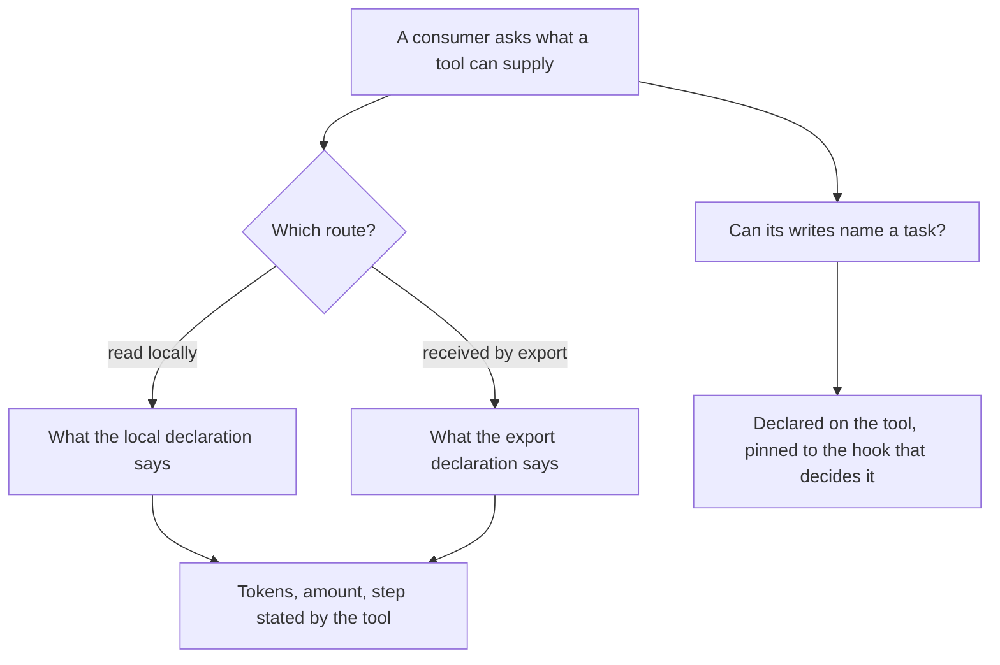
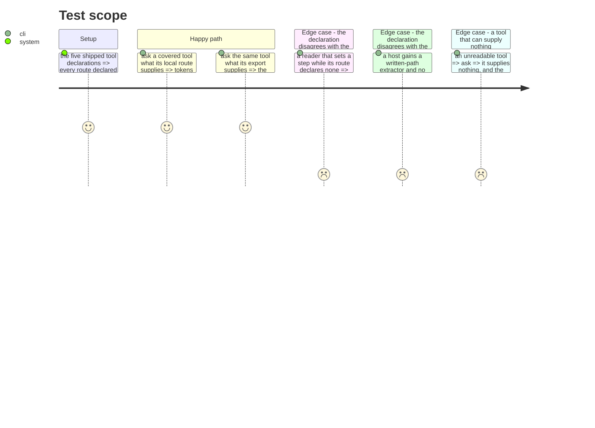

# Instruction: What each tool can supply, declared

## Architecture projection

> Tree of the final files. ✅ create · ✏️ modify · ❌ delete

```txt
.
└── cli/
    ├── src/domain/capabilities/telemetry-capability.ts  ✏️ what a route supplies, beside what it is
    ├── src/domain/tools/contracts.ts                    ✏️ whether a tool's writes can name a task
    ├── src/domain/tools/ai/*.ts                          ✏️ five declarations, measured
    └── tests/…                                          ✅ ✏️
```

## User Journey



## Test Scope



## Tasks to do

### `1)` Declare what a route supplies, on the route

> Claude Code carries an amount on its export and not on its local read, and states its own step on the local read and not on the export. A field on the tool could not express it.

1. Extend the two existing route declarations, never a third tool-level field.
2. Three facts per route: whether it yields token counters, whether it yields an amount, whether the tool states the running step itself.
3. An unreadable or unmeasured route supplies nothing, and its reason stays where it already lives.

### `2)` Declare whether a tool's writes can name a task

> Only Claude Code's hook payload carries a written path in readable form. That truth lives in a table inside a script the build copies verbatim, which this side cannot import.

1. Declare it on the tool.
2. Pin it to the hook's own extractor table with a test, exactly as the journal hosts are already pinned. A host gaining an extractor without a declaration fails, naming the tool.
3. The declaration is about the route to a task, never about whether a task exists.

### `3)` Prove the declarations against the readers, not against the document

> A declaration nobody checks is prose in a type's clothing. The readers are the ground truth, and they are already exercised against captured files.

1. For every covered tool, assert that what its reader actually produces from a captured file matches what its route declares — a route declaring an amount whose reader never sets one fails, and so does the reverse.
2. Assert the same for the step: a route that declares the tool states its own step must produce a record carrying one.
3. Where no capture exists for a route, the declaration says unmeasured and the check skips it rather than asserting over nothing.

## Test acceptance criteria

| Task | Acceptance criteria                                                                                     |
| ---- | ---------------------------------------------------------------------------------------------------------- |
| 1    | Each route declares whether it yields counters, an amount, and a tool-stated step                          |
| 1    | One tool's two routes can declare different answers, and one does                                          |
| 2    | Every tool declares whether its writes can name a task                                                     |
| 2    | The declaration and the hook's extractor table are pinned to each other, failing by name                   |
| 3    | A route declaring an amount whose reader produces none fails the check, naming the route                   |
| 3    | A route declaring a tool-stated step whose reader produces none fails the check                            |
| 3    | An unmeasured route is skipped rather than asserted over                                                   |
