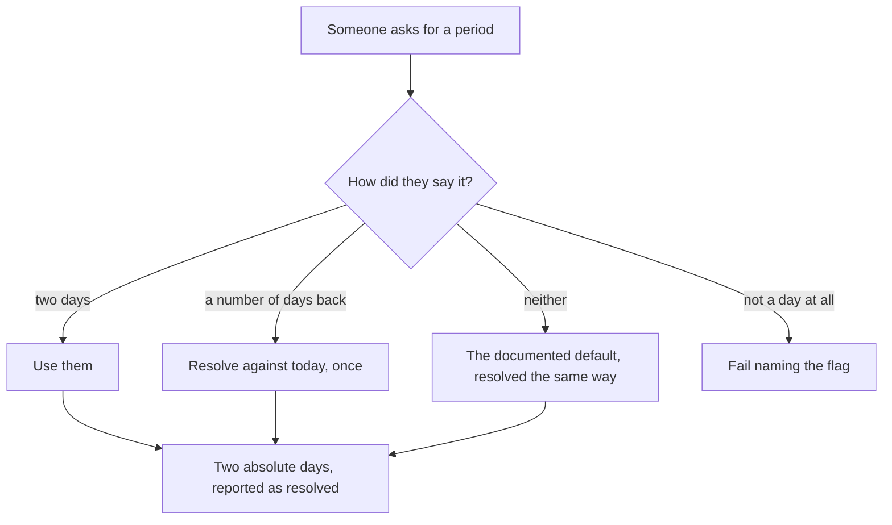
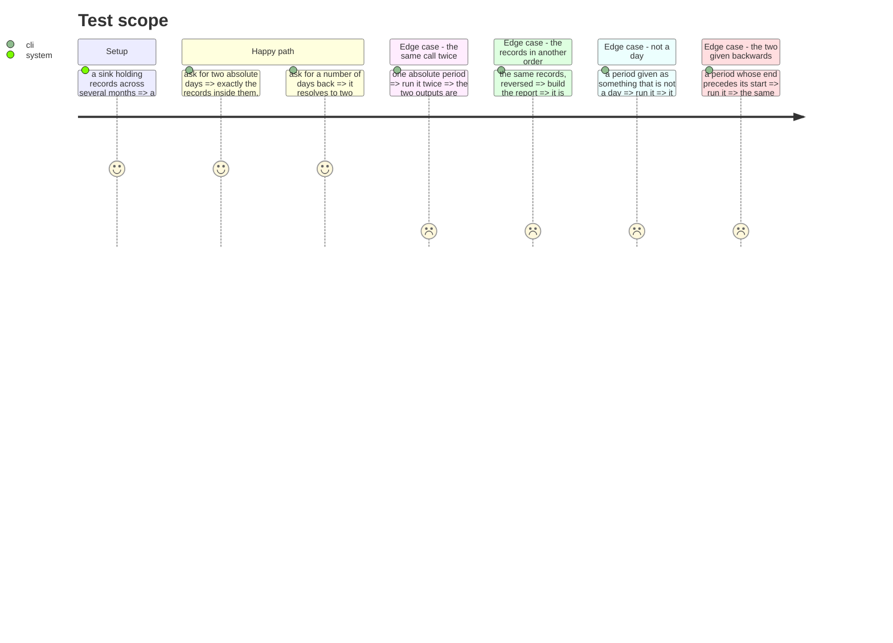

# Instruction: A period stated absolutely

## Architecture projection

> Tree of the final files. ✅ create · ✏️ modify · ❌ delete

```txt
.
└── cli/
    ├── src/domain/models/report-period.ts   ✅ pure: what was asked -> two absolute days
    ├── src/application/commands/telemetry.ts ✏️ --from and --to, with --days defined by them
    ├── src/application/errors.ts             ✏️ a period that is not a period
    └── tests/…                               ✅ ✏️
```

## User Journey



## Test Scope



## Tasks to do

### `1)` Resolve a period once, into two absolute days

> A figure a consumer cannot reproduce is a figure it cannot cite. `--days` resolving against the moment it runs means two identical calls cover two different periods.

1. Accept two absolute days. Keep the number-of-days shorthand, defined in terms of them and resolved exactly once.
2. Report the period as it resolved, never as it was asked. That resolved pair is what a consumer stores beside the figure.
3. Pure: what was asked plus today, in; two days, out. The clock is the caller's.

### `2)` Refuse a period that is not one

> `--days 0` already fails by name. A day given as `notaday` reaches `toISOString` and throws a `RangeError` with a stack trace, which tells a user nothing and a program less.

1. A typed error naming the flag and what it expected, for a day that will not parse.
2. The same for the two given in an order the tool cannot honour, if there is one — or the same period as given the other way round, and asserted either way.
3. No path from a user's string to an unhandled throw.

### `3)` Make determinism a property, not a hope

> Two identical calls being identical is the weaker half. Record order is the half that actually varies: a re-read appends, so the same session's lines sit differently on two machines, and nothing a consumer does controls it.

1. Assert that the same records in reverse order produce the same report, serialized.
2. The groups that carry insertion order today are where this surfaces; give every one of them an order that comes from the data rather than from arrival.
3. Assert the repetition case too, since it is cheap and catches a different mistake.

## Test acceptance criteria

| Task | Acceptance criteria                                                                                     |
| ---- | ---------------------------------------------------------------------------------------------------------- |
| 1    | Two absolute days select exactly the records inside them                                                   |
| 1    | The shorthand resolves to two absolute days, and the output names the resolved pair                        |
| 1    | The period resolution touches no clock of its own                                                          |
| 2    | A day that will not parse fails naming the flag, with no stack trace                                       |
| 2    | A period given end-first behaves identically to the same period given start-first                          |
| 3    | The same records reversed produce a byte-identical report                                                  |
| 3    | The same call run twice produces a byte-identical report                                                   |
