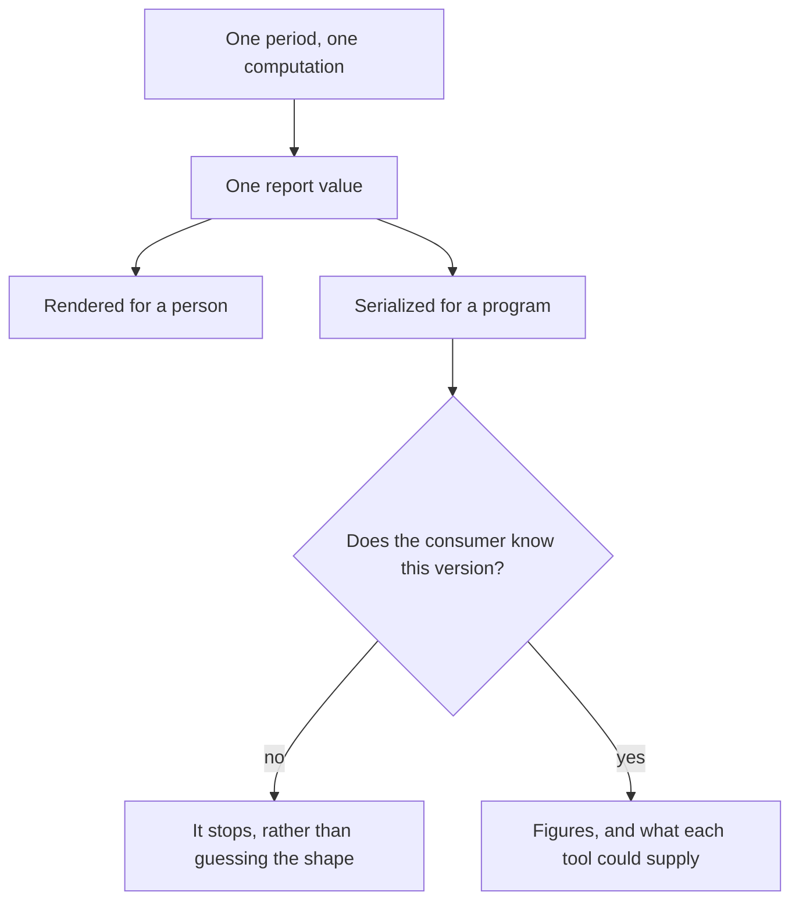
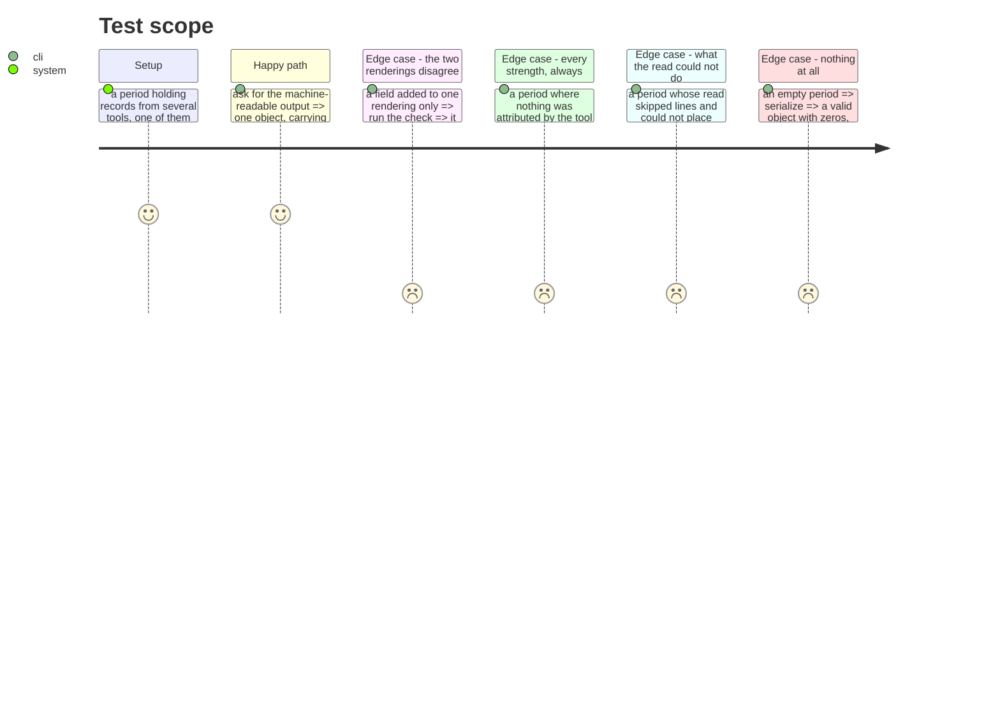

# Instruction: One object, two renderings

## Architecture projection

> Tree of the final files. ✅ create · ✏️ modify · ❌ delete

```txt
.
└── cli/
    ├── src/domain/models/cost-report.ts             ✏️ every strength, always, in a fixed order
    ├── src/domain/models/cost-report-envelope.ts    ✅ pure: the report -> what a program reads
    ├── src/application/display/cost-report-display.ts ✏️ still the same value, rendered for a person
    ├── src/application/commands/telemetry.ts        ✏️ --json
    └── tests/…                                      ✅ ✏️
```

## User Journey



## Test Scope



## Tasks to do

### `1)` Emit every attribution strength, every time, in a fixed order

> Three rows in whatever order the records arrived, with a strength vanishing when it accounts for nothing. A consumer would have to handle one to three rows in an order it cannot predict — and a missing strength there is a measured zero, not an absence.

1. All three, always, in an order that does not depend on the data.
2. Zero where zero is what was measured. This is the one place a zero is the honest answer, and the reason it is belongs in a comment.
3. The human rendering gains the same property, since it renders the same value.

### `2)` Serialize the report a program reads

> A skill scraping aligned columns breaks the first time one gets wider.

1. A version a consumer can refuse. A shape it does not recognise must be set aside, not guessed at.
2. The resolved period, absolutely. The figures, with the same presence rules the stored records use — an absent counter stays absent and never becomes zero.
3. Per tool, what it could supply on each route, from the declarations of phase 2 — so a consumer branches on capability, never on whether a number happened to be there.
4. What the read could not place and could not parse, so a partial answer cannot read as a whole one.
5. Pure: a report in, an object out. No printing, no clock, no filesystem.

### `3)` Keep the two renderings one computation

> "Never a second computation" is a promise a comment cannot keep.

1. Both renderings take the same report value. Neither may derive a figure the other cannot see.
2. A check that fails when a field exists on one side and not the other, naming it — the same shape as the check that already pins the contract document to the stored record.
3. Every guarantee the human output has today survives: an unknown amount is never a zero, an unreadable tool is named with its reason, and unattributed is never "no step ran".

## Test acceptance criteria

| Task | Acceptance criteria                                                                                     |
| ---- | ---------------------------------------------------------------------------------------------------------- |
| 1    | All three strengths appear in every report, in a fixed order                                               |
| 1    | A strength accounting for nothing reads zero rather than disappearing                                      |
| 2    | The object carries a version, and an unrecognised version is refusable                                     |
| 2    | The object carries the resolved period, absolutely                                                         |
| 2    | An absent counter stays absent in the object and never becomes zero                                        |
| 2    | Every declared tool carries what it can supply on each route                                               |
| 2    | The unplaced and unreadable counts are in the object                                                       |
| 2    | The serializer touches no clock and no filesystem                                                          |
| 3    | A field on one rendering and not the other fails a check, naming it                                        |
| 3    | An empty period serializes to a valid object and exits 0                                                   |
