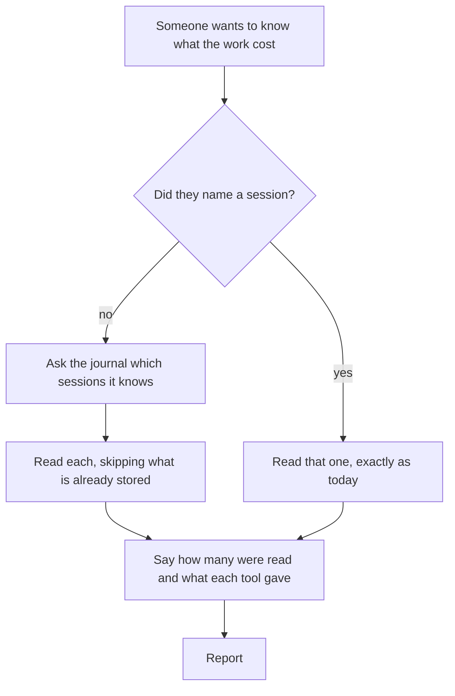
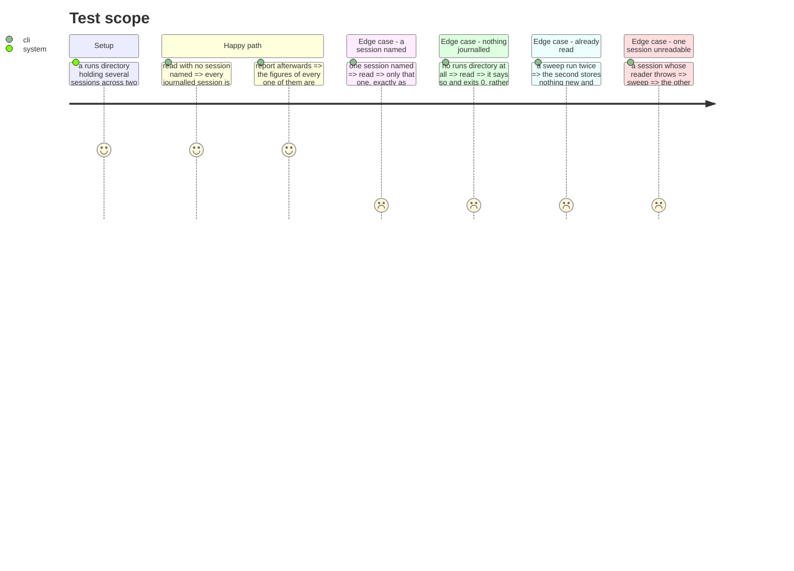

# Instruction: A flow with no identifier in it

## Architecture projection

> Tree of the final files. ✅ create · ✏️ modify · ❌ delete

```txt
.
└── cli/
    ├── src/application/use-cases/telemetry/read-local-cost-use-case.ts  ✏️ every session, or one by name
    ├── src/application/commands/telemetry.ts                            ✏️ --session becomes optional
    ├── src/application/display/telemetry-display.ts                     ✏️ what a sweep reports
    └── tests/…                                                          ✅ ✏️
```

## User Journey



## Test Scope



## Tasks to do

### `1)` Let the journal say which sessions exist

> `--session` is a required option and nothing tells a user their session identifier. The journal has known every one of them since it was written, and the port to enumerate them already exists and is called by nothing.

1. With no session named, read every session the journal knows.
2. `--session` keeps working unchanged, for one session by name.
3. A session the journal names but no tool can read is reported, not skipped silently.

### `2)` Make a sweep say what it did

> A sweep that prints one line per tool per session is unreadable; one that prints nothing is untrustworthy.

1. How many sessions were considered, how many yielded records, how many were already stored.
2. What each tool gave across the sweep, in the same four-or-five answers one session already uses.
3. A sweep that read nothing because nothing was journalled says that, and exits 0.

### `3)` Keep a sweep from being all-or-nothing

> A pass over twenty sessions has twenty chances to meet the failure phase 1 contained. Containment per tool is not the same as containment per session.

1. A session that cannot be read costs that session and no others.
2. Assert it over a sweep where one session's reader throws.
3. Nothing is recorded as read that was not, so a later sweep picks up what this one missed.

## Test acceptance criteria

| Task | Acceptance criteria                                                                                     |
| ---- | ---------------------------------------------------------------------------------------------------------- |
| 1    | With no session named, every journalled session is read                                                    |
| 1    | With a session named, only that session is read                                                            |
| 1    | A journalled session no tool can read is reported rather than skipped                                      |
| 2    | The output says how many sessions were considered and how many yielded records                             |
| 2    | A sweep with nothing journalled says so and exits 0                                                        |
| 2    | A second sweep stores nothing new and says so                                                              |
| 3    | One session failing leaves the others read                                                                 |
| 3    | A later sweep stores what a failed one missed                                                              |
