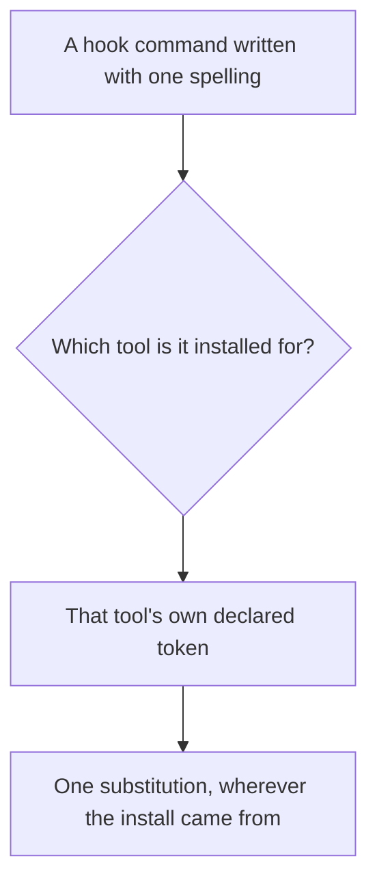
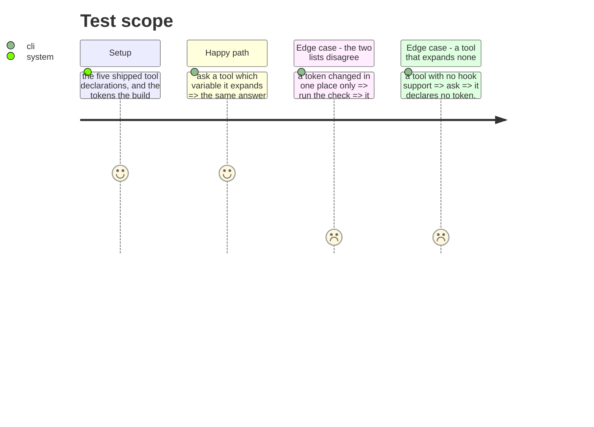

# Instruction: One place says which variable a tool expands

## Architecture projection

> Tree of the final files. ✅ create · ✏️ modify · ❌ delete

```txt
.
└── cli/src/
    ├── domain/tools/contracts.ts        ✏️ the token, beside the tool's other plugin facts
    ├── domain/tools/ai/*.ts             ✏️ five declarations, each already known
    └── application/use-cases/framework/strategies/tool-contracts.ts  ✏️ reads it rather than restating it
```

## User Journey



## Test Scope



## Tasks to do

### `1)` Move the token to where a tool describes itself

> It lives in a build strategy today, which is the one route that happens to need it. The other route needs the same fact, and copying it is how the two spellings start to drift.

1. Declare it beside the tool's other plugin facts, where anything installing for that tool can read it.
2. The build route reads the declaration instead of holding its own copy. Its behaviour does not change; only where it looks does.
3. A tool that runs no hooks declares no token. Absent is not a default value — it is the statement that nothing is substituted.

### `2)` Settle each token by watching a hook run, not by reading a declaration

> Declaring the wrong one installs a hook that runs and quietly resolves to nothing, which is the exact failure this ticket is about. Codex has been measured: it expands both spellings, so its declared `${PLUGIN_ROOT}` is right and the source spelling would have worked too. Cursor has not.

1. Record the Codex measurement beside the declaration, so the next person reads a fact rather than repeats the experiment.
2. Do the same for Cursor: run a hook under it carrying both spellings and see which resolves. Its token is the one value still taken on faith, and it is the tool whose hooks the substitution actually exists for. *Attempted and not obtained: two headless probes fired no plugin hook at all, and nothing in Cursor's config registers the plugins in its plugin directory. The declaration says so rather than implying a measurement.*
3. Claude Code's is its own by definition. Copilot's is what the build route ships; leave it, and say in the declaration that it is unmeasured rather than implying otherwise.

## Test acceptance criteria

| Task | Acceptance criteria |
| ---- | --------------------------------------------------------------------------- |
| 1    | Every tool that runs hooks declares the variable it expands                 |
| 1    | The build route substitutes the declared token, with no copy of its own     |
| 1    | A tool that runs no hooks declares none, and nothing is substituted for it  |
| 2    | Codex's and Cursor's declared tokens are ones a running hook resolved       |
| 2    | A token that was never measured is declared as such, not as a fact          |
