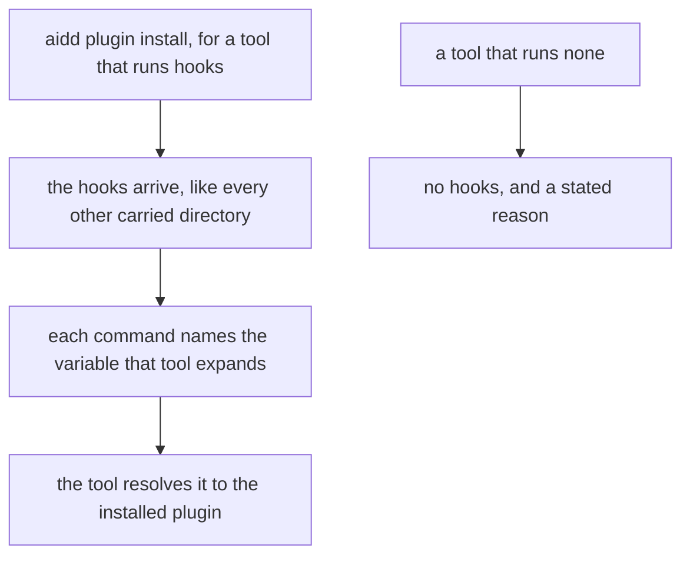
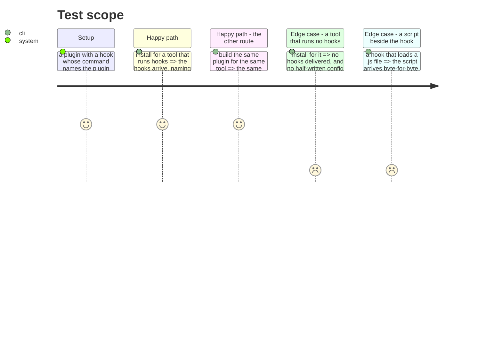

# Instruction: A tool that runs hooks receives them

## Architecture projection

> Tree of the final files. ✅ create · ✏️ modify · ❌ delete

```txt
.
└── cli/src/domain/
    ├── tools/ai/codex.ts                    ✏️ declares that it runs hooks
    ├── capabilities/plugins-capability.ts   ✏️ hook support is stated, not defaulted
    └── models/plugin-content-translator.ts  ✏️ substitutes the target tool's token
```

## User Journey



## Test Scope



## Tasks to do

### `1)` Say which tools run hooks, and stop defaulting the rest

> Three tools declare hook support today and a fourth runs them without saying so. It was never a decision — the field simply falls back to `false` when nobody writes it, so a tool nobody thought about loses its hooks quietly.

1. Codex declares that it runs plugin hooks. That it does is not in question: its own config records a plugin hook, by name, on a machine where one is installed.
2. Every tool states its hook support rather than inheriting a default, and a tool that runs none says why in the same place — the same shape the readers already use for a tool they cannot read.
3. A tool that cannot host a plugin at all still cannot run hooks — that `false` is a consequence, not a default, and stays. What must change is its reason, hardcoded today to name OpenCode, so a second such tool does not inherit the wrong explanation.
4. Removing the fallback will make some tool's silence into a failure. That is the point: fix each one by declaring what is true of it, never by restoring the default.

### `2)` Translate the plugin root variable on the route that forgets to

> One route substitutes it and the other does not, which is the whole bug. A hook that arrives naming another tool's variable is worse than an absent one: it installs, it runs, and it silently does nothing.

1. The translation route substitutes the target tool's declared token, exactly as the build route does, using the same rewrite rather than a second one.
2. It applies to hook commands, and to anything else carried prose-side that names the root. A script carried verbatim stays verbatim — the prose/artefact split already decides which is which, and this must not reopen it.
3. A tool that declares no token has nothing substituted, and its content passes through unchanged.

### `3)` Decide what a skill should name, given the plugin root may not be set for it

> The substitution matches `${CLAUDE_PLUGIN_ROOT}` and nothing else, while every skill action in the telemetry plugin names it bare, as `$CLAUDE_PLUGIN_ROOT`, in a shell the skill itself spawns. Whether a tool exports that variable to a skill is a different question from whether it expands it in a hook command, and only the second has been measured.

1. Establish whether the variable is set when a skill's shell runs, per tool. Rewriting prose to a variable that is empty at skill time would trade one silent failure for another.
2. Where it is set, translate both spellings, so a skill that locates its own script finds it. Where it is not, the skill resolves its script another way and the action says how. *Measured on Codex: the shell a skill spawns has no plugin-root variable at all, so the skill searches each tool's plugin directory instead, installed plugins before the working directory.*
3. The rewrite's own documentation names Copilot's token as `${COPILOT_PLUGIN_ROOT}`; the declaration says `${PLUGIN_ROOT}`, and the declaration is what runs. Correct the prose.

## Test acceptance criteria

| Task | Acceptance criteria |
| ---- | ------------------------------------------------------------------------------- |
| 1    | A plugin installed for Codex carries its hooks                                   |
| 1    | A tool that runs no hooks receives none, and states why                          |
| 1    | No tool's hook support comes from a default                                      |
| 2    | An installed hook command names the target tool's own variable                   |
| 2    | The same plugin, built and installed, yields the same hook command               |
| 2    | A script beside a hook arrives byte-for-byte, its plugin root untouched          |
| 3    | A skill locates its own script after install, on every tool it was installed for |
| 3    | Every other `${...}` variable survives translation unchanged                     |
| 3    | No document names a token that differs from the one the tool declares            |
