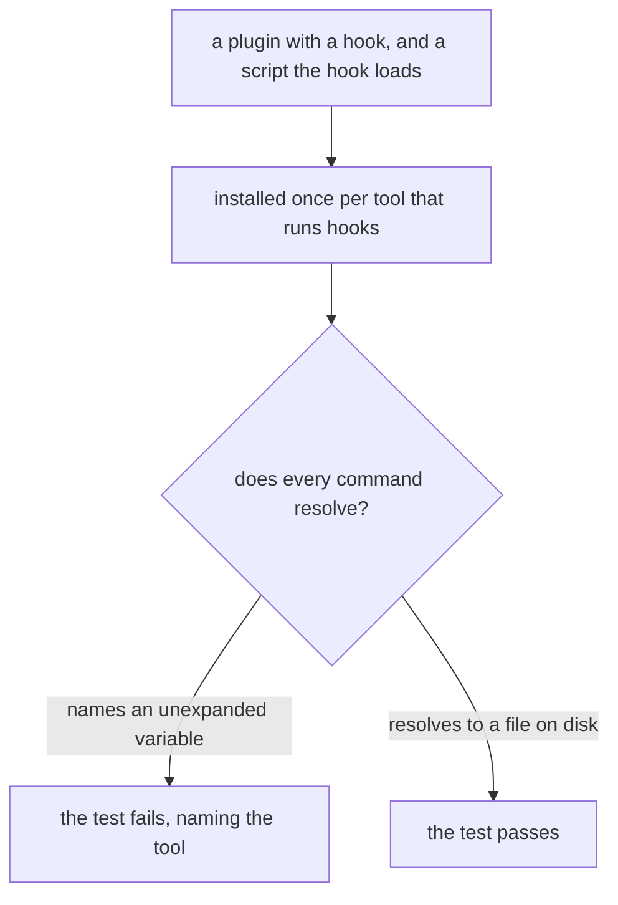
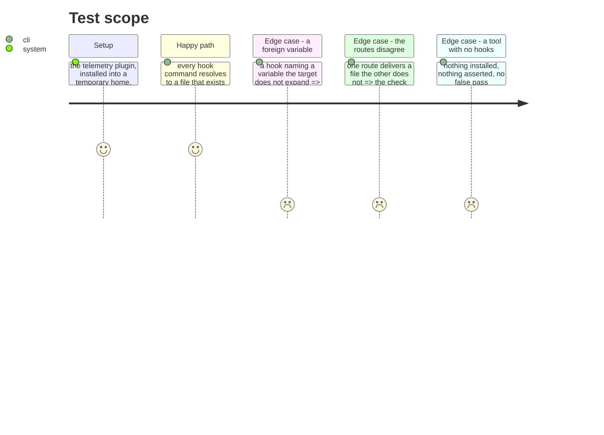

# Instruction: An installed hook is proven to resolve

## Architecture projection

> Tree of the final files. ✅ create · ✏️ modify · ❌ delete

```txt
.
└── cli/tests/
    ├── e2e/plugin-install-delivers-hooks.e2e.test.ts   ✅ installs for each tool, inspects what landed
    └── unit/…                                          ✏️ the declarations, and the two routes agreeing
```

## User Journey



## Test Scope



## Tasks to do

### `1)` Prove an installed hook resolves, not merely that it arrived

> Every failure in this ticket was silent, and each would have passed a test that only counted files. What was never checked is the one thing that matters: that the command a hook carries points at something.

1. Install a plugin that owns hooks, once per tool that runs them, and check that each hook's command resolves to a file present in the installed plugin.
2. Resolution means expanding that tool's own variable. A command still naming an unexpanded variable after install is a failure, and the message says which tool and which variable.
3. Use the plugin that already ships hooks and a script beside them, so the test covers prose and artefact on the same install rather than a fixture invented for it.

### `2)` Hold the two routes to the same delivery

> They diverged because nothing compared them. Their outputs are not identical by design — one writes a bundle, the other writes into a tool's own layout — so the comparison is of what was delivered, not of where it landed.

1. For one plugin and one tool, compare the set of components each route delivers. Hooks arrive from both routes exactly when the tool runs hooks, and the same holds for every other carried directory.
2. Compare each hook command, which both routes must produce identically once the root is substituted. That is the part where they actually diverged, and the part a person can check by eye.
3. A component present on one route and absent from the other fails, naming it. This is what would have caught the hooks going missing, and the `bin/` directory before them.

### `3)` Say what a tool cannot do, where a person will read it

> A tool with no hooks is a fact about the tool, not an omission. It belongs where the tool's other limits are already written, in the same voice.

1. The plugin documentation states, per tool, whether hooks are delivered and which variable resolves them.
2. A tool that runs no hooks appears there with its reason, so the absence reads as known rather than as a gap.
3. No new document. This goes where a reader already looks for what a tool supports.

## Test acceptance criteria

| Task | Acceptance criteria |
| ---- | ------------------------------------------------------------------------- |
| 1    | Every installed hook command resolves to a file that exists               |
| 1    | An unexpanded variable fails the check, naming the tool                   |
| 1    | The same install covers a hook and a script beside it                     |
| 2    | Both routes deliver hooks exactly when the tool runs them                 |
| 2    | The same hook command comes out of either route                          |
| 2    | A component missing from one route fails, naming it                      |
| 3    | Every tool's hook support is documented, including those with none        |
