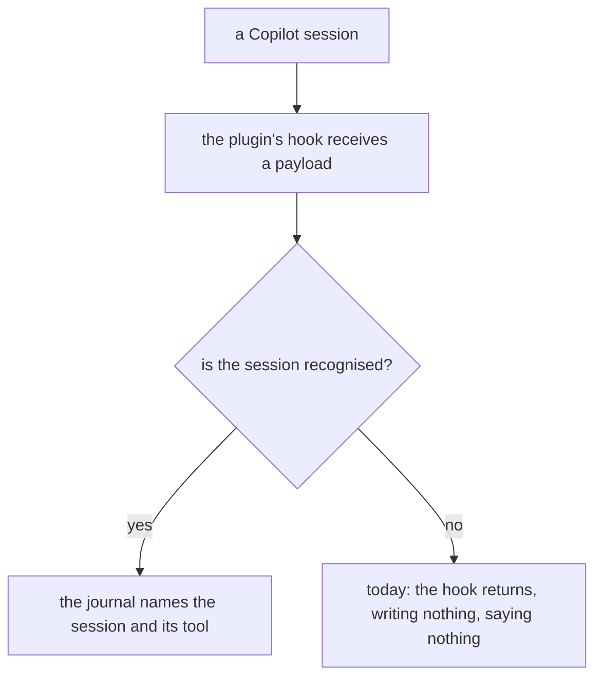
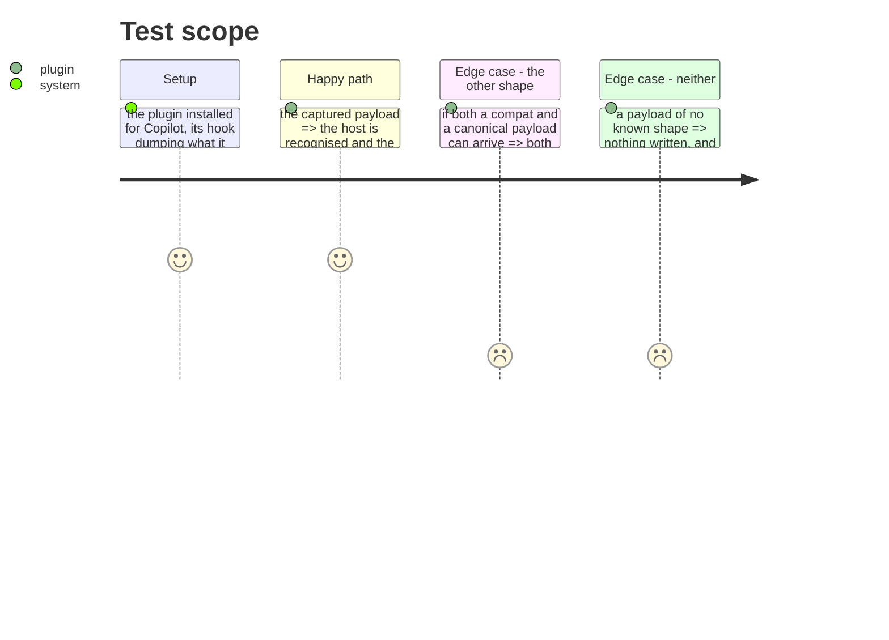

# Instruction: Copilot's own payload is the one we recognise

## Architecture projection

```txt
.
├── plugins/aidd-telemetry/hooks/lib/host.js   ✏️ recognises the shape that actually arrives
├── scripts/__tests__/fixtures/                 ✅ the captured payload, verbatim
└── scripts/__tests__/aidd-telemetry-journal.test.js  ✏️ fails if recognition regresses
```

## User Journey



## Test Scope



## Tasks to do

### `1)` Capture what Copilot actually sends

> The ticket's whole chain was read from a bundle of one version against a runtime of another. Reading it again is not evidence.

1. Install the plugin for Copilot into a throwaway home, have its hook record its stdin verbatim, and run one real session that uses a tool so more than one event fires.
2. Keep the payload as a fixture, one file per event, with the key set exactly as it arrived. Redact nothing that identifies the shape; redact anything that identifies a person.
3. Record which events fired and which did not. `SessionStart` on a deferred project-scope load is the one the ticket flags as uncertain, and the journal's first line depends on it.

### `2)` Recognise the shape that arrives, and say so where a reader looks

> `detectHost()` tests for `sessionId` and the absence of `hook_event_name`. If a compat payload arrives it has neither property, and the journal returns silently.

1. Recognise the captured shape. If both shapes can arrive, recognise both rather than assuming one.
2. A payload matching no known host writes nothing — that part is right — but the run must be able to say afterwards that a payload arrived and was not recognised, since today the two are indistinguishable from outside.
3. The per-tool facts in `docs/telemetry-limits.md` say what Copilot now supplies, with the measurement behind it. *Left untouched: the captured session used a Bash tool only, so nothing in it bears on what the doc claims about per-step breakdown.*

## Test acceptance criteria

| Task | Acceptance criteria |
| ---- | ------------------------------------------------------------------------- |
| 1    | A real Copilot payload is held as a fixture, key set unmodified           |
| 1    | Which events fired, and which did not, is written down                    |
| 2    | The captured payload is recognised as Copilot, and its session id read    |
| 2    | A test fails if recognition of that shape regresses                       |
| 2    | An unrecognised payload is distinguishable from no payload at all         |
