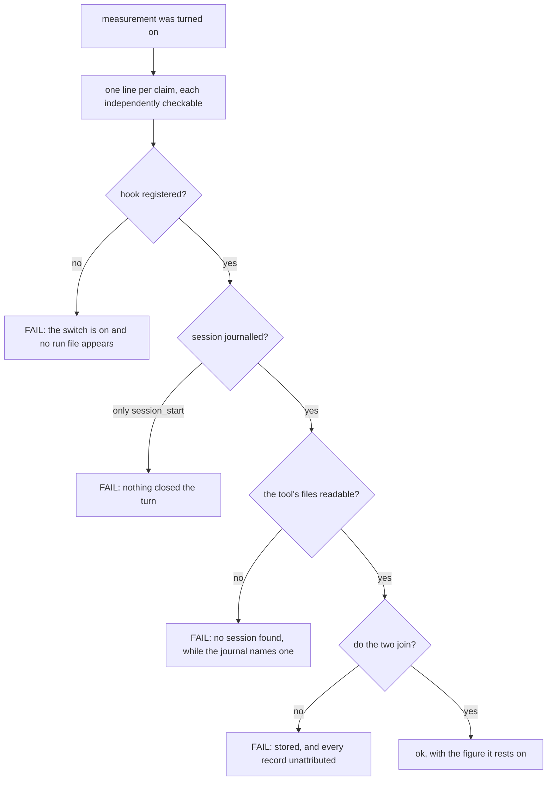
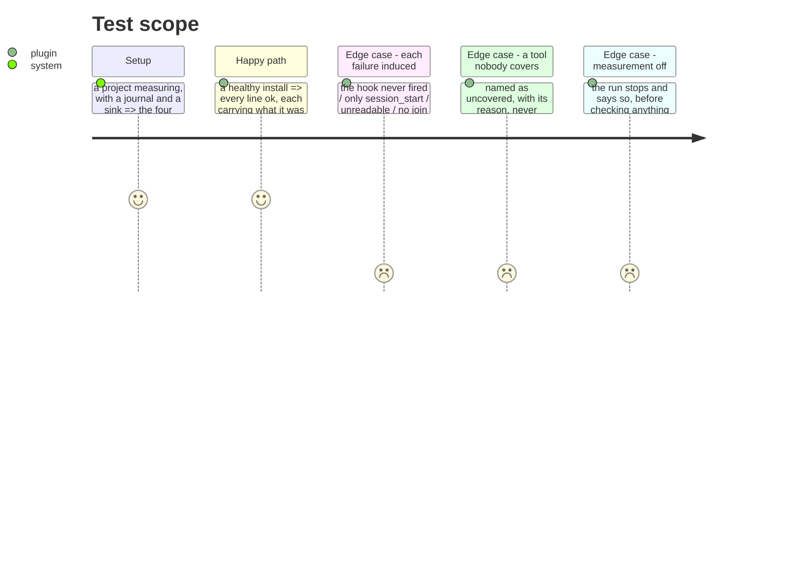

# Instruction: Each way the chain breaks is named as itself

## Architecture projection

```txt
.
└── plugins/aidd-telemetry/skills/02-check/   ✅ a skill that answers four questions
    ├── SKILL.md
    ├── actions/
    └── scripts/telemetry-check.js            ✅ its own script, like the other two skills
```

## User Journey



## Test Scope



## Tasks to do

### `1)` One skill, one question per line

> #617 asks for a diagnostic and #694 restates it against what now exists. Both say the same thing: it must check that a hook *fired*, not that a file exists.

1. A third skill under the telemetry plugin, owning only this question, running only its own script — the same rule the other two follow, and no call to the CLI.
2. One line per independently verifiable claim. No line that summarises the others, because a summary is where a failure hides.
3. Each ok carries what it was read from — the run file, the record count, the moment. A claim a person cannot check is a claim they have to believe.

### `2)` Make every failure distinguishable, by inducing it

> A zero is what a healthy period looks like when nothing happened. That ambiguity is the failure this milestone exists to remove.

1. Induce each of the four failures deliberately and assert the answer names that failure and not another.
2. A tool nothing here can read is named uncovered, with its reason, and never counted toward health.
3. Measurement off stops the run and says so first, rather than reporting four failures caused by the switch.

### `3)` Say what is not known

> Codex will not run a hook it has not been asked to trust, and says nothing. That is #699, and until it is fixed the diagnostic is the only place a person would find out.

1. Where a tool's hook can be installed and still not run, the diagnostic says the hook has never been observed firing rather than that the installation is broken.
2. The uncovered tools are listed from the same declaration the readers use, so a tool gained or lost is gained or lost in one place.

## Test acceptance criteria

| Task | Acceptance criteria |
| ---- | --------------------------------------------------------------------------- |
| 1    | The skill runs its own script, and reaches neither the CLI nor another skill |
| 1    | Every line is one claim, and carries what it was read from                   |
| 2    | Each of the four failures is induced and named as itself                     |
| 2    | An uncovered tool is named with its reason and never counted as healthy      |
| 2    | With measurement off, the run stops and says that first                      |
| 3    | A hook never observed firing reads as such, not as a broken install          |
