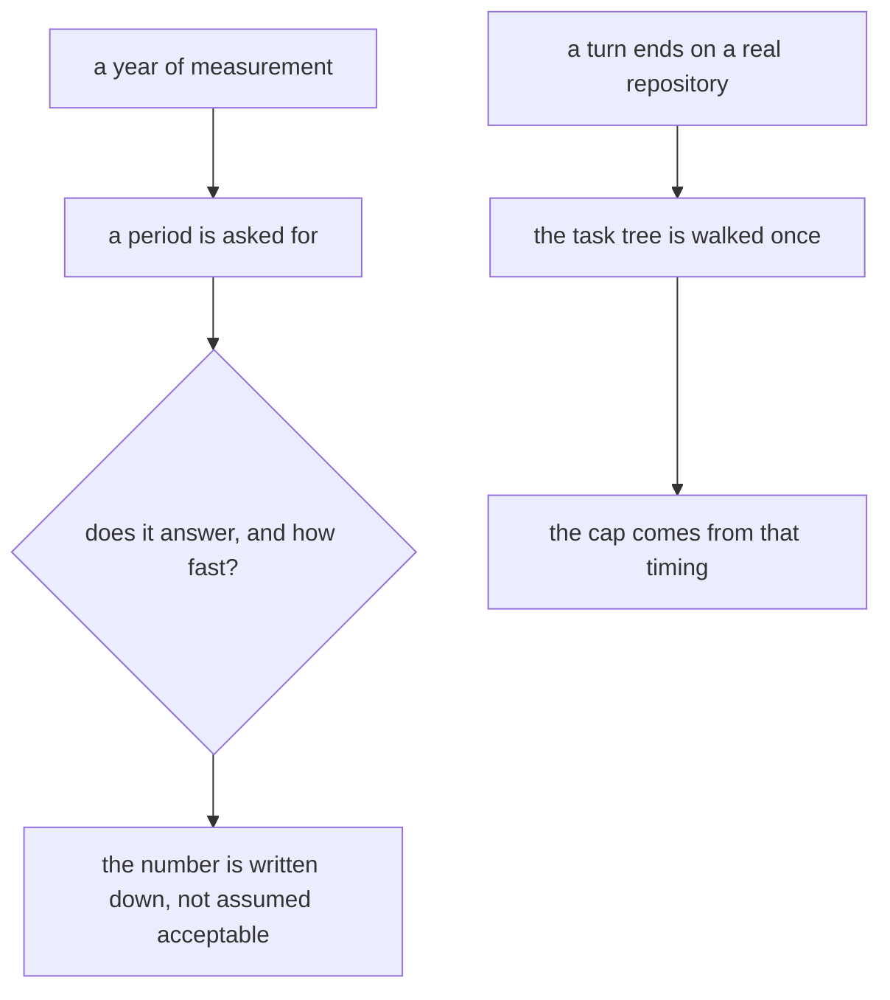
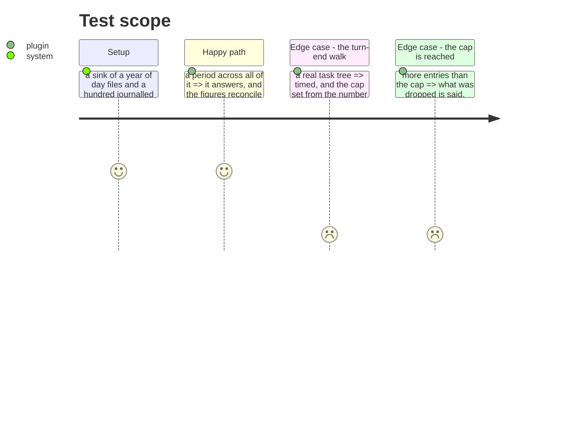

# Instruction: The layer has met a hundred sessions

## Architecture projection

```txt
.
├── scripts/__tests__/telemetry-cost-report.test.js   ✏️ a period holding a year of day files
├── plugins/aidd-telemetry/hooks/lib/file-writes.js   ✏️ a cap set from a measurement
└── aidd_docs/tasks/2026_08/2026_08_21_telemetry-v1-close/measurements.md  ✅ the numbers, written down
```

## User Journey



## Test Scope



## Tasks to do

### `1)` Build a period nobody has run before

> Everything here has met three sessions. "It scales" is a hope with tests around it.

1. A sink holding a year of day files and a hundred journalled sessions, built from the same writer the hooks use rather than hand-written.
2. Ask for the period, the sweep and one task's breakdown. Each must answer, and the breakdown must reconcile to the total exactly — micro-dollars exist for this.
3. Write the timings down. A number in a document is a thing the next person can compare against.

### `2)` Set the turn-end cap from a measurement

> The observed pass walks the task tree once per turn, capped at 2000 entries, on a number nobody measured.

1. Time the walk on a repository with a real task tree, at the size this repository actually has.
2. Set the cap from that timing, and say in one line what the number came from.
3. When the cap is reached, what was dropped is said. Silent truncation reads as complete coverage.

## Test acceptance criteria

| Task | Acceptance criteria |
| ---- | ------------------------------------------------------------------- |
| 1    | A hundred sessions over a year of day files answer                  |
| 1    | The breakdown reconciles to the total exactly                       |
| 1    | The timings are written down                                        |
| 2    | The cap is justified by a timing, in one line                       |
| 2    | Reaching the cap says what was dropped                              |
