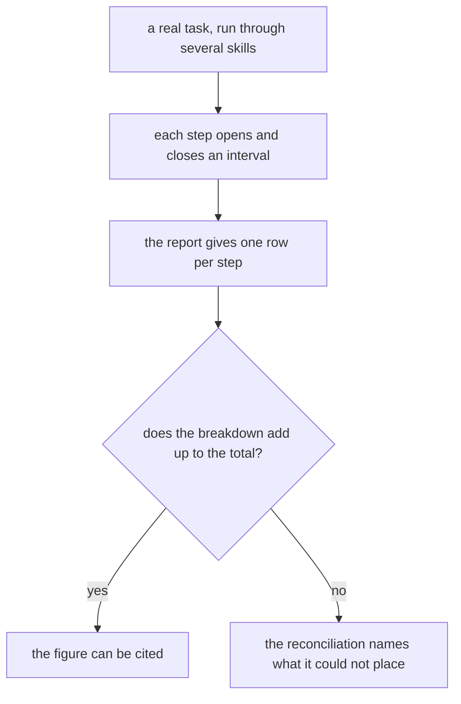
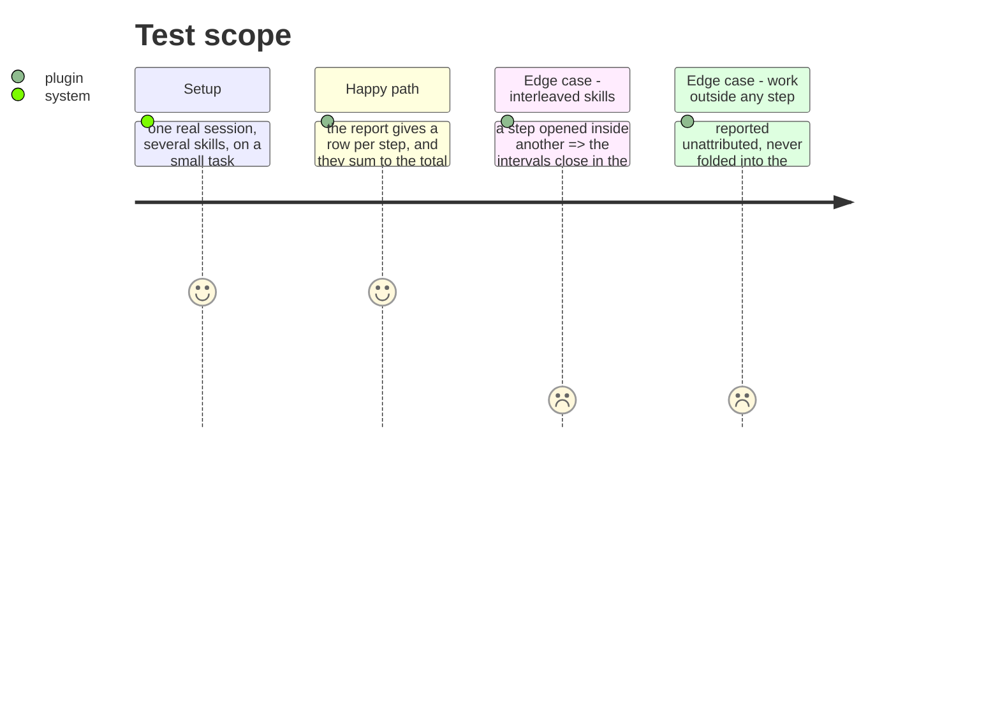

# Instruction: A real multi-step flow reconciles

## Architecture projection

```txt
.
└── aidd_docs/tasks/2026_08/2026_08_21_telemetry-v1-close/
    └── measurements.md   ✏️ what a real SDLC chain cost, step by step
```

## User Journey



## Test Scope



## Tasks to do

### `1)` Run one real chain and read it back

> One skill gives two rows. Interval closing, reconciliation across steps and interleaving stop being unit tests only when a real chain produces them.

1. Run a real multi-step flow on a small task, on a tool where the chain is proven.
2. Read it back: one row per step, and the rows sum to the total. What cannot be placed reads unattributed rather than being folded into the nearest step.
3. Write down what it cost, per step and in total, as the first citable figure this layer has produced.

### `2)` Close the milestone on evidence

> The epic asks that one skill answer what a task cost and prove no session was silently lost. Both halves now exist; this is where they are shown together.

1. The diagnostic and the report are run against the same real task, and their answers agree about which sessions exist.
2. Each of the epic's boundaries is stated as met or deliberately excluded, with the tool coverage as it actually stands rather than as it was scoped.
3. What remains open is named, so closing the milestone is not read as claiming the excluded tools work.

## Test acceptance criteria

| Task | Acceptance criteria |
| ---- | ------------------------------------------------------------------------ |
| 1    | A real multi-step flow reports one row per step                          |
| 1    | The breakdown reconciles to the total                                    |
| 1    | Work outside any step reads unattributed                                 |
| 2    | The diagnostic and the report agree on which sessions exist              |
| 2    | Every epic boundary is stated as met or excluded, against real coverage  |
