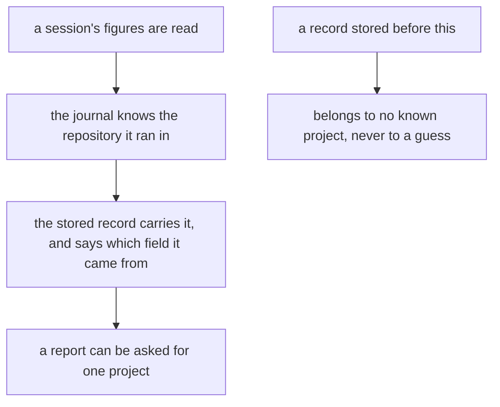
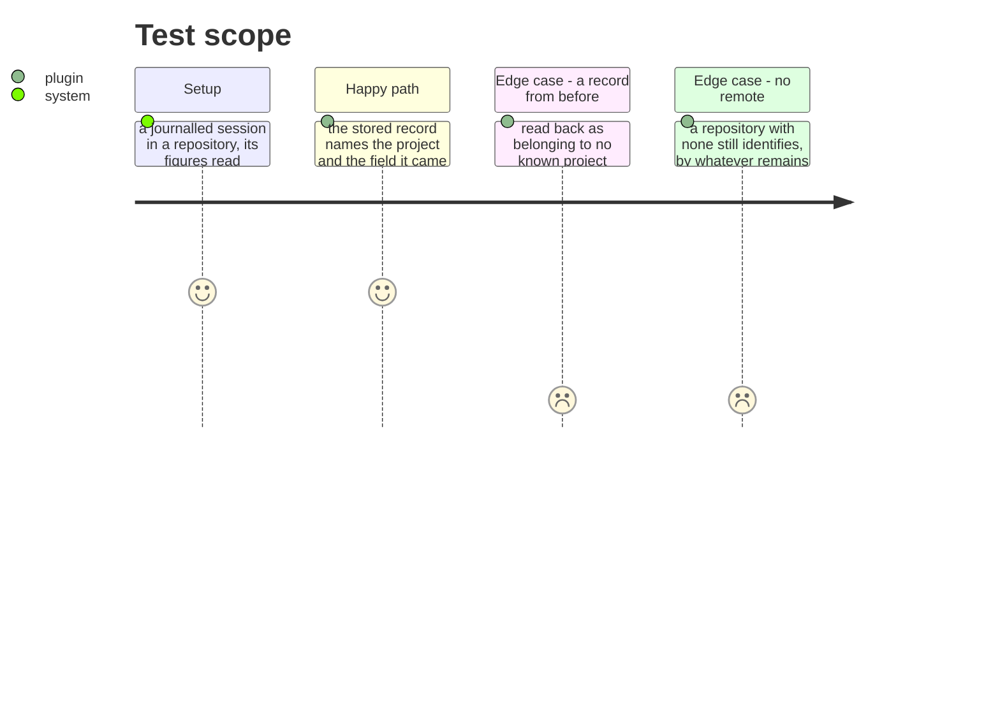

# Instruction: A record knows which project it came from

## Architecture projection

```txt
.
├── plugins/aidd-telemetry/skills/01-cost/scripts/telemetry-report.js  ✏️ carries the project onto the record
└── plugins/aidd-telemetry/skills/01-cost/scripts/lib/journal.js       ✏️ surfaces what session_start already holds
```

## User Journey



## Test Scope



## Tasks to do

### `1)` Carry a fact that already exists one hop further

> `session_start` resolves `project_id` and `project_remote` for the repository the hook fired in. The record the sink stores carries neither, so a machine-level sink mixes every repository worked on and nothing can separate them.

1. The stored record names the project, taken from the journal entry the figures were joined against — never re-derived from wherever the reader happens to be standing.
2. It says which field identified it, the way `vendor_field` already names where an identifier came from. `project_id` is a directory name that collides across machines; `project_remote` is absent without a remote. A consumer must be able to tell which it got.
3. A session with no journal entry gets no project. That is the honest answer and it must not be filled in.

### `2)` Leave the past alone, visibly

> Records already stored have no project, and there is no way to learn one for them.

1. A record without the field reads as belonging to no known project, and is counted as such rather than dropped.
2. It is never attributed to the current repository. A figure that looks placed and is guessed is worse than one that says it does not know.

## Test acceptance criteria

| Task | Acceptance criteria |
| ---- | ------------------------------------------------------------------- |
| 1    | A stored record names its project and the field it came from        |
| 1    | A session with no journal entry stores no project                   |
| 2    | A record from before reads as no known project, and is not dropped  |
| 2    | No record is attributed to the reader's own repository              |
