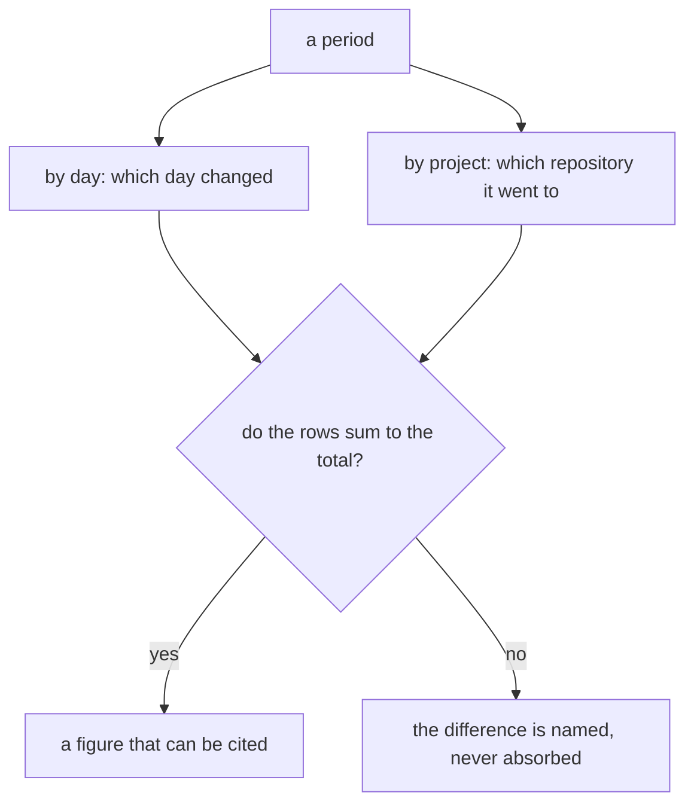
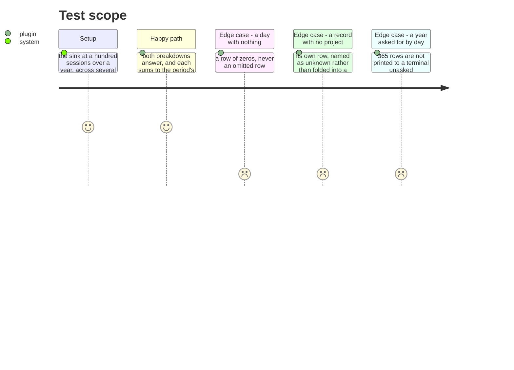

# Instruction: A period breaks down by day and by project

## Architecture projection

```txt
.
└── plugins/aidd-telemetry/skills/01-cost/scripts/lib/
    ├── report.js   ✏️ two more groupings over data already held
    └── render.js   ✏️ and how each reads
```

## User Journey



## Test Scope



## Tasks to do

### `1)` Group over what is already there

> Every record carries the moment the work ran and, after phase 1, the project it ran in. These are groupings, not measurements.

1. `by_day` and `by_project` join the three breakdowns that exist, in the text rendering and in the envelope, under a version that says the shape changed.
2. Each sums to the period's total exactly — whole integers and whole micro-dollars, `assert.equal`, no tolerance. That exactness is why money is stored the way it is.
3. A record with no project gets its own row, named as unknown. Folding it into a neighbour would place a figure that was never placed.

### `2)` Make the empty and the enormous both readable

> A gap in a series reads as continuity, and a year asked for by day is 365 rows.

1. A day on which nothing ran is a row of zeros. It is the one place a zero is the truth rather than the lie this layer usually guards against.
2. A long period does not print a row per day to a terminal unless asked. The envelope always carries them; the reading for a person is what has to stay legible.

## Test acceptance criteria

| Task | Acceptance criteria |
| ---- | --------------------------------------------------------------- |
| 1    | `by_day` and `by_project` appear in both renderings             |
| 1    | Each sums to the period's total exactly                         |
| 1    | A record with no project has its own row, named as unknown      |
| 2    | A day with no work is a row of zeros, never omitted             |
| 2    | A long period stays readable for a person                       |
