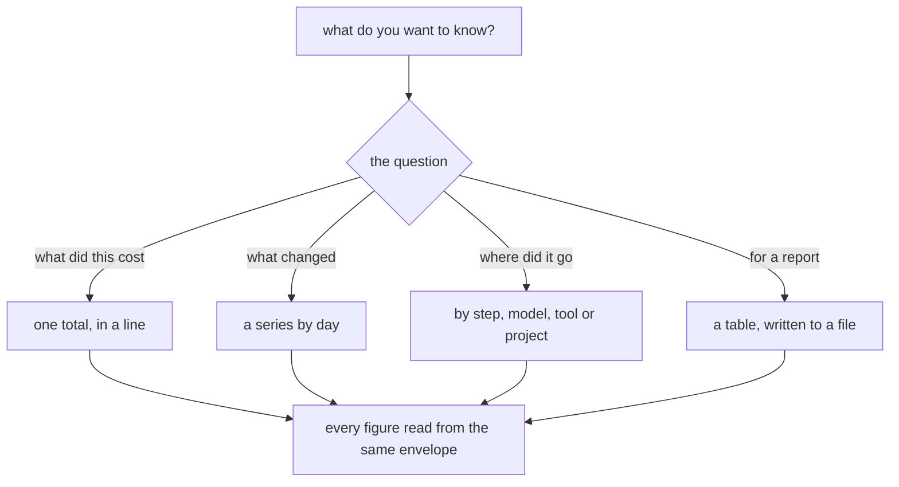
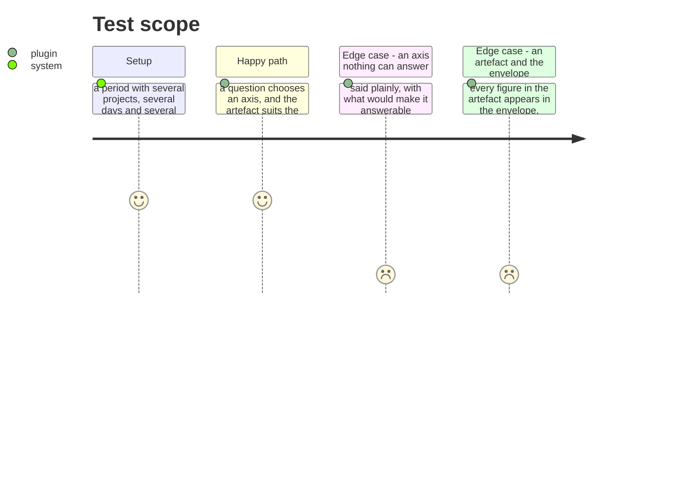

# Instruction: A skill asks the question and hands back an artefact

## Architecture projection

```txt
.
└── plugins/aidd-telemetry/skills/01-cost/
    ├── SKILL.md      ✏️ the question comes first, the axis follows from it
    └── actions/      ✏️ choose the axis, then render what that answer deserves
```

## User Journey



## Test Scope



## Tasks to do

### `1)` Ask what the question is, not which flag to pass

> Someone asking what last month cost does not know which axis answers them. A menu of flags moves the burden onto the person who came for an answer.

1. The skill offers the axes in the language of the question — what did this cost, what changed, where did it go, and for whom or what — and derives the flags itself.
2. A question nothing can answer is said plainly, with what would make it answerable. Per person is the one that exists today, and its reason is that nothing records an identity.
3. The skill computes nothing. It reads the envelope, exactly as it does now.

### `2)` Write the artefact the answer deserves

> A total to quote, a series to see a spike in, and a table to paste into a report are three different things, and printing one shape leaves the reader to reformat.

1. Each axis gets a rendering suited to it, written to a file where a file is what was asked for, and shown inline where it is not.
2. Every figure in an artefact appears in the envelope, identically. A rendering is a rendering — the moment it computes anything, it can disagree with its own total.
3. An artefact says the period and the axis it came from, so a figure that outlives the session that made it can still be placed.

## Test acceptance criteria

| Task | Acceptance criteria |
| ---- | -------------------------------------------------------------------- |
| 1    | A question selects the axis, without the person naming a flag         |
| 1    | An unanswerable axis is named, with what would make it answerable     |
| 1    | The skill reads the envelope and computes nothing                     |
| 2    | Each axis produces a rendering suited to it                           |
| 2    | Every figure in an artefact matches the envelope exactly              |
| 2    | An artefact states its period and its axis                            |
