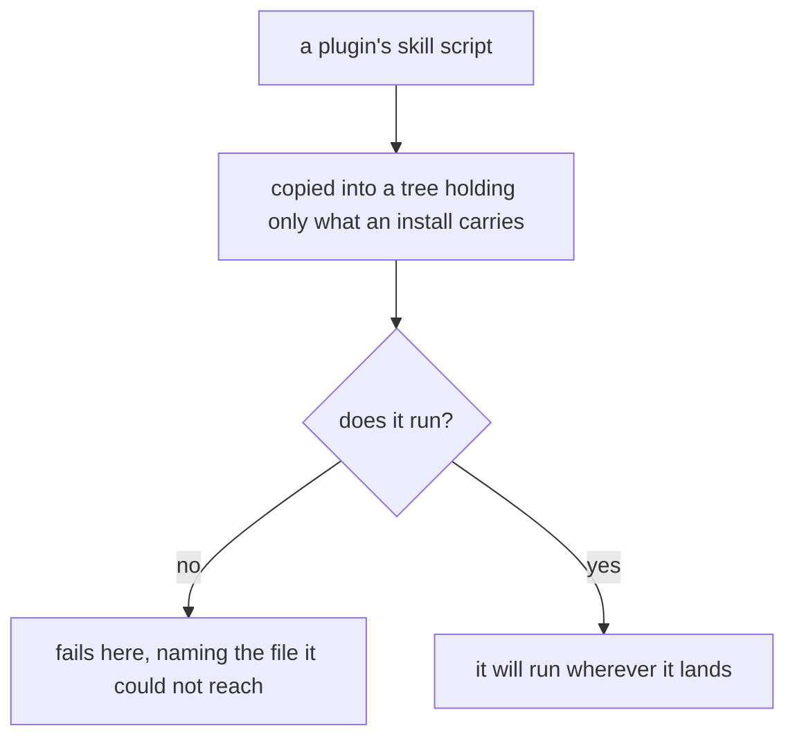
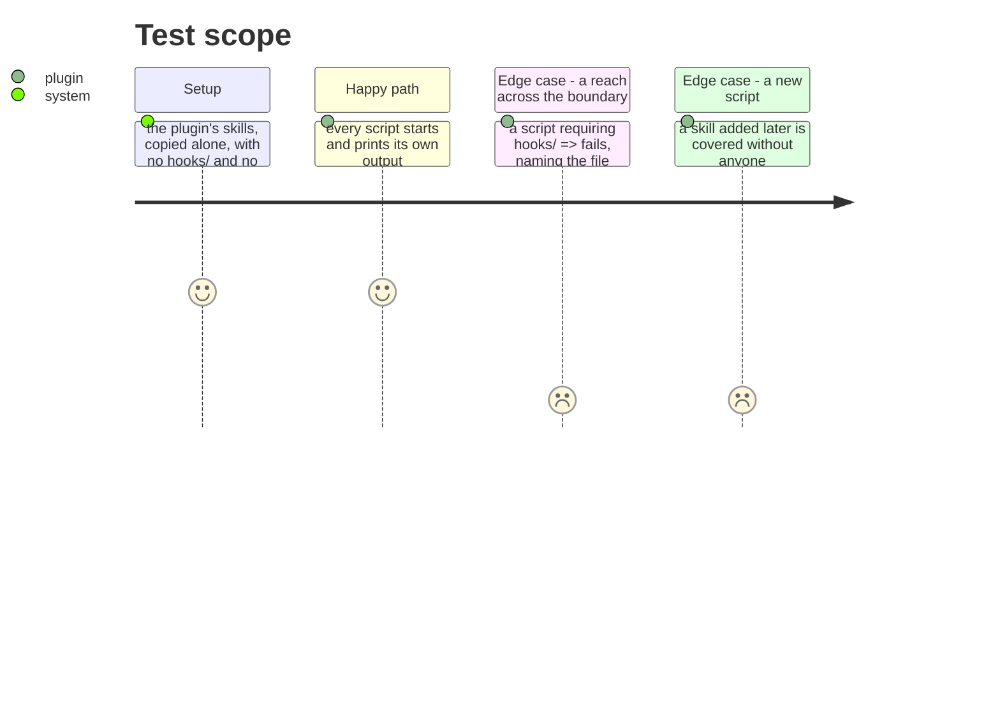

# Instruction: A script runs from the tree an install actually carries

## Architecture projection

```txt
.
└── scripts/__tests__/
    └── plugin-install-shape.test.js   ✅ every skill script, run from a copy of what ships
```

## User Journey



## Test Scope



## Tasks to do

### `1)` Run each script from a copy, not from the source tree

> A script that requires across `hooks/` died at load on a tree that had no `hooks/`, and 310 tests passed over it. Every one of them runs from the repository, where the directory it reached for happens to exist.

1. Copy the plugin's `skills/` alone into a temporary tree — what the flat translation route delivers, nothing else — and run every script it holds.
2. A script that cannot start fails here, and the message names the file it could not reach. A stack trace is not a test result.
3. Discover the scripts by walking `skills/*/scripts/`, so a skill added later is covered without anyone remembering.

### `2)` Cover the shape the native route delivers too

> The flat route is not the only one. A native install places the same scripts beside a `hooks/` directory at a different depth, and a relative path that works in the repository can still miss there.

1. Build the second shape from the translator's own output rather than by hand, so the test cannot drift from what installs.
2. Assert what a person would check: the script runs and prints its own first line, not that a file exists. *The native shape is reconstructed, not observed: the translator is TypeScript with a constructor parameter property and `.js`-extension imports that resolve only against its compiled output, so a node:test file cannot drive it. The reconstruction is derived from the capability rule all four native tools resolve to.*

## Test acceptance criteria

| Task | Acceptance criteria |
| ---- | ------------------------------------------------------------------------ |
| 1    | Every skill script starts from a tree holding only `skills/`             |
| 1    | A script reaching outside it fails, naming the file                      |
| 1    | A script added later is covered without editing the test                 |
| 2    | The same holds for the shape a native install delivers                   |
