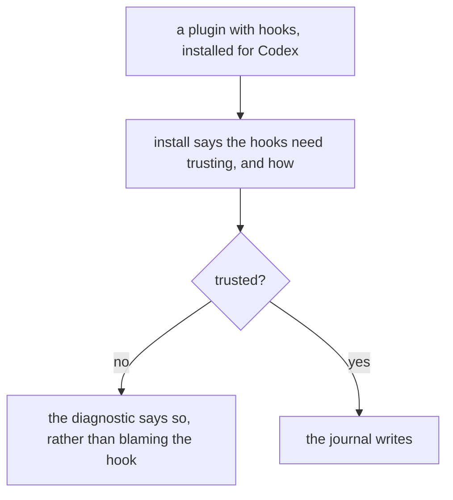
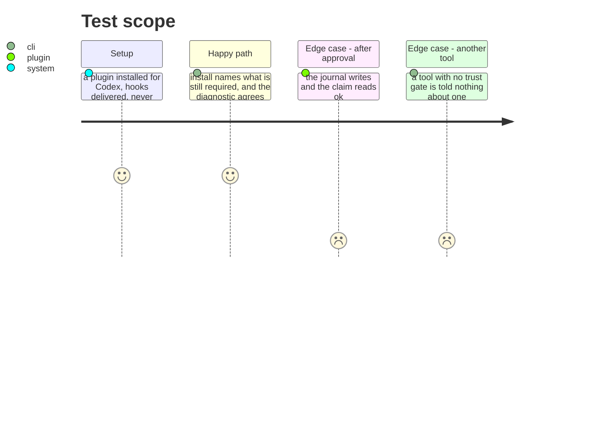

# Instruction: Codex says when it is holding a hook back

## Architecture projection

```txt
.
├── plugins/aidd-telemetry/skills/02-check/scripts/lib/diagnose.js  ✏️ a hook that exists and is not trusted
└── cli/src/…/plugin-add-use-case.ts                                ✏️ says at install what still has to happen
```

## User Journey



## Test Scope



## Tasks to do

### `1)` Say it at install, where a person is already looking

> Four consecutive sessions ran clean and wrote no journal before the flag that bypasses hook trust made the difference visible. Nothing in the install output hinted at it.

1. Installing a plugin that ships hooks for a tool that gates them says so, and says what grants it.
2. The text comes from the tool's own declaration, so a second gated tool does not need this written twice.
3. A tool with no such gate is told nothing — a warning that appears everywhere is read nowhere.

### `2)` Let the diagnostic tell "not trusted" from "never fired"

> They are opposite diagnoses today collapsed into one answer, and the wrong one is the one printed.

1. Where the trust state is readable from the tool's own configuration, read it and say a hook exists and is not trusted.
2. Where it is not readable, say that rather than guessing — an unread state is not an absent one.
3. Prove it by running Codex with the hook untrusted and then trusted, and reading both answers.

## Test acceptance criteria

| Task | Acceptance criteria |
| ---- | ---------------------------------------------------------------------- |
| 1    | Installing hooks for a gated tool names what still has to happen       |
| 1    | A tool with no gate is told nothing about one                          |
| 2    | An untrusted hook reads as untrusted, never as never fired             |
| 2    | Both answers come from a Codex session that was actually run           |
