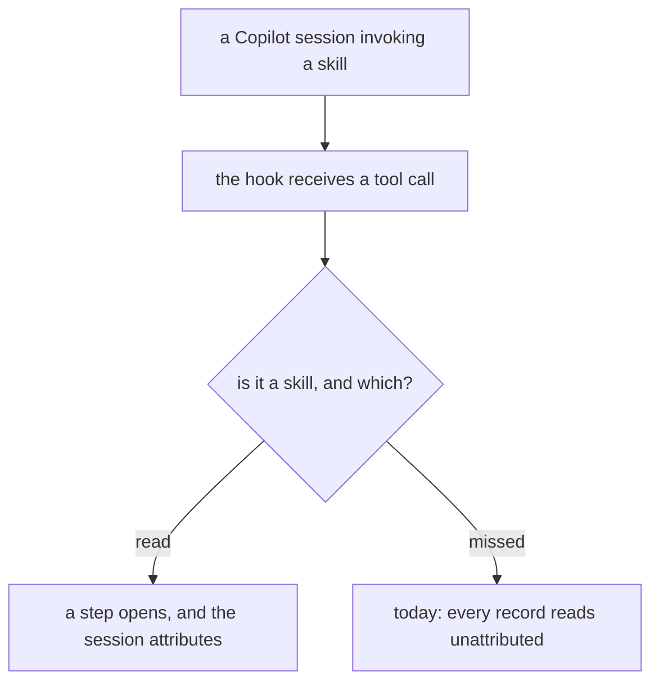
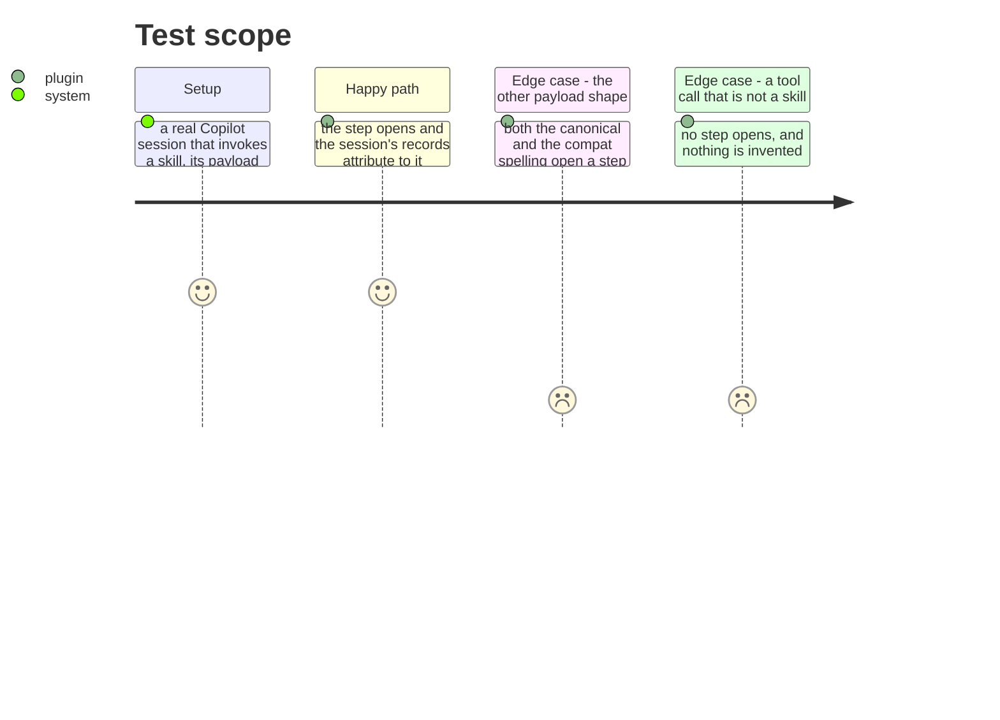

# Instruction: A Copilot session names the step it is in

## Architecture projection

```txt
.
├── plugins/aidd-telemetry/hooks/lib/step-starts.js   ✏️ reads the spelling Copilot actually sends
├── scripts/__tests__/fixtures/                        ✅ a captured skill call, not a tool call
└── docs/telemetry-limits.md                           ✏️ what Copilot supplies, and what it never will
```

## User Journey



## Test Scope



## Tasks to do

### `1)` Capture a skill call, not another tool call

> The capture that fixed recognition used a Bash tool. It settled the field names for a tool call and nothing about a skill call. Two values are still unknown: what the compat builder puts in `tool_name` for a skill, and where the skill's name sits inside `tool_input`.

1. Run a real Copilot session that invokes a skill, and keep its `PostToolUse` payload as a fixture.
2. Both shapes are in play. If only one can be produced, say which and leave the other unclaimed.
3. Guessing those two values would fail exactly as the last one did — silently, with a journal that looks healthy.

### `2)` Open the step, and say what a figure still cannot be

> Attribution and a figure are separate promises. This phase can keep the first and must be honest that the second is not coming from Copilot's own files.

1. The step reader recognises whichever spelling the capture carries, alongside the canonical one, and a test fails if either stops being recognised.
2. A Copilot session running a skill produces a `step_start` naming it, and its records attribute rather than reading unattributed.
3. `docs/telemetry-limits.md` states what Copilot supplies after this, and why no per-request figure exists in what it writes — the session-granularity route is a separate question, tracked separately.

## Test acceptance criteria

| Task | Acceptance criteria |
| ---- | ------------------------------------------------------------------------- |
| 1    | A real Copilot skill call is held as a fixture, key set unmodified        |
| 2    | A Copilot session running a skill opens a step naming it                  |
| 2    | Both payload shapes open a step, or the unclaimed one is named as such    |
| 2    | A tool call that is not a skill opens nothing                             |
| 2    | The limits document says what Copilot supplies, with the capture behind it |
