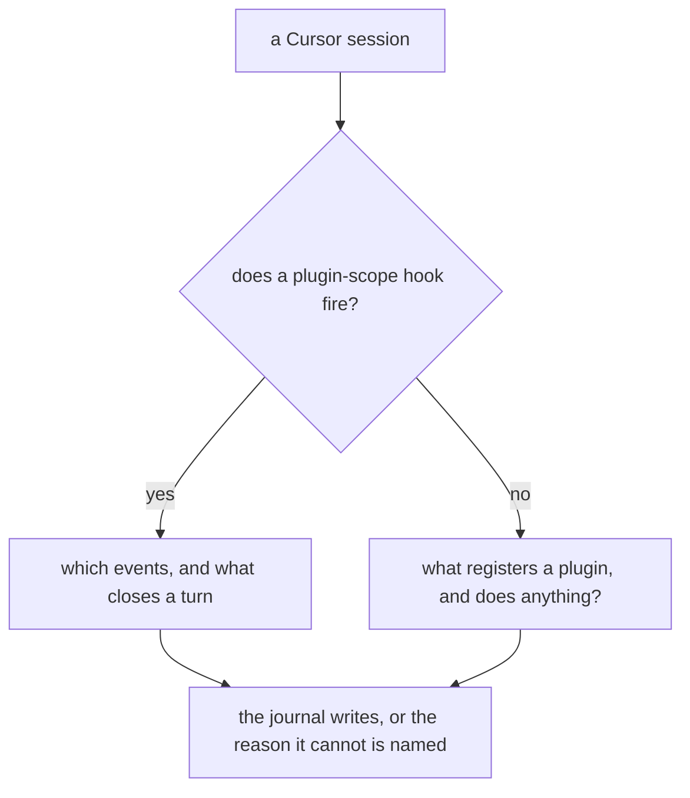
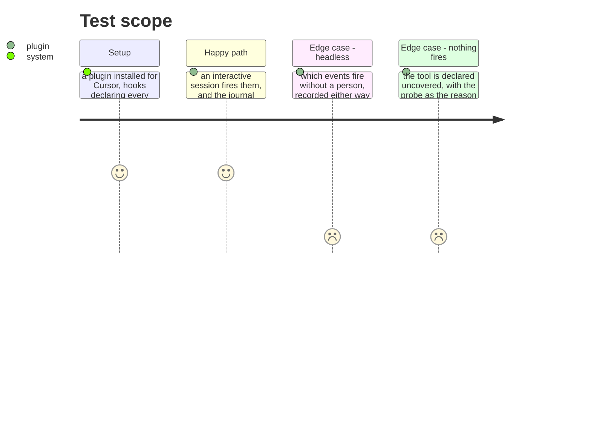

# Instruction: Cursor either runs a plugin hook, or is known not to

## Architecture projection

```txt
.
├── cli/src/domain/formats/flat-hooks-merge.ts   ✏️ only if a probe says the mapping is what is wrong
├── docs/telemetry-limits.md                      ✏️ what Cursor does, from a session
└── aidd_docs/tasks/…/measurements.md             ✏️ the probe, whatever it finds
```

## User Journey



## Test Scope



## Tasks to do

### `1)` Settle whether a plugin's hooks run at all

> Two headless probes fired nothing from plugin scope, while an earlier probe fired five of seven events from a project-scope file. That is a prior question to `stop` versus `sessionEnd`: if plugin hooks never run, mapping the event correctly changes nothing.

1. Probe interactively as well as headless — the difference between them is the first thing to establish, and one run settles both open questions at once.
2. Find what registers a plugin sitting in Cursor's plugin directory. Nothing in its configuration files named them, which is a finding either way.
3. Record what fired and what did not, per scope. This is a measurement, and its result may be that Cursor cannot journal.

### `2)` Act on what the probe found, and nothing more

> `CURSOR_EVENT_MAP` maps `Stop` to `stop` and has no entry for `sessionEnd`. Changing that before knowing whether `stop` ever fires would be guessing which of two events is the real one.

1. If plugin hooks fire and `stop` does not, map whatever marks the end of the work — and only after a probe shows the two are not both firing.
2. If plugin hooks never fire, Cursor is declared uncovered with the probe as its reason, in the same voice the other uncovered tools use.
3. Either way, `docs/telemetry-limits.md` says what Cursor does, from a session rather than from its documentation.

## Test acceptance criteria

| Task | Acceptance criteria |
| ---- | ------------------------------------------------------------------------ |
| 1    | What fires under Cursor is recorded per scope, interactive and headless  |
| 1    | What registers a plugin for Cursor is established, or stated as unknown  |
| 2    | A mapping changes only where a probe showed which event marks the end    |
| 2    | Cursor's entry in the limits document cites the session behind it        |
