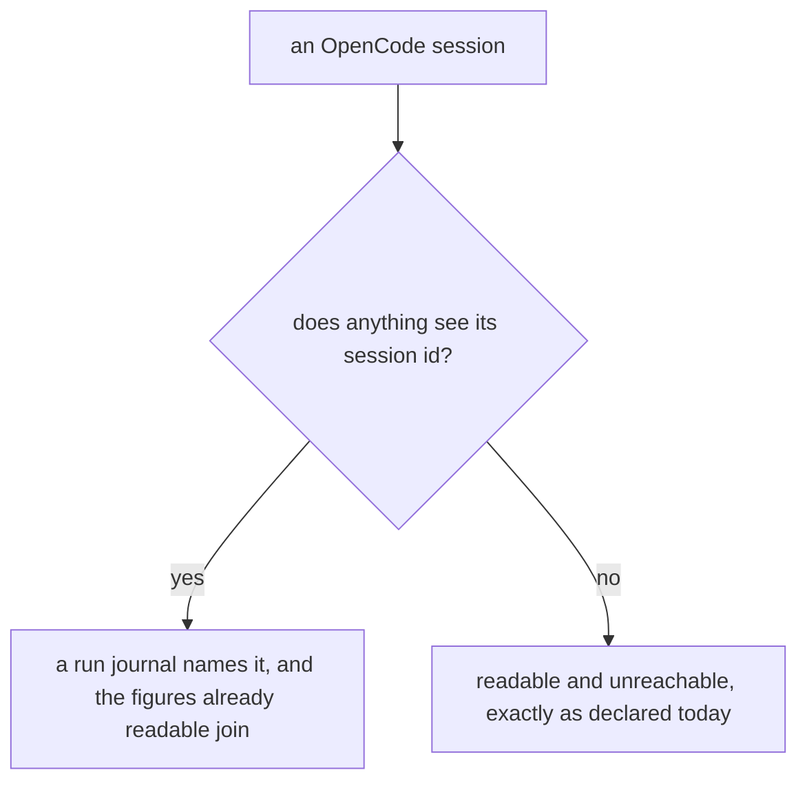
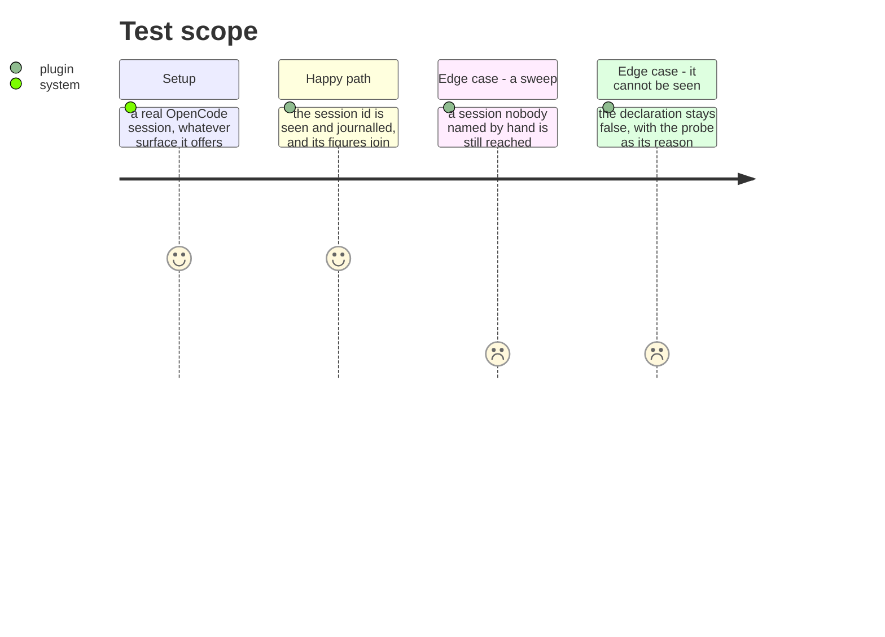

# Instruction: OpenCode's own session id reaches the journal

## Architecture projection

```txt
.
├── plugins/aidd-telemetry/…                      ✏️ or a plugin-API entry point, if hooks cannot serve
├── plugins/aidd-telemetry/skills/01-cost/scripts/lib/readers.js  ✏️ journalAttributable, once it is true
└── docs/telemetry-limits.md                       ✏️ what changed, and what did not
```

## User Journey



## Test Scope



## Tasks to do

### `1)` Find out what sees an OpenCode session

> `journalAttributable: false` means two things at once: no step from an interval, and a sweep never reaches one of its sessions. Its figures are readable and cannot be tied to anything.

1. Establish what surface OpenCode offers — its plugin runtime is JS modules and a declarative `hooks.json` means nothing to it, which is why the install skips them.
2. The question is narrow: does anything running inside a session see that session's own identifier. Answer it by running one, not by reading the API.
3. If it does, the journal gains a fourth tool. If it does not, the declaration stays false and gains a citation.

### `2)` Join it, or say precisely why it stays unjoinable

> The reader already produces figures for OpenCode. Only the join is missing, so this is a small change or an impossible one, and which is not yet known.

1. Where the identifier is seen, journal it in the shape every other tool uses, and let the existing reader join it unchanged.
2. Flip `journalAttributable` only when a sweep reaches an OpenCode session nobody named by hand — that is what the flag actually promises.
3. Where it is not seen, the reason in `readers.js` cites the probe rather than describing the API.

## Test acceptance criteria

| Task | Acceptance criteria |
| ---- | ----------------------------------------------------------------------- |
| 1    | Whether an OpenCode session sees its own id is settled by running one   |
| 2    | If it does, a sweep reaches that session without it being named by hand |
| 2    | If it does not, the declared reason cites the probe                     |
