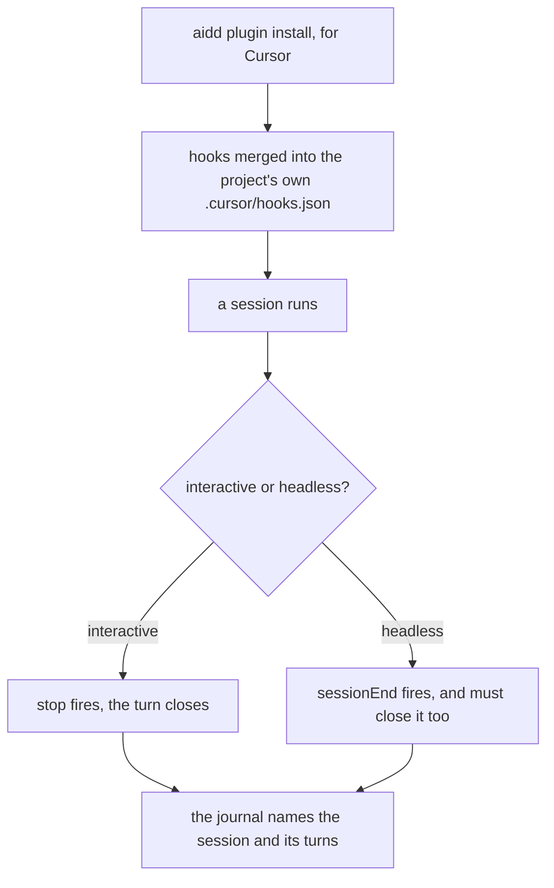
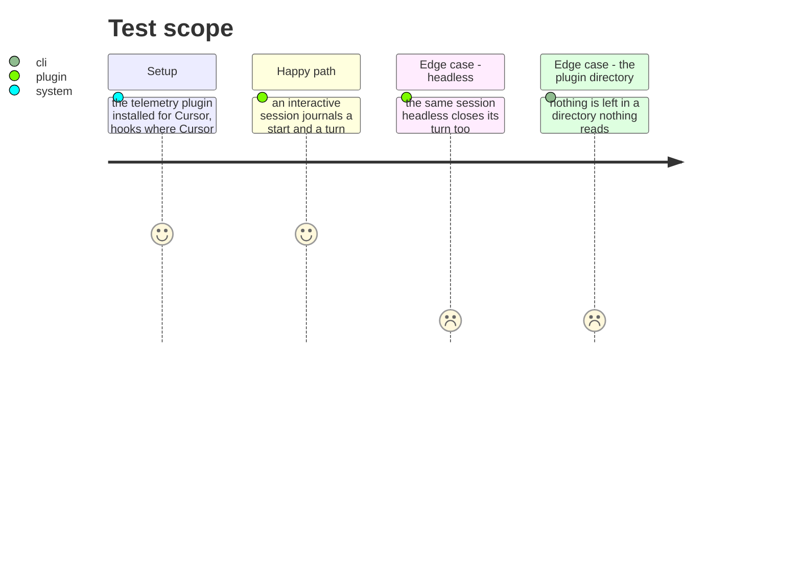

# Instruction: Cursor's hooks install where Cursor reads them

## Architecture projection

```txt
.
├── cli/src/domain/tools/ai/cursor.ts        ✏️ its hooks go to the file it reads
├── cli/src/domain/formats/flat-hooks-merge.ts ✏️ only the event a probe showed marks the end
└── plugins/aidd-telemetry/hooks/lib/repo.js ✏️ Cursor names its roots differently
```

## User Journey



## Test Scope



## Tasks to do

### `1)` Deliver hooks to the file Cursor actually reads

> Measured: a plugin-scope `hooks.json` fired nothing across three probes and every loading mechanism, while a project-scope `.cursor/hooks.json` fired and produced a real run file with Cursor's own conversation id. The obstacle was never Cursor.

1. Cursor's hooks go where the `cursor:flat` build target already puts them, while its skills and commands keep the placement they have. One tool, two destinations, because that is what the tool reads.
2. An install leaves nothing behind in a directory nothing reads — a file that is never loaded is worse than an absent one, because it looks installed.
3. Do not restructure what is not in the way. `installScope`, `pluginsDir` and the manifest are about skills and commands, and those work.

### `2)` Close a turn in both modes, from what each one fires

> Interactive fires `stop`, observed twice in one session. The one headless probe fired `sessionEnd` and not `stop`. `CURSOR_EVENT_MAP` maps `Stop` and has no `SessionEnd`, so a headless install would journal a start and never a boundary.

1. Establish, by running both, which events fire in each mode. One observation of each is what exists today and it is not enough to choose between them.
2. Subscribe to whatever closes a turn in each mode. If both fire in one mode, that is not a problem to design around — a run file already carries two `turn_end` lines from two real stops, and the reader tolerates it — but say so rather than discovering it later.
3. The plugin's own `hooks.json` and the event map change together, or one of them silently does nothing.

### `3)` Read the root the way Cursor names it

> Cursor's payload carries `workspace_roots`, not `cwd`. Every other host uses `cwd`, and the hook reads `cwd`, so the repository resolves by accident or not at all.

1. Resolve Cursor's root from the field Cursor sends, in the same per-host table the other differences already live in.
2. A host whose spelling is unknown keeps today's behaviour rather than gaining a guess.
3. This is what made the probe work; without it the rest of this phase journals nothing.

## Test acceptance criteria

| Task | Acceptance criteria |
| ---- | -------------------------------------------------------------------------- |
| 1    | Installing for Cursor writes hooks into the file Cursor reads              |
| 1    | Nothing is left in the plugin directory Cursor does not read               |
| 2    | An interactive Cursor session journals a start and a turn boundary         |
| 2    | A headless one does too, from whichever event fires there                  |
| 3    | Cursor's repository root resolves from `workspace_roots`                   |
| 3    | Every other host's resolution is unchanged                                 |
