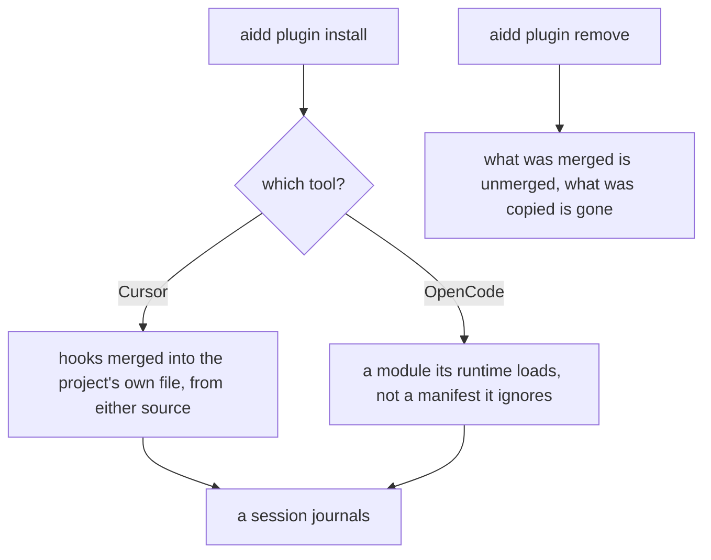
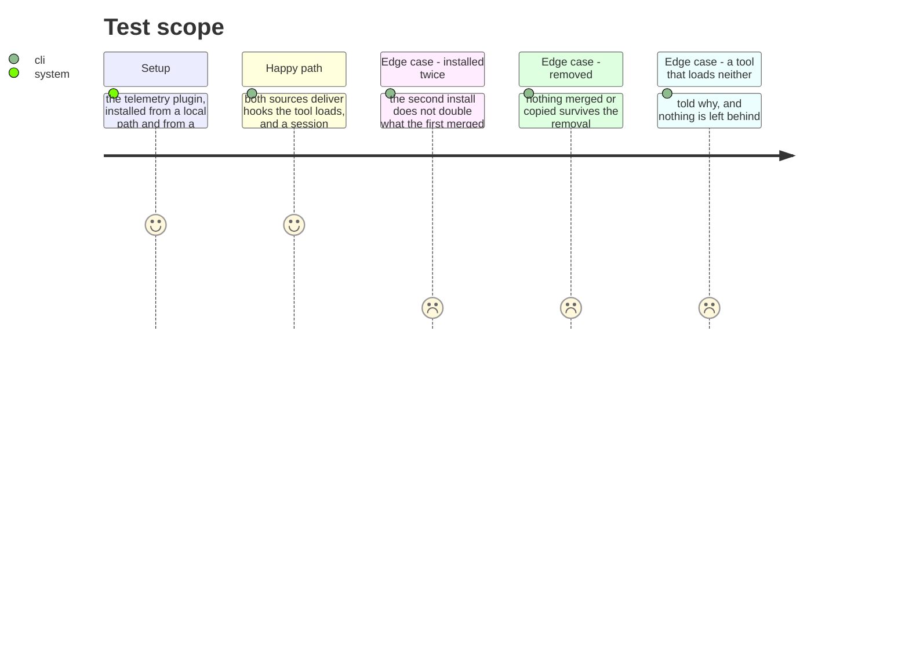

# Instruction: What was proven by hand is what an install delivers

## Architecture projection

```txt
.
└── cli/src/
    ├── domain/models/plugin-content-translator.ts   ✏️ OpenCode receives a runtime it can load
    ├── application/…/built-tree-materialization-translator.ts  ✏️ Cursor, from a marketplace too
    └── application/…/plugin-remove-use-case.ts      ✏️ what an install merged, a removal unmerges
```

## User Journey



## Test Scope



## Tasks to do

### `1)` Deliver OpenCode a runtime it can load

> Its journal was proven with a file placed by hand. `aidd plugin add` still says "hooks skipped for opencode", which was the right answer while a declarative manifest was all we had — its loader ignores those, and only runs a genuine ESM export.

1. An OpenCode install delivers the module its loader runs, in the directory its loader scans, instead of skipping the component.
2. The skip reason stops being a statement that hooks cannot work there. It becomes true or it goes.
3. Prove it by installing through the CLI and running a session — the hand-placed file proved the mechanism, and this task is about delivery.

### `2)` Make a marketplace install do what a local one does

> Cursor's hooks now reach the project's own file from a local path. From a marketplace they still land in the plugin directory nothing reads — the same failure, one route over, and now the only one left.

1. Both sources deliver to the same destination, decided by the tool's declaration rather than by which translator ran.
2. A test fails when the two routes disagree about where a tool's hooks go. Two routes drifting is how this ticket started.

### `3)` Undo what an install did

> A merge into a shared file is not a directory that can be deleted. Removing a plugin today leaves its entries in `.cursor/hooks.json` and its scripts beside them, and installing twice appends a second copy of both.

1. Removing a plugin removes what it merged and what it copied, and leaves every other plugin's entries untouched.
2. Installing the same plugin twice leaves one copy, not two.
3. Both are proven by installing and removing for real, not by reading the merge.

## Test acceptance criteria

| Task | Acceptance criteria |
| ---- | ---------------------------------------------------------------------- |
| 1    | An OpenCode install delivers a module its loader runs                  |
| 1    | A session after that install journals                                  |
| 1    | No message claims hooks cannot work there                              |
| 2    | A marketplace install puts Cursor's hooks where a local one does       |
| 2    | A test fails when the two routes disagree                              |
| 3    | Removing a plugin leaves nothing it merged or copied                   |
| 3    | Installing twice leaves one copy                                       |
