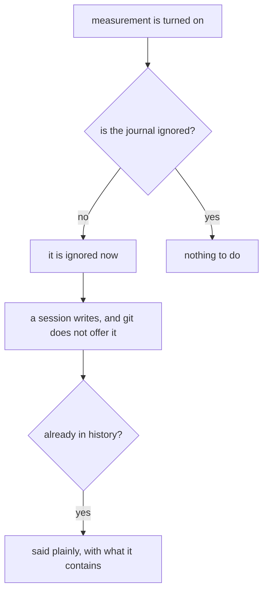
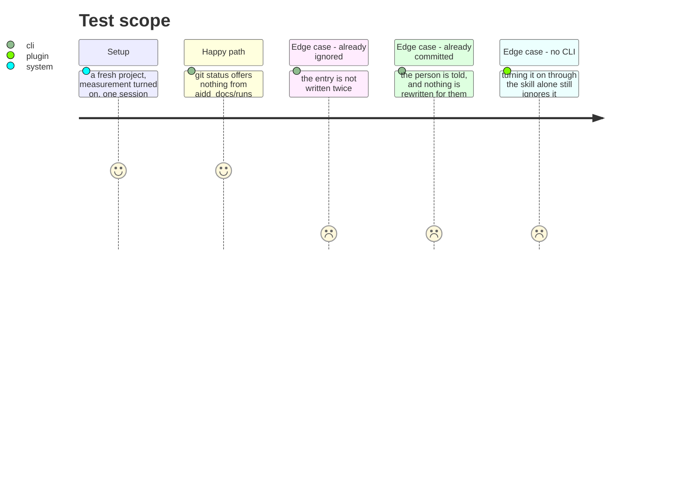

# Instruction: A journal is never offered to a commit

## Architecture projection

```txt
.
├── cli/src/application/use-cases/shared/post-install-pipeline-use-case.ts  ✏️ the journal joins the cache
└── plugins/aidd-telemetry/skills/00-init/                                   ✏️ turning it on ignores it, CLI or not
```

## User Journey



## Test Scope



## Tasks to do

### `1)` Ignore it wherever measurement gets turned on

> `aidd setup` writes one entry, `.aidd/cache/`. The plugin writes none at all. So the only project where the journal is ignored is the one where somebody typed it by hand — this one.

1. Turning measurement on adds the journal to the project's `.gitignore`, through the CLI and through the plugin's own switch alike. The plugin cannot call the CLI, so it does its own — the same rule the rest of the plugin follows.
2. The entry is not written twice, and an existing one is left as it is.
3. It covers the journal and nothing else. A directory ignored more widely than it needs is how a file someone wanted disappears.

### `2)` Say it when the horse has left

> Someone who turned measurement on before this exists may already have journal files in git history, and no edit to `.gitignore` reaches what is already tracked.

1. Where journal files are already tracked, say so, and say what they contain — who worked on what, for how long, and every file each session wrote.
2. Do not rewrite history and do not `git rm` anything. What to do about a commit that is already pushed is the person's decision.
3. Say it once, where they are already looking — at the moment measurement is turned on — not on every run afterwards.

## Test acceptance criteria

| Task | Acceptance criteria |
| ---- | ---------------------------------------------------------------------- |
| 1    | After turning measurement on, `git status` offers nothing from the journal |
| 1    | The same holds through the plugin's switch with no CLI installed        |
| 1    | An existing entry is not duplicated                                     |
| 2    | A journal already tracked is named, with what it contains               |
| 2    | Nothing is removed or rewritten on the person's behalf                  |
