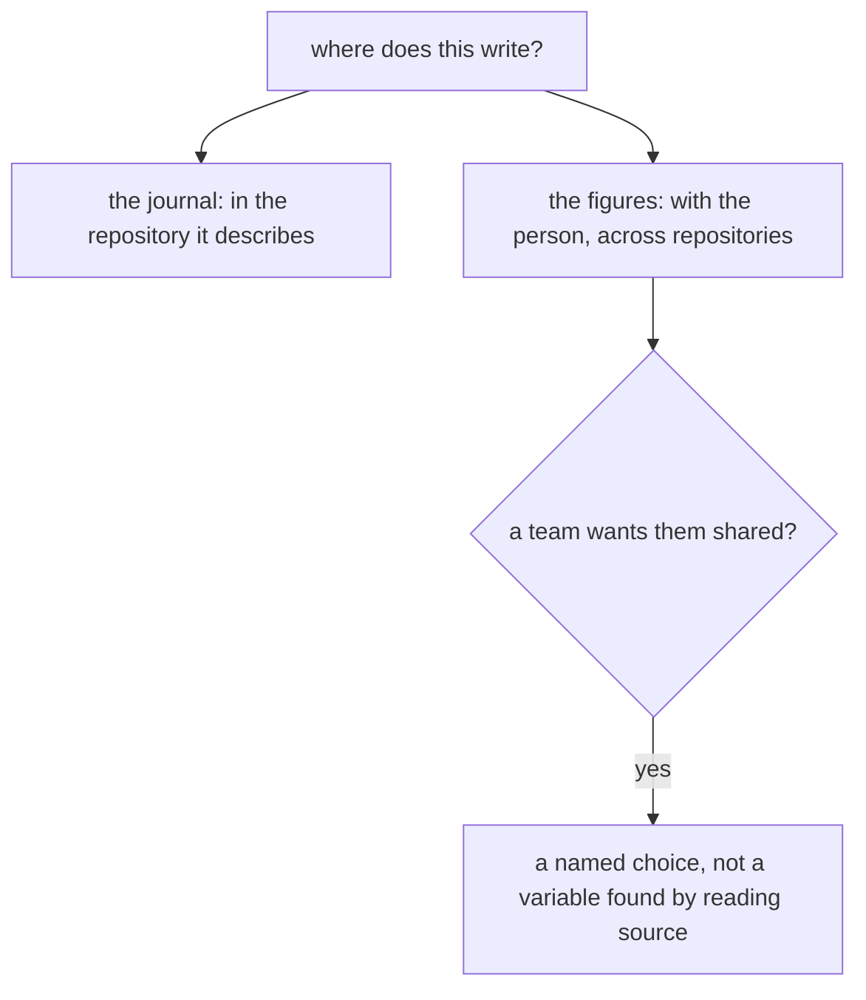
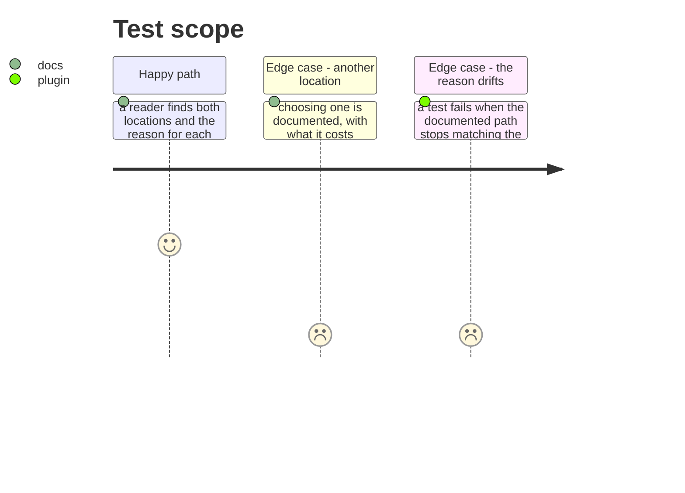

# Instruction: Where each thing lives is a stated choice

## Architecture projection

```txt
.
├── docs/telemetry-limits.md            ✏️ where things are written, and why there
└── plugins/aidd-telemetry/README.md    ✏️ the same, for someone holding only the plugin
```

## User Journey



## Test Scope



## Tasks to do

### `1)` Write the decision down where it is looked for

> Both locations are right and neither is stated. The gap in phase 1 is what happens when a decision is made without being written: the consequence goes undrawn.

1. Say where the journal is written and why it belongs to the repository, and where the figures are written and why they belong to the person.
2. Say what each contains, since that is what makes the first one worth ignoring: who worked on what, for how long, and every file a session wrote.
3. Say it for someone holding only the plugin, with no CLI installed — that is a supported way to use this and it has its own README.

### `2)` Turn an environment variable into an offered choice

> `AIDD_USER_CONFIG_DIR` already lets the figures live somewhere else. Undocumented, it is a workaround insiders know rather than a choice a person can make.

1. Name it, say what it is for — a team that wants shared figures, a CI that wants its own per repository — and say what it costs: figures outside the default are not swept together with the rest.
2. Keep the default. The per-user location is right for one person on one machine, which is nearly everyone.
3. A test fails when the documented path stops matching what the code writes. A location documented once and moved later is worse than one never written down.

## Test acceptance criteria

| Task | Acceptance criteria |
| ---- | ------------------------------------------------------------------ |
| 1    | Both locations and both reasons are stated where a reader looks    |
| 1    | What each file contains is stated beside where it lives            |
| 1    | The plugin's own README says it too                                |
| 2    | Choosing another location is documented, with its cost             |
| 2    | A test fails when the documented path stops matching the code      |
