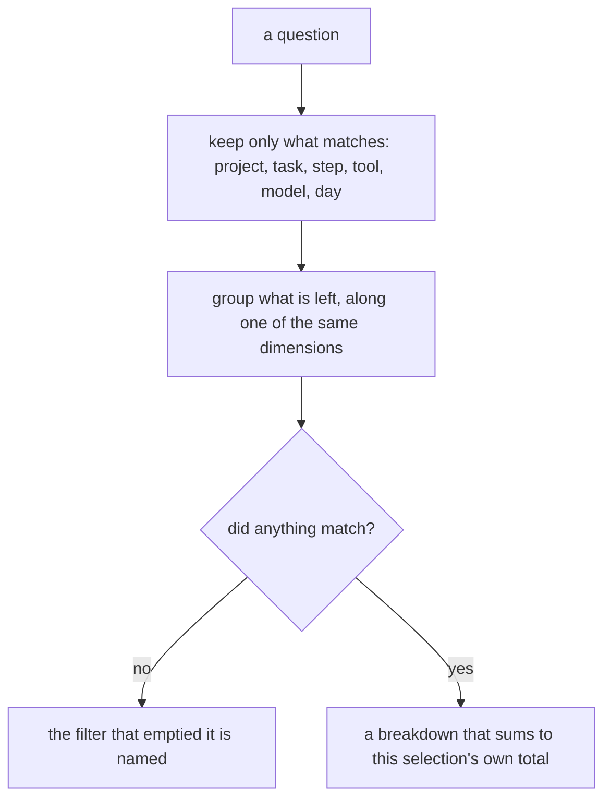
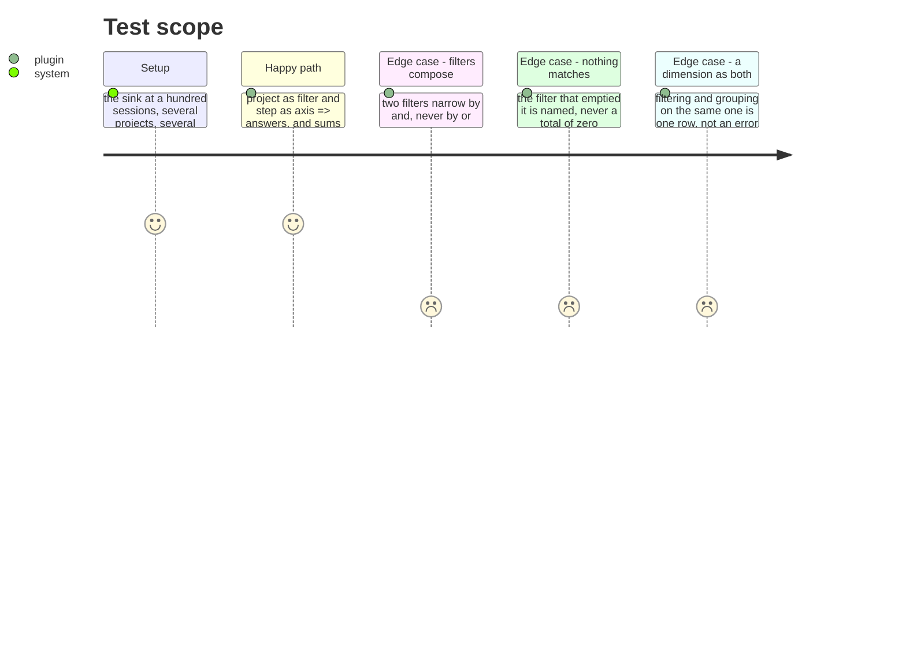

# Instruction: Any dimension filters as well as it groups

## Architecture projection

```txt
.
├── plugins/aidd-telemetry/skills/01-cost/scripts/telemetry-report.js  ✏️ filters, plural
├── plugins/aidd-telemetry/skills/01-cost/scripts/lib/report.js        ✏️ narrow, then group
└── cli/src/…/cost-report.ts                                           ✏️ the same, both sides
```

## User Journey



## Test Scope



## Tasks to do

### `1)` Make every dimension a filter

> Today a report takes a period and `--task`, and picks one axis. A project over a week broken down by step cannot be asked for, and it is the most ordinary question there is.

1. Day, project, task, step, model and tool each work as a filter, alongside the period that already exists.
2. Filters compose by `and`. Two named narrow to the intersection, and the report says which selection it answered so a figure can be cited without its command.
3. Filtering and grouping on the same dimension is a legal, boring answer — one row — not an error to guard against.

### `2)` Keep the arithmetic true under any selection

> A breakdown that no longer sums to its own total is how a report starts lying quietly, and a selection makes that easier to miss.

1. Under any combination of filters, every breakdown sums to that selection's own total, exactly, integer for integer.
2. `session`-shaped records still never sum with `request`-shaped ones. A filter narrows what is counted; it does not change what may be added.
3. The CLI and the plugin answer identically — the byte-comparison test already holds them to it, and it must keep holding.

### `3)` Say when nothing matched

> A period with no work is a row of zeros because the zero is true. A filter that matches nothing is a different thing entirely, and printing zero for it would be the lie this layer exists to remove.

1. An empty selection names the filter that emptied it, and says what would have matched without it where that is cheap to know.
2. A filter naming something that never existed — a project nobody worked in — is told apart from one that existed and had no work in the period.

## Test acceptance criteria

| Task | Acceptance criteria |
| ---- | --------------------------------------------------------------------- |
| 1    | Each of the six dimensions works as a filter                          |
| 1    | Two filters narrow by `and`                                           |
| 1    | Filtering and grouping on one dimension answers with a single row     |
| 2    | Every breakdown sums to its selection's own total, exactly            |
| 2    | The CLI and the plugin answer identically                             |
| 3    | An empty selection names the filter responsible                       |
| 3    | An unknown value is told apart from a known one with no work          |
