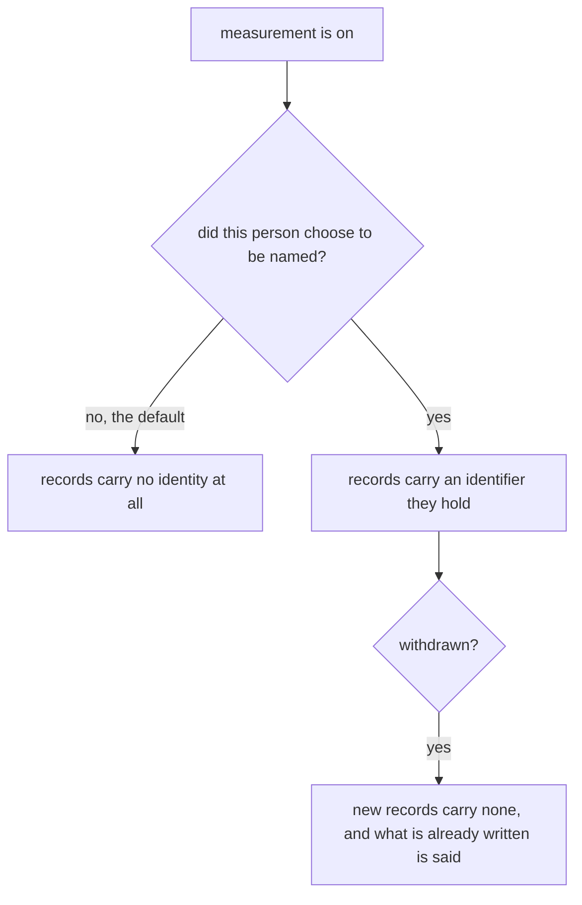
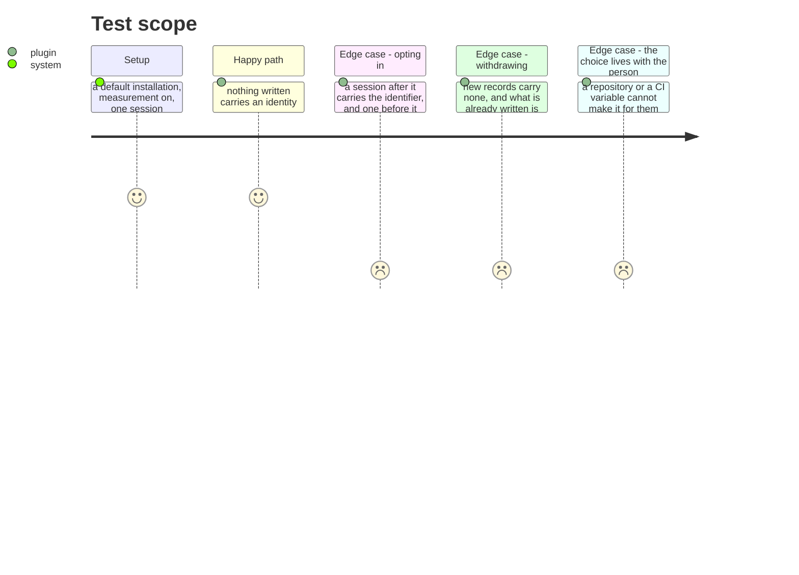

# Instruction: A person can choose to be named, and unchoose

## Architecture projection

```txt
.
└── plugins/aidd-telemetry/skills/00-init/
    ├── actions/                 ✏️ choosing, and taking it back
    └── scripts/                 ✏️ where the choice is kept, and what it holds
```

## User Journey



## Test Scope



## Tasks to do

### `1)` Record nothing about anyone, until asked

> This is the claim that has to hold before any of the rest is safe to build, and it must be provable by reading what gets written rather than by reading the setting.

1. A default installation writes no identity, anywhere — not in the journal, not in the stored figures.
2. Prove it by running a session and reading every line produced, not by asserting the flag is off.
3. Where an identity is absent, the figure stays complete and reads as belonging to no person — never as missing, never as zero.

### `2)` Let a person choose, and take it back

> Something a person cannot withdraw is not a choice they were offered.

1. Opting in is one action, on their own machine, and says plainly what it will attach to and what it will not.
2. The choice belongs to the person, not the repository: a checkout, a CI variable or a lead cannot make it for them, and a test says so.
3. Withdrawing is one action, stops new records carrying it, and says what happens to those already written. Records from before an opt-in stay anonymous — a choice made today does not reach backwards.

### `3)` Keep the identifier and the name apart

> They are different decisions and conflating them is how a system that promised anonymity starts showing names.

1. What joins a person's records across tools and machines is an identifier they hold, stable and not derived from anything that identifies them elsewhere.
2. A display name is a separate field that exists only once asked for, and its absence is normal rather than incomplete.
3. Nothing derives one from the other, in either direction.

## Test acceptance criteria

| Task | Acceptance criteria |
| ---- | ------------------------------------------------------------------- |
| 1    | A default installation writes no identity, proven from what it wrote |
| 1    | A figure with no person is complete, not missing                     |
| 2    | Opting in and out are one action each, and each says what it changes |
| 2    | A repository or CI variable cannot choose for a person               |
| 2    | Records from before an opt-in stay anonymous                         |
| 3    | The identifier and the display name are separate and independent     |
