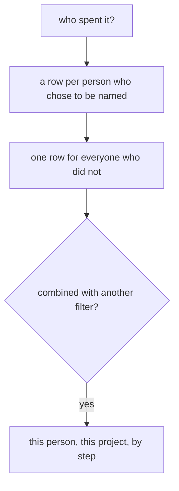
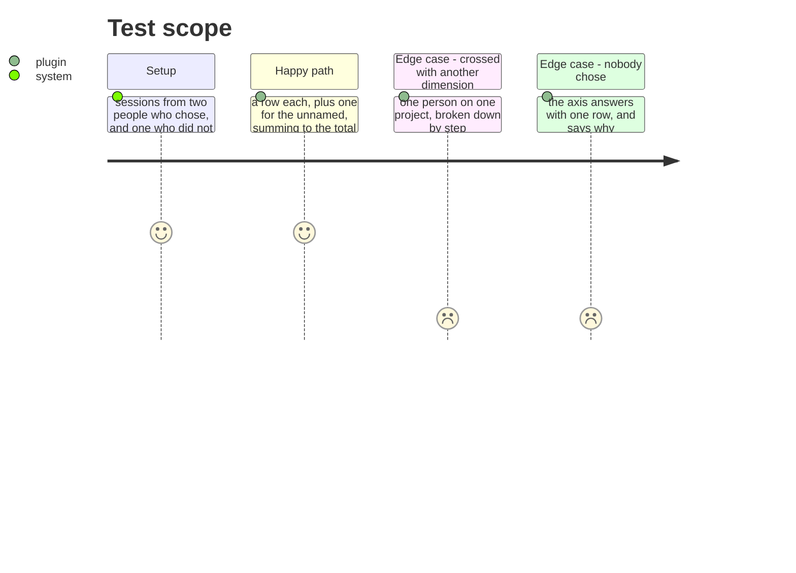

# Instruction: A report answers who, for those who chose

## Architecture projection

```txt
.
├── plugins/aidd-telemetry/skills/01-cost/   ✏️ person, as a filter and as an axis
└── docs/telemetry-limits.md                 ✏️ what a report can and cannot say about people
```

## User Journey



## Test Scope



## Tasks to do

### `1)` Person, as a filter and as an axis

> Phase 1 made every dimension do both. This is that work applied to the one dimension that needed a decision first.

1. Person joins the dimensions from phase 1, filtering and grouping like any other.
2. Everyone who did not choose is one row, named as unattributed to a person, and it sums with the rest into the same total.
3. Crossing person with any other dimension works because both are filters — one person, one project, by step, without a new mechanism.

### `2)` Prove it on real sessions, across tools

> An identity that joins on one tool proves nothing about the thing it exists for.

1. Sessions from more than one tool, for the same person, join into one row.
2. A session from a person who did not choose stays out of every named row, on every tool.
3. Run it, do not assert it: `scripts/verify-chain.mjs` already runs a real session per tool and is the place this belongs.

### `3)` Say what a report can and cannot tell you about people

> This is the part someone will be asked about by their own team, and it should be written before they are.

1. `docs/telemetry-limits.md` says what is recorded, when, on whose choice, and what withdrawing does.
2. It says what this cannot answer — teams, hierarchies, anyone who did not choose — and that those are absences by design rather than gaps.

## Test acceptance criteria

| Task | Acceptance criteria |
| ---- | --------------------------------------------------------------------- |
| 1    | Person filters and groups like every other dimension                  |
| 1    | Everyone unnamed is one row that sums with the rest                   |
| 1    | Person crosses with another dimension without a new mechanism         |
| 2    | One person's sessions from two tools join into one row                |
| 2    | Someone who did not choose appears in no named row, on any tool       |
| 3    | The limits document says what is recorded and what withdrawing does   |
