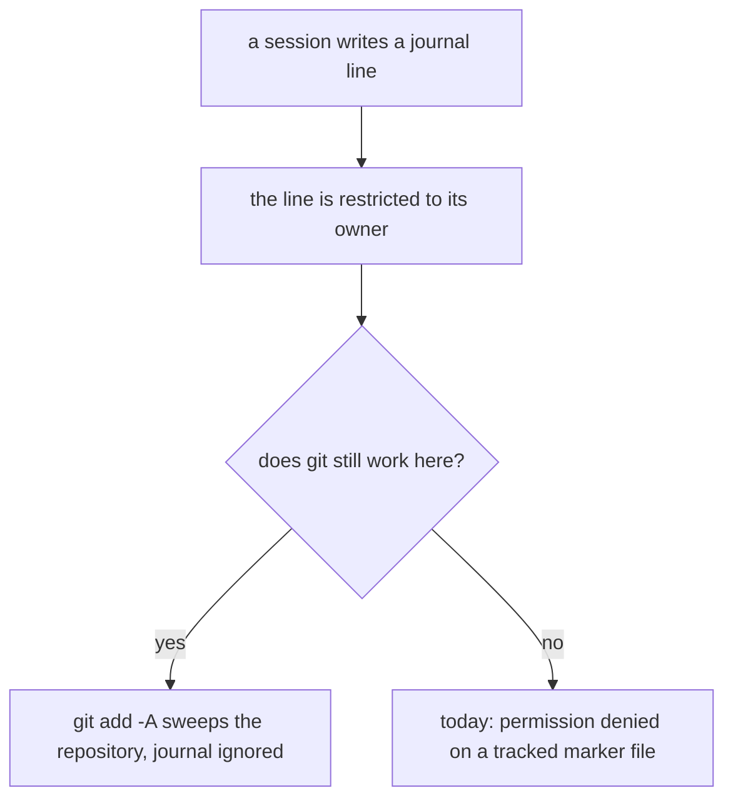
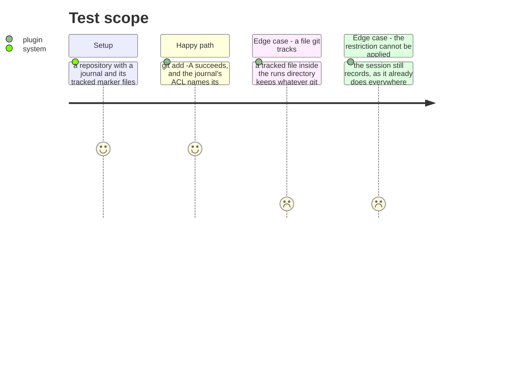

# Instruction: A private journal git can still stage

## Architecture projection

```txt
.
└── plugins/aidd-telemetry/hooks/lib/repo.js   ✏️ what is re-owned, and what is left alone
```

## User Journey



## Test Scope



## Tasks to do

### `1)` Find what actually collides, before changing anything

> Three explanations fit the symptom and they need different remedies: a handle git holds while we reset, an inheritance flag the reset clears from a file git needs, or the fact that `.gitkeep` is *tracked* inside a directory we re-own. Guessing produces a fix that works for the wrong reason, which is worse than none because nobody will revisit it.

1. Reproduce it on the runner and establish which of the three it is. Say which in one sentence before saying what you changed.
2. The directory's contents are not uniformly ours. A journal line we wrote and a marker file git tracks are different cases, and the reset currently treats them alike.

### `2)` Keep both properties, or stop and say so

> Losing the privacy to fix the collision would trade the important property for the convenient one, and every test would go green while doing it.

1. After the change, on the runner: the journal file's ACL still names the current user alone, **and** `git add -A` succeeds in a repository holding one. Both, read back from the runner's own output.
2. If both cannot hold at once, do not choose — report which one you would have to give up and why, and stop.
3. Failure to restrict stays soft, the way it already is: a foreign owner, a read-only mount or a policy refusal must never cost a session its recording.

## Test acceptance criteria

| Task | Acceptance criteria |
| ---- | ---------------------------------------------------------------------- |
| 1    | The collision's cause is named, from a reproduction rather than a guess |
| 2    | The journal's ACL names the current user alone, read back from Windows  |
| 2    | `git add -A` succeeds in a repository holding a journal                |
| 2    | A restriction that cannot be applied never costs a recording            |
