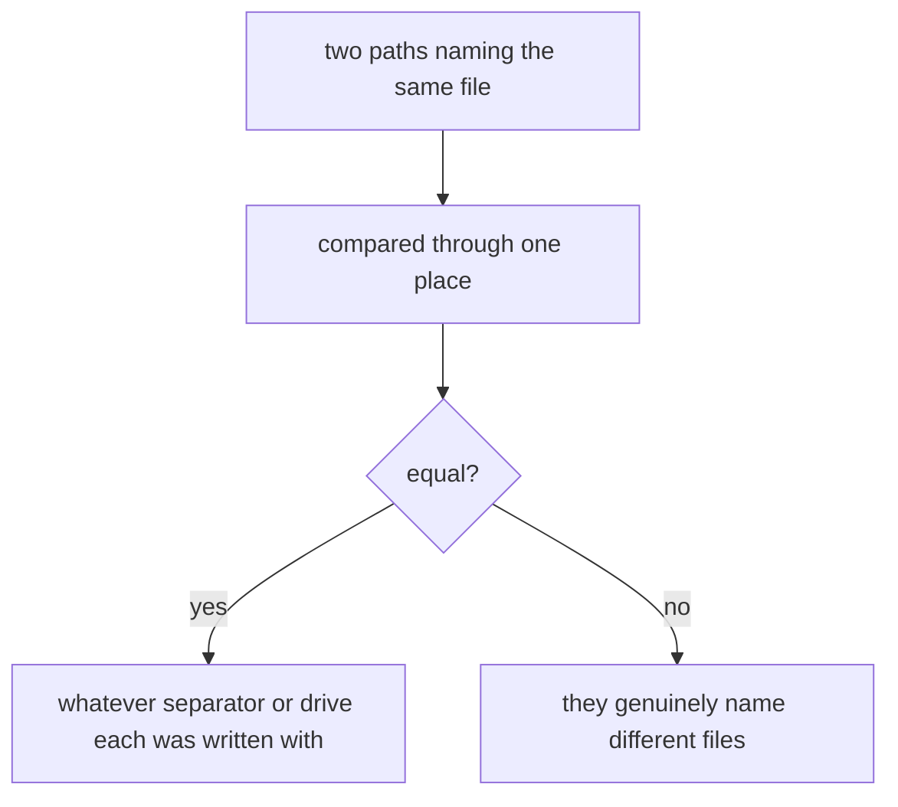
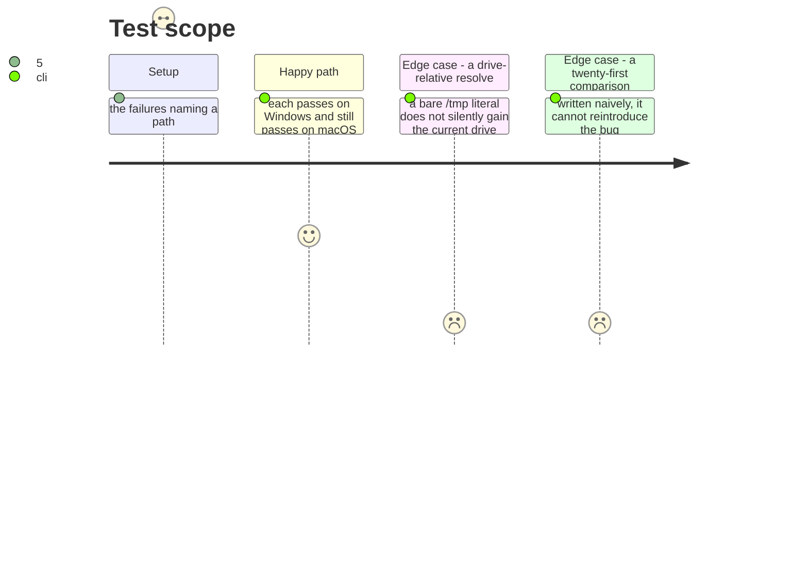

# Instruction: A path is compared one way, in one place

## Architecture projection

```txt
.
├── cli/src/…                       ✏️ where a path is compared, not everywhere one appears
└── cli/tests/helpers/ports/…       ✏️ the double that backs most of these
```

## User Journey



## Test Scope



## Tasks to do

### `1)` Find where paths are compared, not where they appear

> The failing assertions say it plainly: `expected 'D:\…'`, `expected [ '/test-project/.gitignore' ] to include …`, and two objects of identical shape differing only in how their paths are spelled. It reaches the auth storage, the build cache's own directory assertion, four plugin translators, the OpenCode install and the in-memory adapter that backs most of them.

1. List every site where one path is compared against another or used as a map key. That list, not the list of failing tests, is the work.
2. Route them through one place. A normalisation applied at each site is a habit, and the twenty-first site will not have it.
3. The in-memory file adapter is the double behind most of these — a real filesystem treats `/` and `\` as the same and it does not. Fixing it there fixes many at once, and that is a signal about where the seam belongs rather than a shortcut.

### `2)` Keep both platforms honest

> A Windows fix that costs a macOS pass is not a fix, and a normalisation that hides a genuine difference is worse than the bug.

1. Every touched test passes on Windows and still passes on macOS, and the host gate stays exactly as green.
2. Where two paths genuinely name different files, they still compare unequal. Prove that with a case, not by assertion.
3. Say which of the fixes were tests written for one platform and which were the code itself. They are different findings and only the second is a product defect.

## Test acceptance criteria

| Task | Acceptance criteria |
| ---- | ------------------------------------------------------------------ |
| 1    | Comparison happens in one place, named                             |
| 1    | The in-memory adapter treats both separators as a filesystem does  |
| 2    | Every touched test passes on both platforms                        |
| 2    | Genuinely different paths still compare unequal                    |
| 2    | Test-authoring fixes and product defects are reported separately   |
