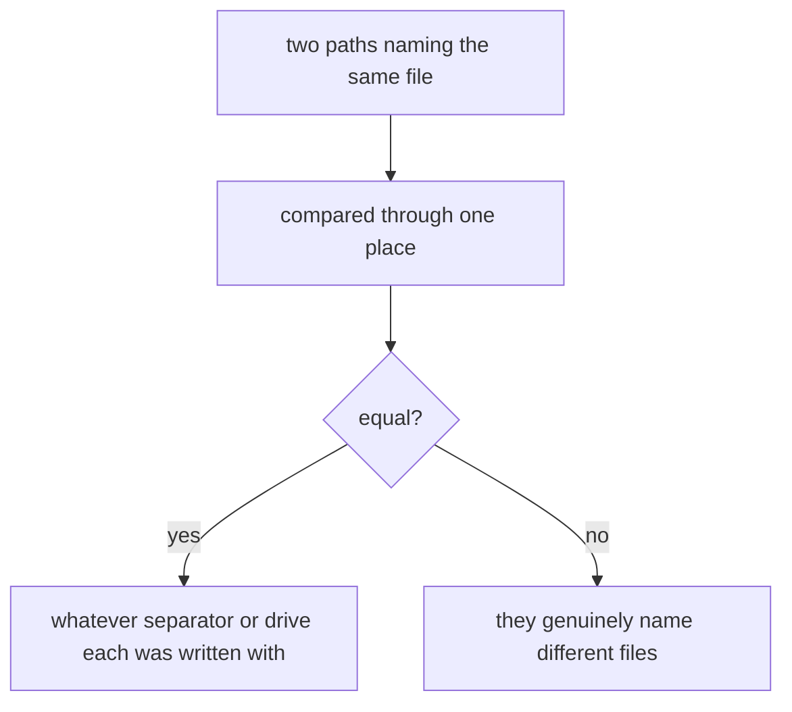
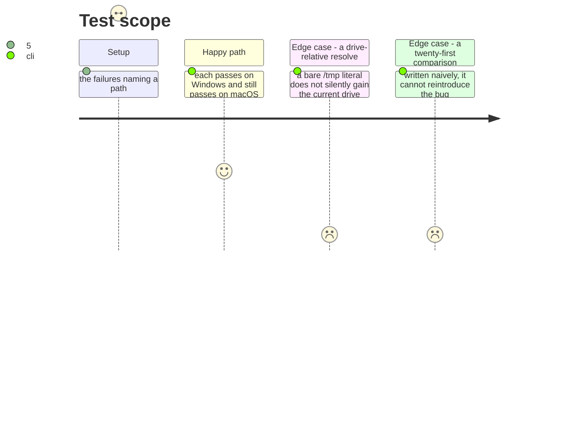

# Instruction: A path is compared one way, in one place

## Architecture projection

```txt
.
├── cli/src/…                       ✏️ where a path is compared, not everywhere one appears
└── cli/tests/helpers/ports/…       ✏️ the double that backs most of these
```

## User Journey



## Test Scope



## Tasks to do

### `1)` Find where paths are compared, not where they appear

> The failing assertions say it plainly: `expected 'D:\…'`, `expected [ '/test-project/.gitignore' ] to include …`, and two objects of identical shape differing only in how their paths are spelled. It reaches the auth storage, the build cache's own directory assertion, four plugin translators, the OpenCode install and the in-memory adapter that backs most of them.

1. List every site where one path is compared against another or used as a map key. That list, not the list of failing tests, is the work.
2. Name the comparison once where the *same* question is genuinely being asked twice. What that turned out to be: one predicate, "is this directory the other one, or inside it", asked by a build refusing to write into the tree it reads from and by the cache-rebuild path deciding on its temp-dir detour. Both had spelled it out with a hardcoded `/`; both now ask `pathsOverlap()` in the domain, pinned by a unit test whose inputs are spelled with backslashes.
3. Not one blanket normaliser for every path in the codebase. Roughly ten files fold a separator at their own site, and they are not all doing the same thing: producing a `/`-separated `relativePath` that downstream string-matching depends on is a different operation from comparing two native paths, and collapsing them would erase a distinction rather than name one. Each of those was fixed where its defect lived — a `posix.join` where the value is documented as `/`-separated, a `resolve()` where a drive-less path reached a check that had one.

### `2)` Keep both platforms honest

> A Windows fix that costs a macOS pass is not a fix, and a normalisation that hides a genuine difference is worse than the bug.

1. Every touched test passes on Windows and still passes on macOS, and the host gate stays exactly as green.
2. Where two paths genuinely name different files, they still compare unequal. Prove that with a case, not by assertion.
3. Say which of the fixes were tests written for one platform and which were the code itself. They are different findings and only the second is a product defect.

## Test acceptance criteria

| Task | Acceptance criteria |
| ---- | ------------------------------------------------------------------ |
| 1    | The one duplicated predicate is named once, not repeated           |
| 1    | Sites doing genuinely different work stay distinct, with reasons   |
| 2    | Every touched test passes on both platforms                        |
| 2    | Genuinely different paths still compare unequal                    |
| 2    | Test-authoring fixes and product defects are reported separately   |
