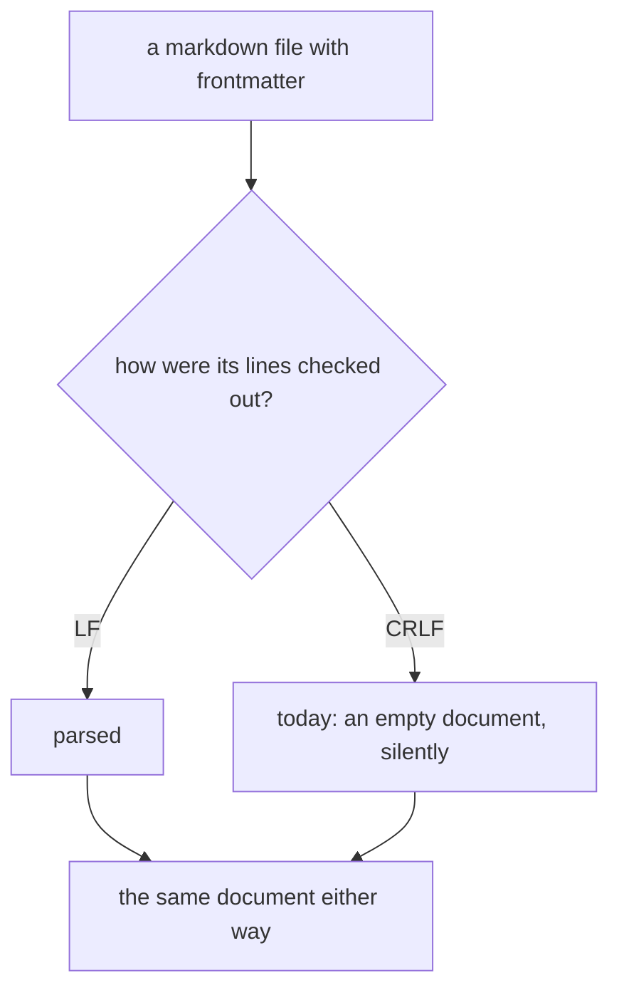
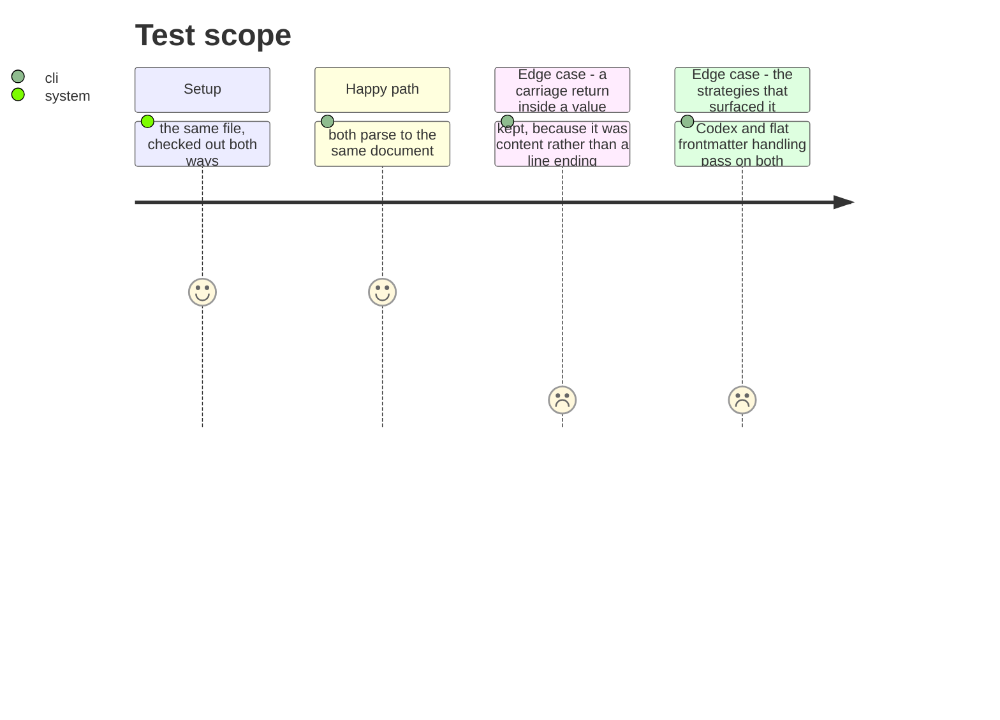

# Instruction: A line ends either way

## Architecture projection

```txt
.
└── cli/src/domain/formats/   ✏️ where a document is parsed from text
```

## User Journey



## Test Scope



## Tasks to do

### `1)` Parse a document, not a byte sequence

> `{ allowed_tools: [] }` where a parsed document was expected means the parser saw no document at all. A file checked out with CRLF is the same file; a parser that disagrees is reading bytes rather than lines.

1. Find where text is split into lines or matched against a line-anchored pattern, and make a carriage return a line ending rather than content there.
2. A carriage return *inside* a value is content and stays. Splitting on either ending is not the same as stripping every `\r`, and the difference matters for anyone who put one in a string deliberately.
3. Fix it where the parsing happens, not in the tests that noticed. The Codex and flat build strategies are the ones that surfaced it, not the ones at fault.

## Test acceptance criteria

| Task | Acceptance criteria |
| ---- | ------------------------------------------------------------- |
| 1    | The same file parses identically with either line ending      |
| 1    | A carriage return inside a value survives                     |
| 1    | The frontmatter tests pass on both platforms                  |
