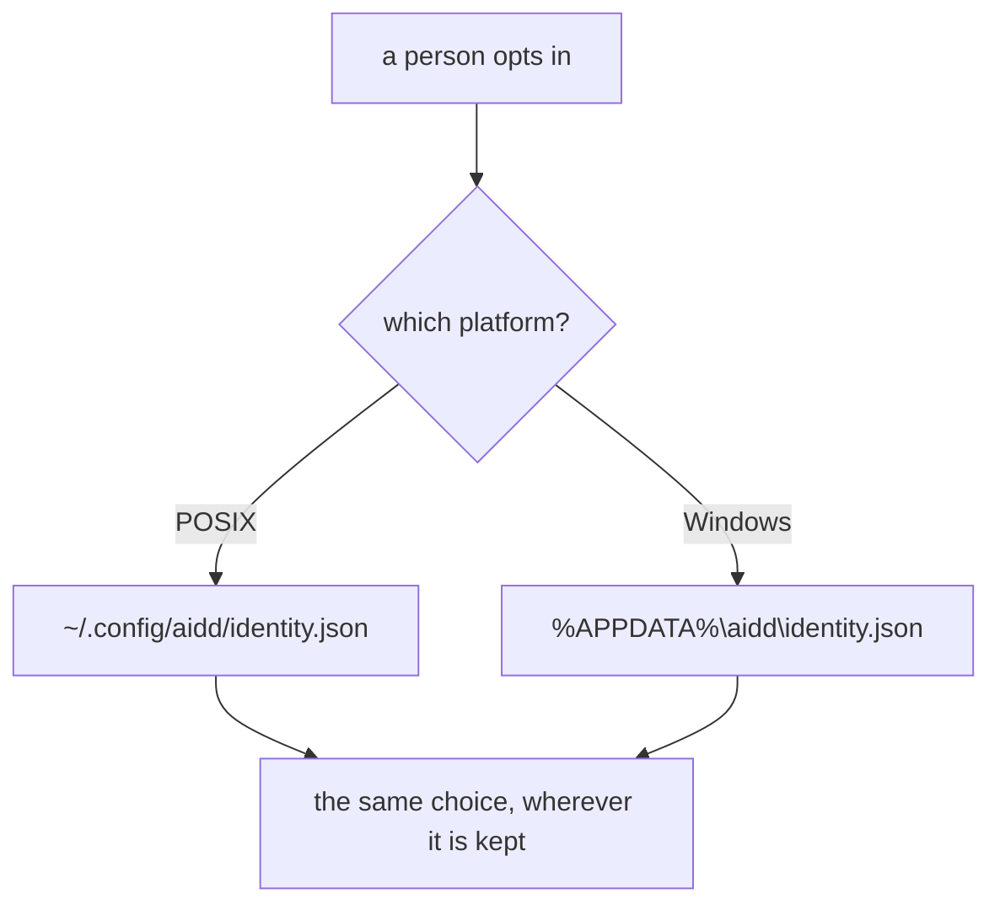
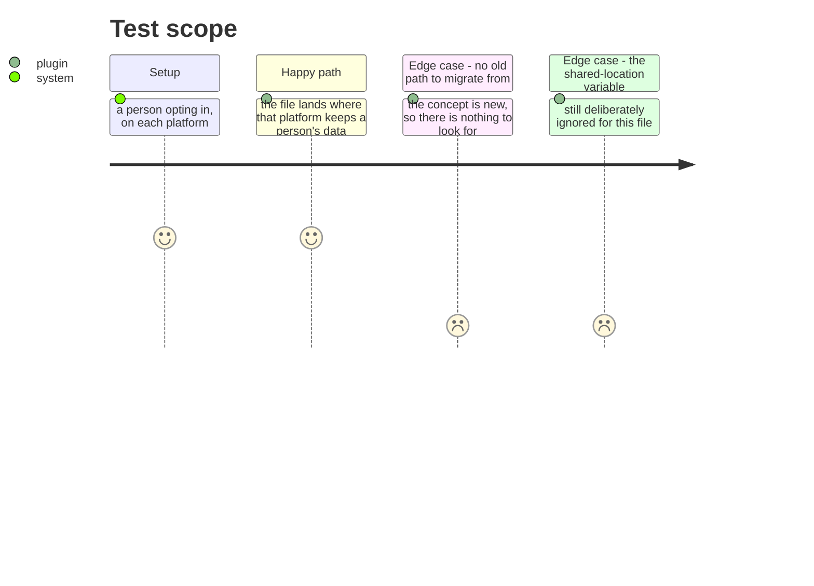

# Instruction: A person's file is where Windows keeps it

## Architecture projection

```txt
.
└── plugins/aidd-telemetry/skills/_shared/identity.js   ✏️ resolves like its neighbours
```

## User Journey



## Test Scope



## Tasks to do

### `1)` Resolve the way the sink already does

> The identity feature landed after the sink learned `%APPDATA%`, so it resolves a POSIX path everywhere. Eleven of its tests fail for that one reason, and a Windows user's choice lands where nothing on that platform looks.

1. Resolve the identity file the way the figures already are: `%APPDATA%\aidd` on Windows, the OS user's own `.config/aidd` elsewhere.
2. Deliberately without the sink's legacy-data fallback. No identity file has ever existed under an older path, so a lookup there could only ever find something this feature did not write. The rule is repeated rather than shared for exactly that reason, and the comment says so.
3. `AIDD_USER_CONFIG_DIR` stays deliberately ignored for this file — it is documented as a place a team or a CI can point every figure at, and a person's own choice is not theirs to relocate. That decision does not change with the platform, and a test says so on both.

## Test acceptance criteria

| Task | Acceptance criteria |
| ---- | ------------------------------------------------------------------ |
| 1    | The identity file lands where each platform keeps a person's data  |
| 1    | Pinned on any platform, not only on a Windows runner               |
| 1    | No lookup at a path this feature never wrote to                    |
| 1    | The shared-location variable stays ignored, on both platforms      |
