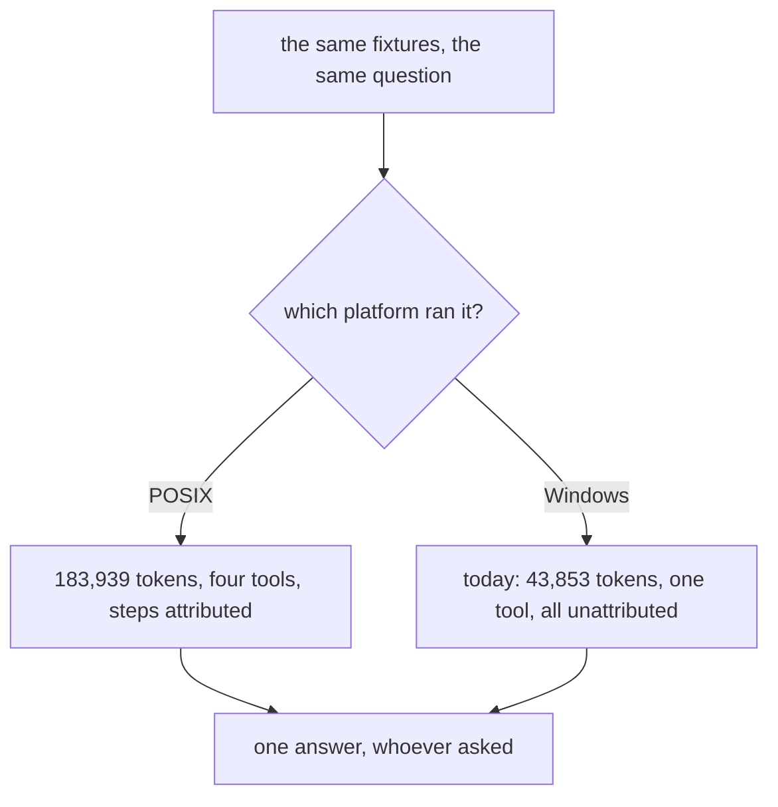
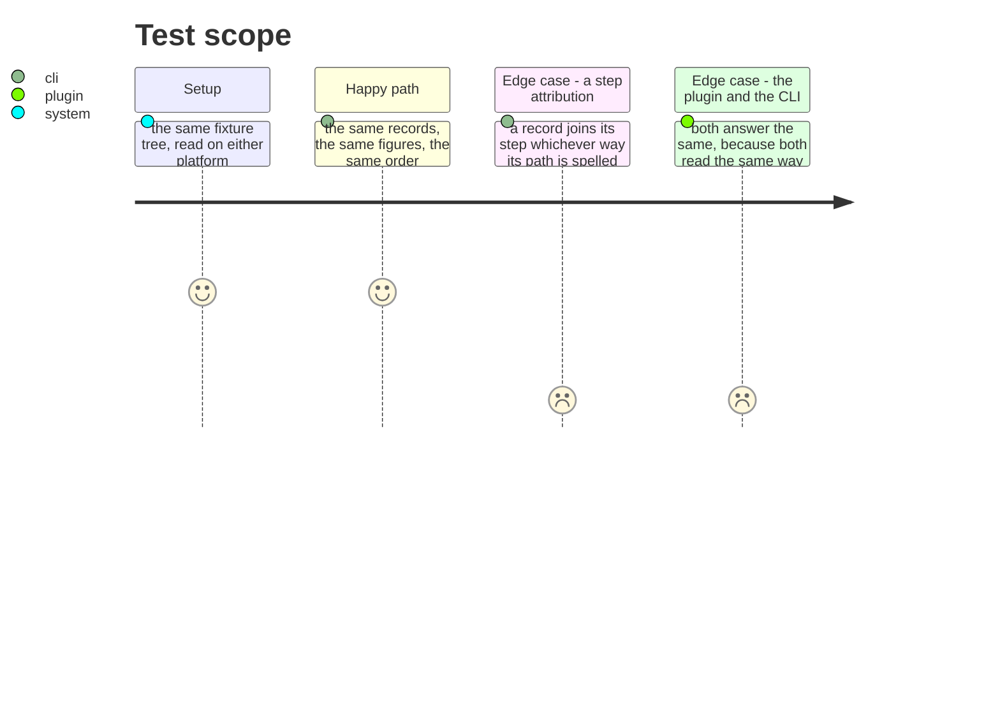

# Instruction: A reader finds the file on either platform

## Architecture projection

```txt
.
├── cli/src/domain/formats/                        ✏️ what the CLI reads a tool's files with
└── plugins/aidd-telemetry/skills/_shared/         ✏️ what the plugin reads the same files with
```

## User Journey



## Test Scope



## Tasks to do

### `1)` Find what does not match, and prove it

> This is the only cause in the set that changes an answer rather than a test. A guess repaired here would look exactly like a fix and would still be wrong.

1. Locate where a path built one way is compared against, or used to key, a path built the other. A record that comes back `unattributed` on one platform and attributed on the other is the loudest clue: whatever the attribution join matches on is the first thing to read.
2. Prove each candidate by handing the function a backslash-spelled path and showing it answers differently from the same path spelled the other way. A candidate that cannot be made to answer wrongly that way is not the defect.
3. Fix it where it lives. The assertion that noticed is not the thing at fault, and no test is loosened to make this pass.

### `2)` Say which side the chain check was reporting

> `tool files readable FAIL` printed on a runner that has no real tool session. That may be honest there rather than a defect, and the two must not be conflated.

1. Decide it with evidence, and say which it was.

## Test acceptance criteria

| Task | Acceptance criteria |
| ---- | -------------------------------------------------------------------- |
| 1    | The same fixtures answer the same figures on either platform         |
| 1    | A step attribution joins whichever way its path is spelled           |
| 1    | Pinned by a test that fails when the fix is reverted, on any platform |
| 2    | The chain check's Windows verdict is explained, not assumed          |
