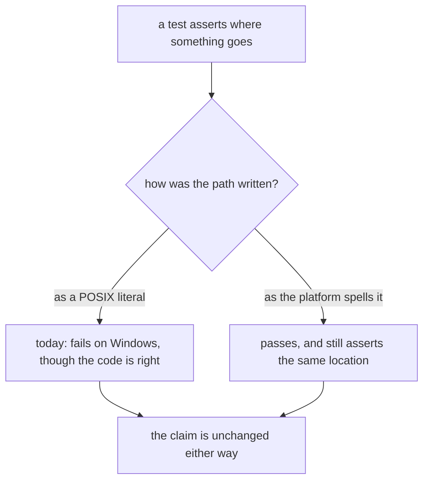
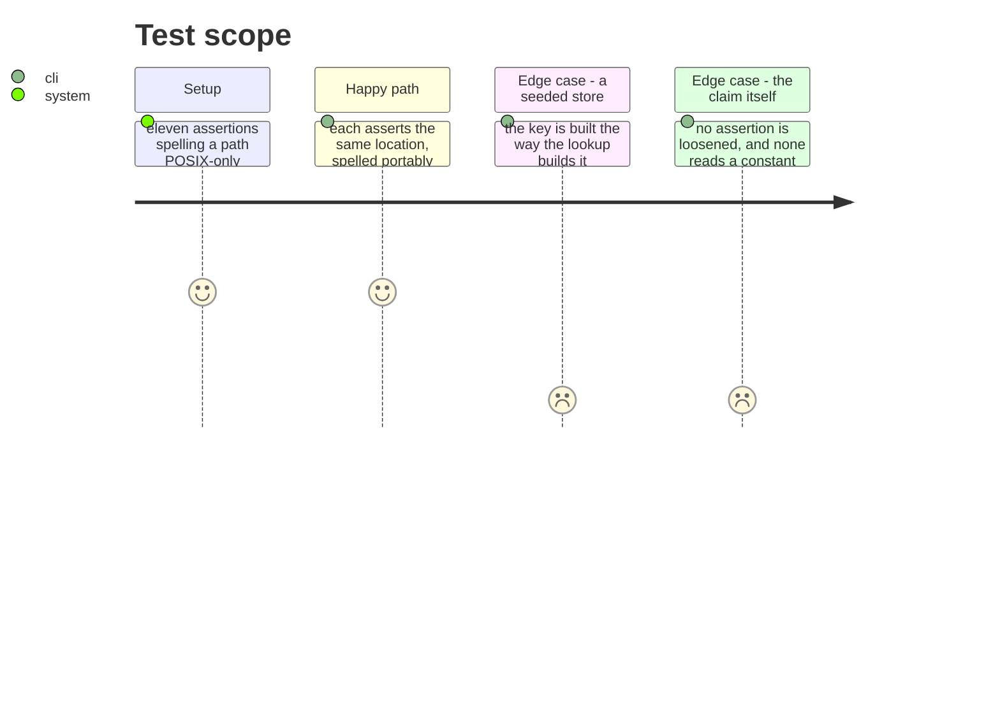

# Instruction: An assertion names a location, not a spelling

## Architecture projection

```txt
.
└── cli/tests/   ✏️ only the tests; no source file is at fault here
```

## User Journey



## Test Scope



## Tasks to do

### `1)` Correct the spelling, never the claim

1. An expectation becomes the same location written the way the platform writes it. It does not become a looser matcher, and it does not take its value from the constant or function the implementation uses - that would only assert the code agrees with itself.
2. Where an in-memory store's key is the problem, seed it through the same resolution the production path uses to build the key.
3. Each change carries the reason its claim is unchanged, so a later reader can see it was a spelling and not a concession.

## Test acceptance criteria

| Task | Acceptance criteria |
| ---- | ------------------------------------------------------ |
| 1    | Every corrected expectation asserts the same location  |
| 1    | No assertion is loosened and none is self-referential  |
| 1    | The POSIX counts stay exactly where they were          |
