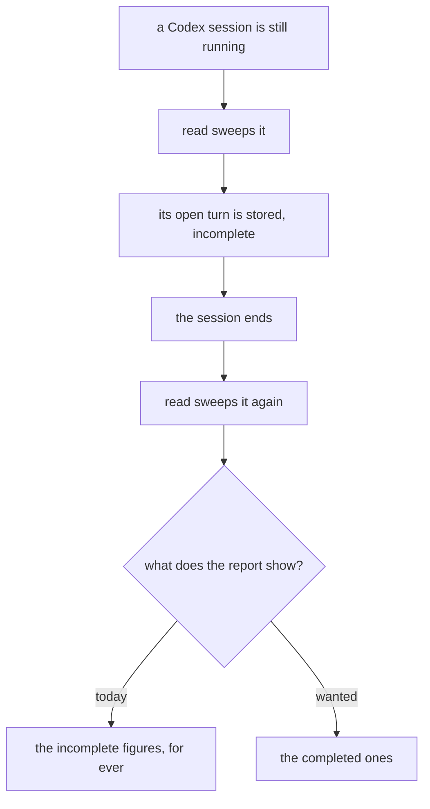
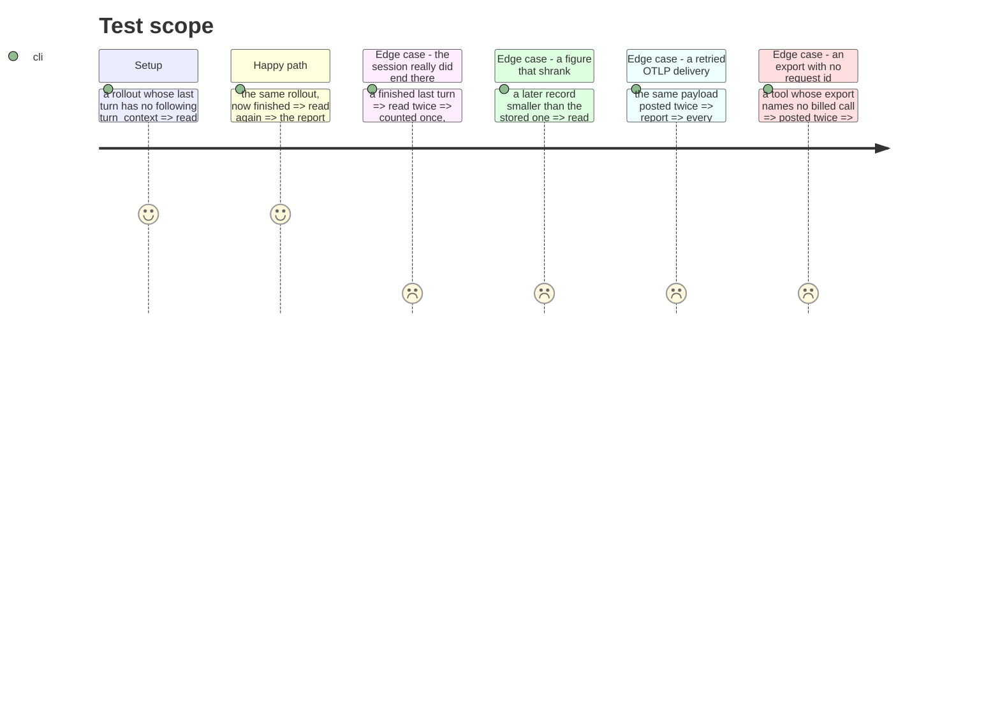

# Instruction: A turn read while it runs is not the last word

## Architecture projection

```txt
.
├── cli/src/domain/formats/codex-rollout.ts                          ✏️ says a turn is unfinished
├── cli/src/domain/models/telemetry-sink-record.ts                   ✏️ carries that, if it must
├── cli/src/domain/models/cost-report.ts                             ✏️ the later record supersedes
├── cli/src/application/use-cases/telemetry/read-local-cost-use-case.ts  ✏️ stops refusing the completed one
├── cli/src/application/use-cases/telemetry/receive-telemetry-use-case.ts ✏️ a retried delivery lands once
└── plugins/aidd-telemetry/skills/01-cost/scripts/lib/report.js      ✏️ the mirror, same rule
```

## User Journey



## Test Scope



## Tasks to do

### `1)` Let a later reading replace an earlier, less complete one

> Measured on the repo's own fixture: 91% of an open turn's cache-read tokens and 36% of its output are lost, and lost permanently, because the dedupe treats the partial record as the final word.

1. Decide what marks a record provisional. A Codex turn is closed by the next `turn_context`, and the last turn of a file has none — the file never says "finished". The run journal's own `turn_end` line does say it; whether that is reachable here is the first thing to establish, and if it is not, the record must carry that it was flushed at end of file.
2. Make the completed reading land. `storeNewCandidates` currently matches on `turn_id` and drops it; the sink is append-only, so the correction is a second line that supersedes, never an edit.
3. Supersede at report time, in the collapse `billed_request_id` already goes through. The survivor is the more complete record, decided by content and not by arrival order, so two reads in either sequence answer the same.
4. A later record that is *smaller* is not a correction. Keep the larger and say so rather than letting a figure shrink quietly.

### `2)` Answer whether a retried export lands twice

> OTLP delivery is at-least-once and `receive` appends every mapped record unconditionally. The `billed_request_id` collapse may already cover this — that is a question to settle, not to assume.

1. Post the same payload twice and read the report. If the collapse absorbs it, say so in the contract and add the test that proves it.
2. If it does not, the export route needs its own dedupe, and the key is whatever names the billed call on that route.
3. Name what happens for a tool whose export carries no such identifier, rather than leaving it implied.

## Test acceptance criteria

| Task | Acceptance criteria |
| ---- | ------------------------------------------------------------------------ |
| 1    | A session read while running and again after it ends reports the completed figures |
| 1    | A finished turn read twice is counted once, and its figures do not change  |
| 1    | Two reads in either order produce the same report                         |
| 1    | A later, smaller figure does not silently replace a larger one            |
| 2    | The same OTLP payload delivered twice moves no counter                    |
| 2    | A route that cannot name a billed call says so                            |
