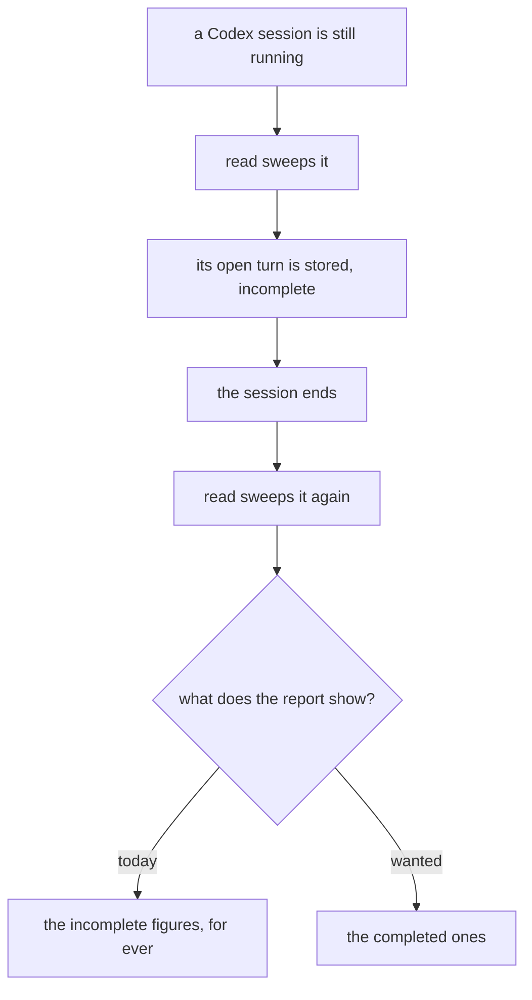
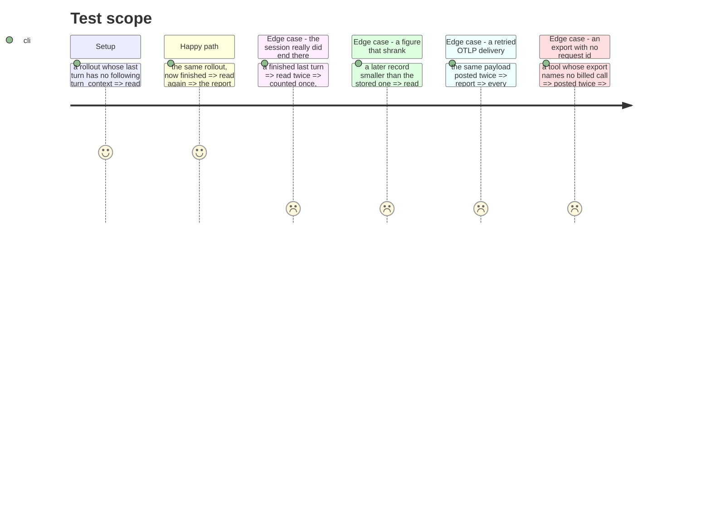

# Instruction: A turn read while it runs is not the last word

## Architecture projection

```txt
.
├── cli/src/domain/formats/codex-rollout.ts                          ✏️ says a turn is unfinished
├── cli/src/domain/models/telemetry-sink-record.ts                   ✏️ carries that, if it must
├── cli/src/domain/models/cost-report.ts                             ✏️ the later record supersedes
├── cli/src/application/use-cases/telemetry/read-local-cost-use-case.ts  ✏️ stops refusing the completed one
├── cli/src/application/use-cases/telemetry/receive-telemetry-use-case.ts ✏️ a retried delivery lands once
└── plugins/aidd-telemetry/skills/01-cost/scripts/lib/report.js      ✏️ the mirror, same rule
```

## User Journey



## Test Scope



## Tasks to do

### `1)` Let a later reading replace an earlier, less complete one

> Measured on the repo's own fixture: 91% of an open turn's cache-read tokens and 36% of its output are lost, and lost permanently, because the dedupe treats the partial record as the final word.

1. Decide what marks a record provisional. A Codex turn is closed by the next `turn_context`, and the last turn of a file has none — the file never says "finished". The run journal's own `turn_end` line does say it; whether that is reachable here is the first thing to establish, and if it is not, the record must carry that it was flushed at end of file.
2. Make the completed reading land. `storeNewCandidates` currently matches on `turn_id` and drops it; the sink is append-only, so the correction is a second line that supersedes, never an edit.
3. **Do not reuse the `billed_request_id` collapse for this.** Checked before planning: only the Claude Code reader sets that field (`claude-code-transcript.ts:105`) and the OTLP allowlist maps `request_id` onto it — Codex, Copilot and OpenCode records carry none, so the mechanism does not reach the very tool this defect is about. Codex's own `turn_id` is unique per record (one record per turn, `codex-rollout.ts:26`), which makes `tool + vendor_id + turn_id` a sound supersede key **for the local-read route only**. On the export route `turn_id` is a prompt id shared by several billed calls, so the same key there would merge distinct calls — which is why `billed_request_id` was introduced in the first place. Two mechanisms that look alike and are not: one reconciles two routes seeing one call, the other reconciles two readings of one source.
4. A later record that is *smaller* is not a correction. Keep the larger and say so rather than letting a figure shrink quietly.

### `2)` Answer whether a retried export lands twice

> OTLP delivery is at-least-once and `receive` appends every mapped record unconditionally.

Checked before planning, and mostly already true: `mergeBilledRequestGroup` **picks** a survivor and never sums, and its own comment names this case — "OTLP redelivery can duplicate an export record". So a retried delivery of a payload carrying `request_id` is already absorbed.

1. Prove it rather than inherit it: post the same payload twice, read the report, and add the test that fails if the collapse ever starts summing.
2. The residual is an export whose payload carries no `request_id` at all — nothing keys it, so redelivery would double it. Establish which of the five tools that describes, from their real payloads.
3. Where a route cannot name its billed call, say so in the contract instead of leaving the gap implied.

## Test acceptance criteria

| Task | Acceptance criteria |
| ---- | ------------------------------------------------------------------------ |
| 1    | A session read while running and again after it ends reports the completed figures |
| 1    | A finished turn read twice is counted once, and its figures do not change  |
| 1    | Two reads in either order produce the same report                         |
| 1    | A later, smaller figure does not silently replace a larger one            |
| 2    | The same OTLP payload delivered twice moves no counter                    |
| 2    | A route that cannot name a billed call says so                            |
