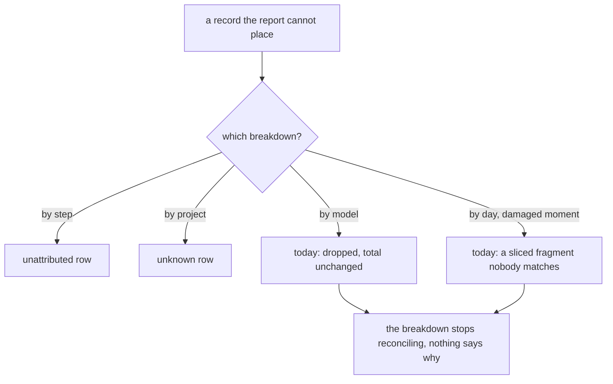
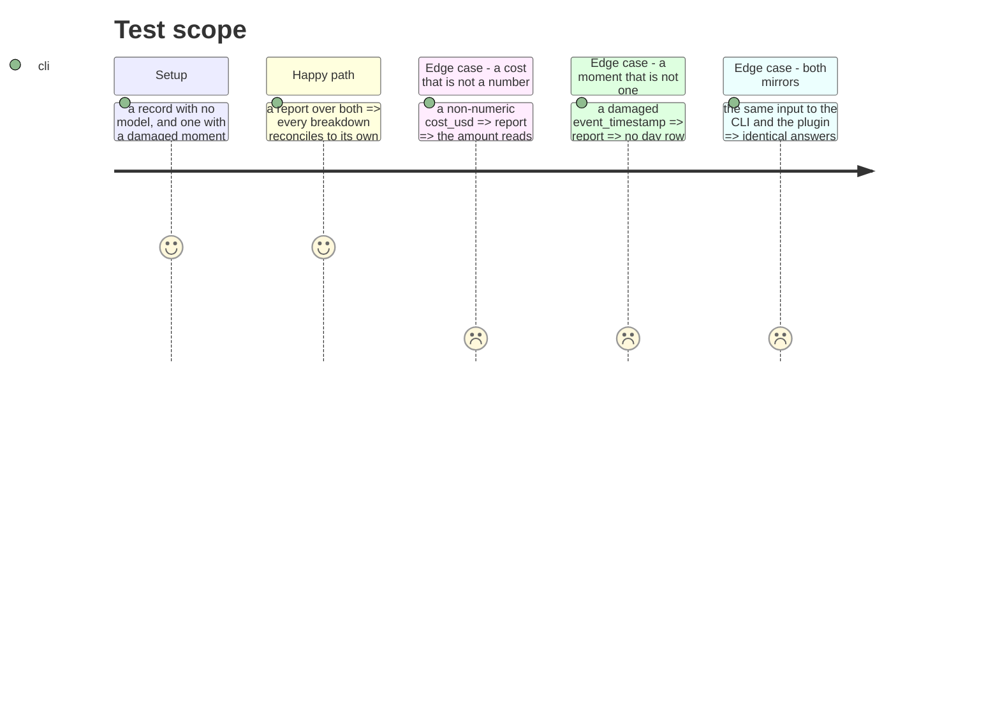

# Instruction: An unknown keeps its row and never becomes a zero

## Architecture projection

```txt
.
├── cli/src/domain/models/cost-report.ts                         ✏️ the two guards that disagree
├── cli/src/domain/models/telemetry-sink-record.ts               ✏️ a day key that answers a fragment
├── plugins/aidd-telemetry/skills/01-cost/scripts/lib/report.js  ✏️ the mirror, same three
└── cli/tests/domain/models/cost-report.unit.test.ts             ✏️ fixtures that reach the branch
```

## User Journey



## Test Scope



## Tasks to do

### `1)` Give `byModels` the row the other breakdowns already have

> `bySteps` has `unattributed`, `byProjects` has an unknown row, `byModels` drops the record. Both the Codex and OpenCode readers permit a request with no model, so the breakdown can stop adding up to its own total with nothing naming the gap.

1. Name the row the way the neighbouring breakdowns name theirs, so a reader recognises it without being taught.
2. The fixtures in the reconciliation test all carry a model, which is why the existing strict assertion never sees this. One that does not is the whole point.

### `2)` Make the cost guard match the counter guard

> In the same file, a token counter is gated on `typeof value === "number"` and cost on `!== undefined`. So a non-numeric cost becomes `costMicroUsd: 0` — "known to be free" — in the module written to forbid exactly that. `JSON.stringify(NaN)` is `null`, which round-trips as `null !== undefined`, so the path is reachable rather than theoretical.

1. One guard, asked the same way for both, so the asymmetry cannot come back by editing one side.
2. `Number("")` and `Number(false)` are `0` rather than `NaN`; they fabricate a zero without going near the null path, and belong in the same fix.

### `3)` A moment that is not one answers nothing, not a fragment

> `telemetrySinkRecordDayKey` returns `at.slice(0,10)` for any string of ten characters or more ending in `Z`, so `"not-a-momentZ"` yields `"not-a-mome"`. Its own docstring promises `undefined` instead. Such a key matches no real day, so the record leaves `byDays` while staying in the total — the two disagree, silently.

1. Answer from whether the moment parses, not from its shape.
2. The plugin carries the same code with the same behaviour; both move together or the mirrors diverge.

## Test acceptance criteria

| Task | Acceptance criteria |
| ---- | ---------------------------------------------------------------- |
| 1    | A record with no model has a row, and `byModels` reconciles       |
| 1    | The fixture reaches the branch — the test fails without the fix   |
| 2    | A non-numeric cost reads as unknown, never as a zero              |
| 2    | An empty string and a boolean fabricate no amount                 |
| 3    | A damaged moment produces no day row and leaves the total intact  |
| 3    | The CLI and the plugin answer identically for all three           |
