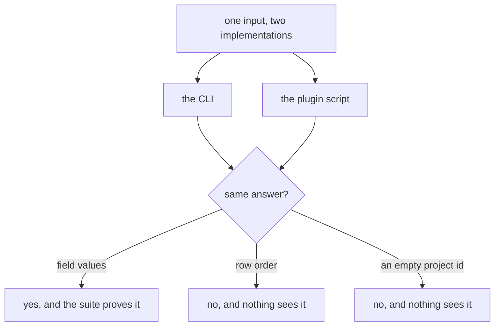
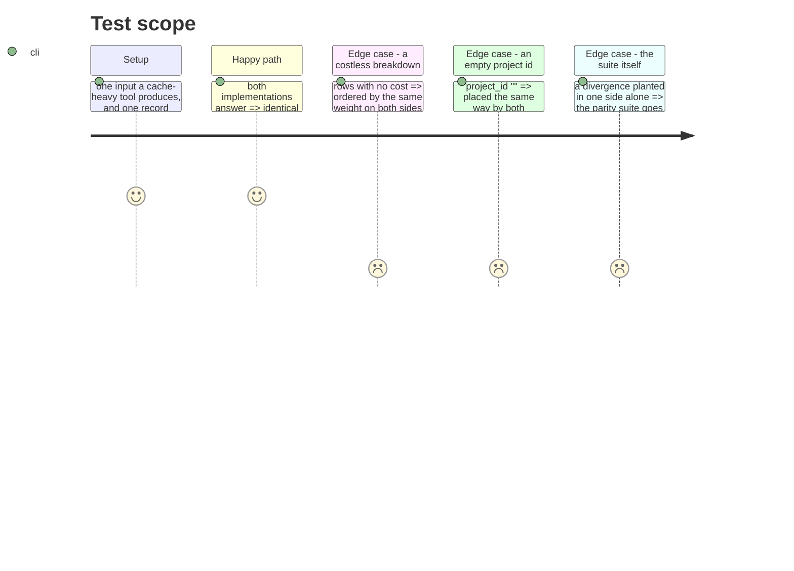

# Instruction: The two implementations answer the same, everywhere

## Architecture projection

```txt
.
├── cli/src/domain/models/cost-report.ts                          ✏️ row weight, empty project
├── plugins/aidd-telemetry/skills/01-cost/scripts/lib/report.js   ✏️ the same two, agreed
└── cli/tests/e2e/telemetry-plugin-matches-cli.e2e.test.ts        ✏️ sees order and placement, not only values
```

## User Journey



## Test Scope



## Tasks to do

### `1)` One weight for a costless row

> The CLI weights it by input plus output; the plugin weights it by all four counters. For a cache-heavy tool — which is every tool here, at 90%-plus cache — the two order the same rows in opposite directions. Both are internally correct, which is why nothing caught it.

1. Decide which weight answers "largest first" honestly when almost all of the volume is cache, and give both sides that one.

### `2)` One meaning for an empty project id

> The CLI's `?? NO_KNOWN_PROJECT` leaves an empty string as its own real project row; the plugin treats it as unplaced. So the CLI renders a nameless row for something the plugin correctly reports as unknown.

1. An empty string is not a name. Both sides place it where a missing one goes.

### `3)` Let the parity suite see what it is blind to

> It compares field values, so a divergence in order or in placement passes it. Both defects above lived under a green parity suite for exactly that reason — the suite's shape, not its assertions, is the gap.

1. Compare the rendered answer, order included, not only the values inside it.
2. Prove the extension by planting a divergence in one side alone and watching it go red. Without that, the suite's new reach is a claim.

## Test acceptance criteria

| Task | Acceptance criteria |
| ---- | ------------------------------------------------------------------ |
| 1    | Both implementations order a costless breakdown identically         |
| 2    | An empty project id is placed the same way by both                  |
| 3    | The parity suite fails when one side alone is changed               |
| 3    | It fails for an order-only divergence, not just a value one         |
