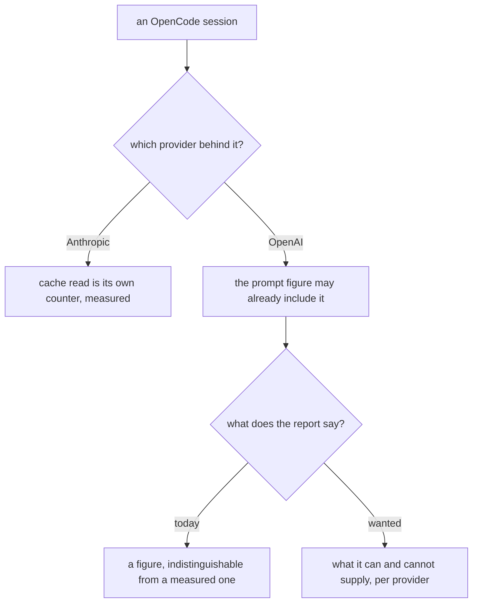
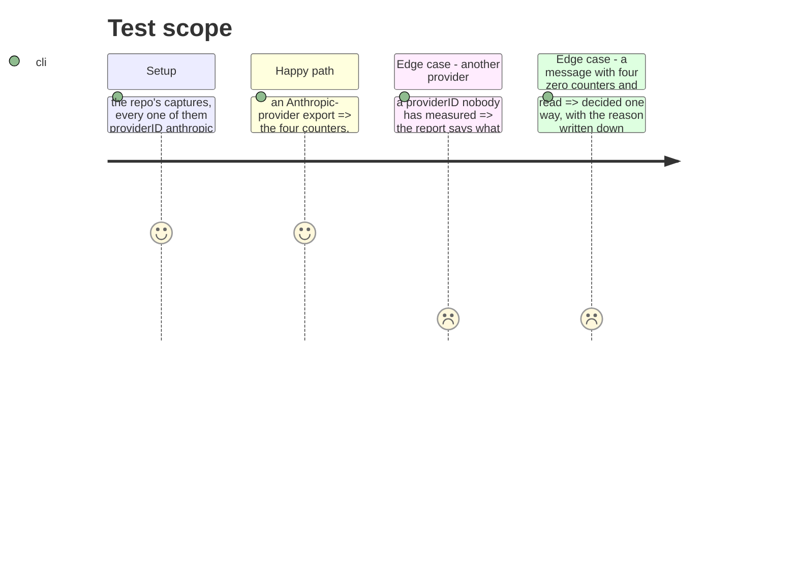

# Instruction: What one provider's captures cannot settle

## Architecture projection

```txt
.
├── cli/src/domain/formats/opencode-export.ts     ✏️ what it supplies, and for whom
├── cli/src/domain/tools/ai/opencode.ts           ✏️ the declaration a report reads
└── docs/telemetry-limits.md                      ✏️ the limit, with the measurement behind it
```

## User Journey



## Test Scope



## Tasks to do

### `1)` Say which providers the arithmetic is measured for

> On every capture here, `total == input + output + cache.read + cache.write` exactly, so the mapping is right — for Anthropic. Every capture carries `providerID: "anthropic"`. Where a provider reports prompt tokens inclusive of cached ones, the same arithmetic counts cache twice, and the resulting figure looks exactly like a measured one.

1. Establish what the export actually carries per provider before changing any arithmetic. One capture from a second provider settles it; without one, nothing here should be rewritten on a guess.
2. Until it is settled, the report says what it cannot vouch for. Cursor's `not covered` line is the precedent, and it is a declaration rather than a silence.
3. Write the measurement, and its date, beside the limit — so the next person can tell a settled question from an open one.

### `2)` Decide the all-zero message

> A message whose four counters are zero and which carries no total yields a request record today, adding one to the request count. Whether that is a billed call or an aborted one is not established by the file.

1. Decide it from what OpenCode writes, not from what is convenient, and record which.
2. A billed call reading zero on all four is still an observation and keeps its record; an aborted one was never a request and must not inflate the count. The two answers differ, so the evidence has to.

## Test acceptance criteria

| Task | Acceptance criteria |
| ---- | -------------------------------------------------------------------- |
| 1    | The report names which providers the OpenCode figures are measured for |
| 1    | No arithmetic changed without a capture that justifies it              |
| 2    | The all-zero message is handled one way, with its reason recorded      |
| 2    | The request count reflects that decision                               |
