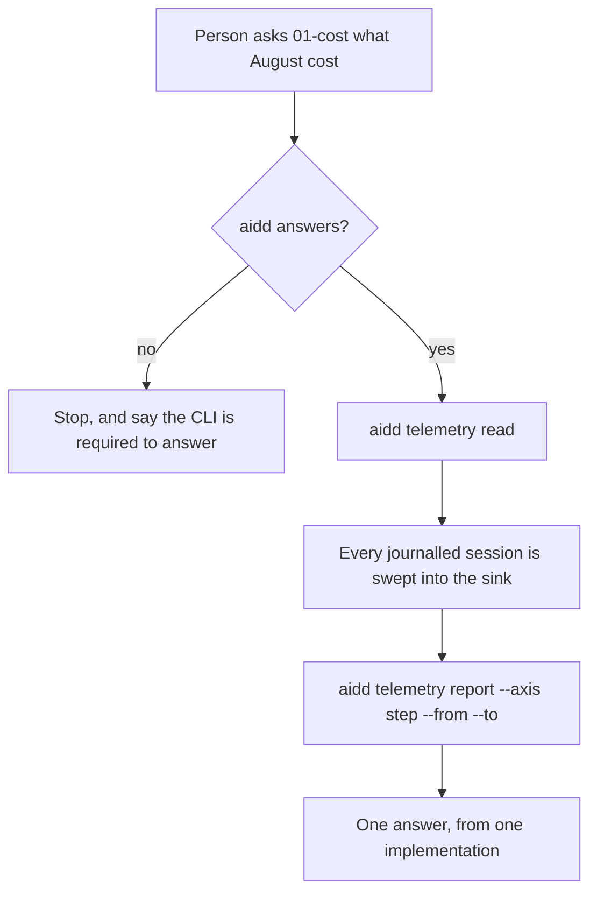
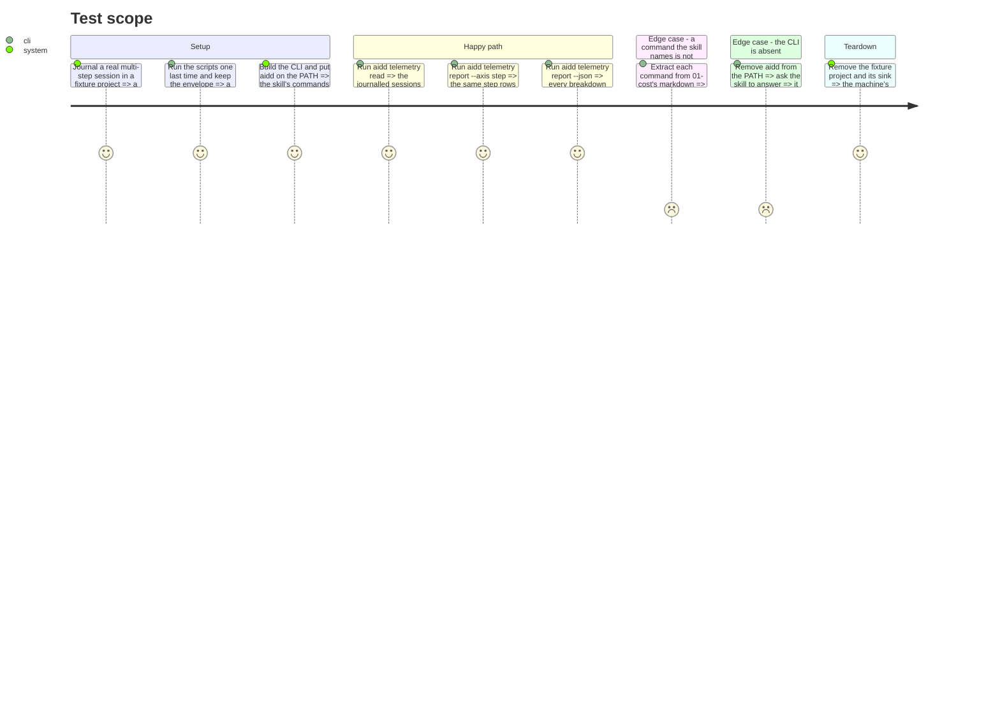

# Instruction: `01-cost` calls the CLI

## Architecture projection

> Tree of the final files. ✅ create · ✏️ modify · ❌ delete
>
> First because it needs no new CLI command: `read` and `report` already exist. It deletes
> the most (2,413 lines) and proves the whole pivot before a line of new surface is written.

```txt
.
├── cli
│   └── tests
│       └── e2e
│           ├── telemetry-plugin-matches-cli.e2e.test.ts            ❌ it compared two implementations; one remains
│           └── telemetry-cost-skill-commands.e2e.test.ts           ✅ every command 01-cost names, accepted by the CLI
├── plugins
│   └── aidd-telemetry
│       └── skills
│           └── 01-cost
│               ├── SKILL.md                                        ✏️ names aidd, not a script beside it
│               ├── actions
│               │   ├── 01-locate.md                                ✏️ locating a script becomes requiring the CLI
│               │   ├── 02-collect.md                               ✏️ aidd telemetry read
│               │   └── 03-report.md                                ✏️ aidd telemetry report --axis --from --to --json
│               ├── package.json                                    ❌ no script left to declare commonjs for
│               └── scripts/                                        ❌ 8 files, 2,413 lines
└── scripts
    └── __tests__
        ├── aidd-telemetry-cost-skill.test.js                       ✏️ asserts the commands, not the script's flags
        ├── telemetry-cost-readers.test.js                          ❌ the readers it exercised are deleted
        ├── telemetry-cost-report.test.js                           ❌ the report it exercised is deleted
        ├── telemetry-cost-sink.test.js                             ❌ the sink it exercised is deleted
        └── telemetry-where-things-live.test.js                     ✏️ keeps the sink-location tests, loses the copy guards
```

## User Journey



## Test Scope



## Tasks to do

### `1)` Capture the reference, in two artefacts that prove different things

> Once the scripts are gone there is nothing left to compare against. A committed fixture has
> to be reproducible in CI, and it must not be somebody's real usage: this repository is
> public, and the layer's own rule is that nothing leaves the machine.

1. **Committed, synthetic.** Build a sink covering every shape the readers produce — `request`
   and `session` kinds, a record with a model and one without, a stated step and an
   unattributed one, several tools and several days. Run `telemetry-report.cjs report --json`
   over it and commit both the sink and the envelope.
2. Assert the fixture carries at least two distinct steps and a non-zero total, so a later
   vacuous pin fails loudly rather than passing on emptiness.
3. **Not committed, real.** Run the script and the CLI over the machine's own sink and compare
   the two envelopes. A synthetic fixture agrees with the code that reads it; only data nobody
   authored for this test can disagree. Record the outcome in the phase's notes, as evidence
   rather than as a test CI can rerun.

### `2)` Rewrite what `01-cost` tells the agent to run

> Every `node <script>` becomes an `aidd telemetry` command.

1. `telemetry-report.cjs read` → `aidd telemetry read`.
2. `report --axis|--from|--to|--json` → the same flags on `aidd telemetry report`.
3. `01-locate.md` no longer locates a file beside the skill: it checks that `aidd` answers, and stops with that reason when it does not.
4. Write that rule once, in a form phases 3 and 6 reuse verbatim: the skill stops, names the CLI as the missing piece, and states that recording is unaffected. It never proceeds to report nothing — a missing tool is not a measurement of zero.

### `3)` Delete the second implementation and the guards that held two copies together

> The duplication is the thing being removed; its guards go with it.

1. Delete `01-cost/scripts/` and its `package.json` marker, which existed only for those scripts.
2. Delete `telemetry-plugin-matches-cli.e2e.test.ts` and the three plugin suites that exercised the deleted readers, report and sink.
3. In `telemetry-where-things-live.test.js`, keep the tests about where the sink writes; remove the byte-identical copy guards.

### `4)` Prove the answer did not change, and that every named command exists

> Two different failures: a wrong figure, and a command the CLI never accepts.

1. Assert the CLI's envelope equals the task-1 fixture, field for field.
2. Extract every `aidd telemetry …` command from `01-cost`'s markdown and assert the CLI parses each one, the way the deleted test did for the script's flags.

## Test acceptance criteria

| Task | Acceptance criteria                                                                                                              |
| ---- | -------------------------------------------------------------------------------------------------------------------------------- |
| 1    | The committed fixture is synthetic, holds at least two step rows and a non-zero total, and a fixture that does not fails the suite. The real-sink comparison was run and its outcome written down. |
| 2    | No file under `01-cost/` names a `.cjs` path, and with `aidd` absent the skill stops naming the CLI and stating that recording is unaffected — never an empty or zero result. |
| 3    | `plugins/aidd-telemetry/skills/01-cost/scripts/` no longer exists, and the whole suite is green without the deleted guards.       |
| 4    | The CLI's envelope equals the task-1 fixture field for field, and every command extracted from `01-cost` is accepted by the CLI.  |
