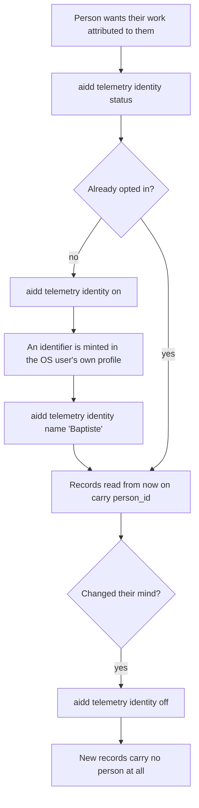
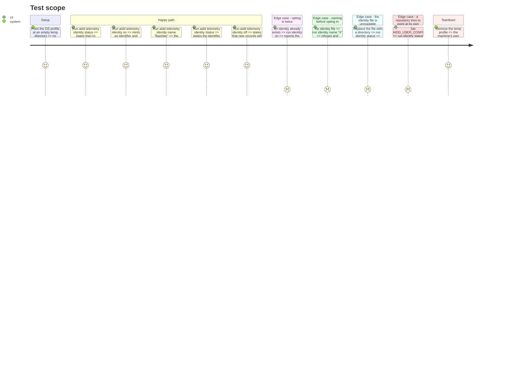

# Instruction: `aidd telemetry identity`

## Architecture projection

> Tree of the final files. ✅ create · ✏️ modify · ❌ delete

```txt
.
└── cli
    ├── src
    │   ├── application
    │   │   ├── commands
    │   │   │   └── telemetry.ts                                    ✏️ four verbs: status, on, off, name
    │   │   └── use-cases
    │   │       └── telemetry
    │   │           └── person-identity-use-case.ts                 ✅ the choice, and what it promises
    │   └── infrastructure
    │       └── adapters
    │           └── person-identity-adapter.ts                      ✏️ gains write; it only reads today
    └── tests
        ├── application
        │   └── use-cases
        │       └── telemetry
        │           └── person-identity-use-case.unit.test.ts       ✅ each verb, and opting out
        └── e2e
            └── telemetry-identity.e2e.test.ts                      ✅ pinned against the script phase 3 deletes
```

## User Journey



## Test Scope



## Tasks to do

### `1)` Give the adapter a write side

> It reads an identity today; it must also mint, name and forget one.

1. Add `mint`, `setDisplayName` and `forget` to the port the adapter implements.
2. Write with the modes the plugin already uses: `0600` on the file, `0700` on the directory.
3. Resolve the directory the way `identity.cjs` does — the OS user's own profile, `%APPDATA%` on Windows — and accept no override, because a path a repository or a CI can point at is not a person's own choice.

### `2)` A use-case that owns the choice

> The four verbs, and what each promises.

1. `status` answers one of three states: no identity, an identity with no name, an identity with a name.
2. `on` mints only when none exists; a second `on` is not a new identifier.
3. `name` refuses when nothing was opted into, naming `on` as the missing step.
4. `off` removes the identity and says that new records will carry no person, never that past ones lose theirs.

### `3)` Restore the two suites phase 1 had to move here

> Phase 1 deleted `01-cost`'s reporter, and two suites in
> `scripts/__tests__/aidd-telemetry-identity.test.js` drove `read` through it: *"what a
> default install actually stores, proven from the stored bytes"* and *"a choice made today
> does not reach backwards"*. Reading the stored bytes is a stronger claim than the unit
> tests that currently hold the behaviour, and this is the phase that can restore it.

1. Rebuild both as e2e tests against `aidd telemetry read`, with a journal and a fixture home.
2. Assert from the stored lines themselves, not from a stubbed sink.

### `4)` Wire the subcommand and pin it against the script

> The script is still present in this phase, which is the only chance to compare them.

1. Add `identity` with its four verbs to `telemetry.ts`, wiring only, every failure through `errorHandler.handle`.
2. Drive both `telemetry-identity.cjs <verb>` and `aidd telemetry identity <verb>` against the same temp profile.
3. Assert the resulting identity file is byte-identical and the stated states agree.

## Test acceptance criteria

| Task | Acceptance criteria                                                                                                       |
| ---- | ------------------------------------------------------------------------------------------------------------------------- |
| 1    | The identity file lands in the OS user's own profile with `0600`/`0700`, and `AIDD_USER_CONFIG_DIR` does not move it.      |
| 2    | A second `on` reports the same identifier as the first; `name` before `on` refuses and names `on`; `off` states that only new records are affected. |
| 3    | A default install stores no person field, proven by reading the lines `aidd telemetry read` wrote; records stored before opting in stay unnamed. |
| 4    | For each of the four verbs, the file the CLI writes is byte-identical to the file the script writes from the same starting state, and an unreadable file surfaces as an error rather than as "no identity". |
