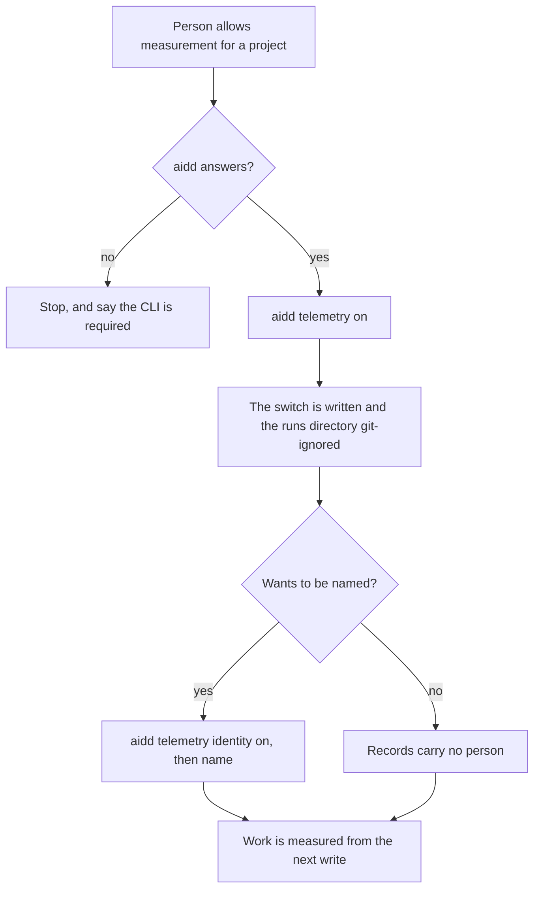
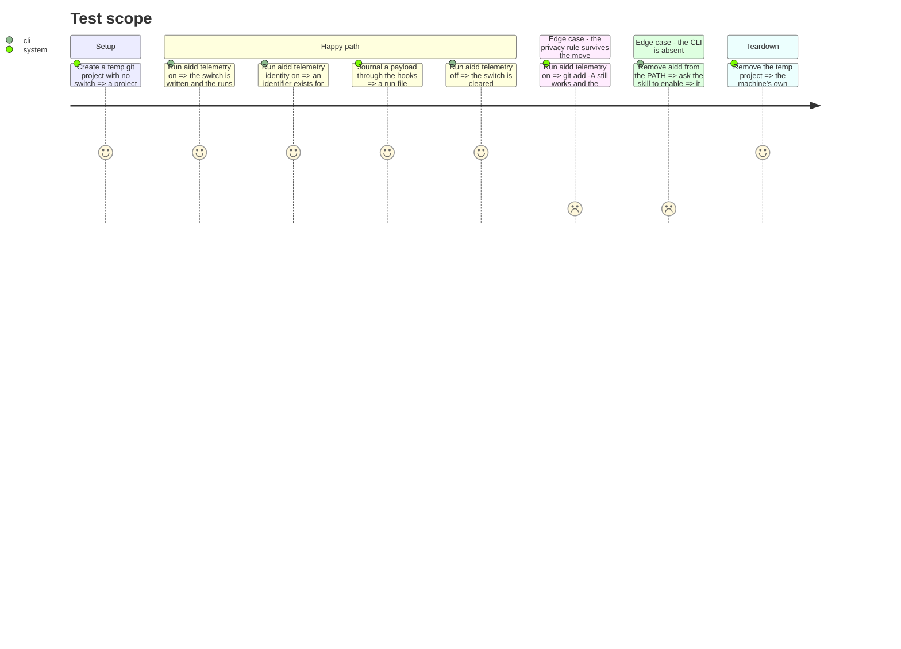

# Instruction: `00-init` calls the CLI

## Architecture projection

> Tree of the final files. ✅ create · ✏️ modify · ❌ delete

```txt
.
├── cli
│   └── tests
│       └── e2e
│           └── telemetry-init-skill-commands.e2e.test.ts           ✅ every command 00-init names, accepted by the CLI
├── plugins
│   └── aidd-telemetry
│       └── skills
│           └── 00-init
│               ├── SKILL.md                                        ✏️ names aidd, not a script beside it
│               ├── actions
│               │   ├── 01-check.md                                 ✏️ the switch is read through the CLI
│               │   ├── 02-enable.md                                ✏️ aidd telemetry on | off
│               │   ├── 04-identify.md                              ✏️ aidd telemetry identity on | name
│               │   └── 05-forget.md                                ✏️ aidd telemetry identity off
│               ├── package.json                                    ❌ no script left to declare commonjs for
│               └── scripts/                                        ❌ 4 files, 278 lines
└── scripts
    └── __tests__
        └── aidd-telemetry-identity.test.js                         ❌ the script it exercised is deleted
```

## User Journey



## Test Scope



## Tasks to do

### `0)` Separate the switch from the endpoint, before any swap

> Measured 2026-08-26: `aidd telemetry on` refuses to run without `--endpoint`, and it does not
> only flip a boolean — it upserts OTLP keys into every installed tool's own settings file. The
> plugin's `telemetry-switch.cjs on` writes `.aidd/config.json` and a `.gitignore` line, nothing
> else. Task 1 below was written as a swap; it is not one until this is done.

1. `aidd telemetry on|off` owns the project switch alone: the flag, and git-ignoring the runs
   directory. It stops requiring `--endpoint`, and stops writing any tool's settings.
2. A new `aidd telemetry endpoint <url>` owns making the tools emit, and `endpoint clear`
   undoes it. Named for the destination it sets, not for an export it does not perform — the
   tool exports, later, on its own.
3. `off` shrinks to the switch. It must no longer remove tool settings that `on` no longer
   wrote, or turning off a local journal would silently erase somebody's export configuration.
4. The consent text in `02-enable.md` keeps its promise: "nothing leaves the machine" stays
   true for `on`, and becomes false only when someone types `endpoint`.

### `1)` Rewrite what `00-init` tells the agent to run

> Every `node <script>` becomes an `aidd telemetry` command. True as a swap only after task 0.

1. `telemetry-switch.cjs on|off` → `aidd telemetry on|off`.
2. `telemetry-identity.cjs status|on|off|name` → `aidd telemetry identity …`, from phase 2.
3. `01-check.md` reads the switch through the CLI, reusing phase 1's absent-CLI rule verbatim rather than inventing a second wording.

### `2)` Carry over what the switch script did beyond flipping a flag

> `journal-privacy.cjs` git-ignores the runs directory and warns when it is already tracked. Deleting it must not delete that.

1. Confirm `aidd telemetry on` already git-ignores `aidd_docs/runs/` and warns when the directory is tracked; add whichever is missing.
2. Keep the measured Windows rule: the directory and the journal name the current user alone, and `git add -A` still works.

### `3)` Delete the scripts and their suite

1. Delete `00-init/scripts/` and its `package.json` marker.
2. Delete `scripts/__tests__/aidd-telemetry-identity.test.js`, whose subject is gone.

### `4)` Prove every named command exists

1. Extract every `aidd telemetry …` command from `00-init`'s markdown and assert the CLI parses each one.

## Test acceptance criteria

| Task | Acceptance criteria                                                                                       |
| ---- | ----------------------------------------------------------------------------------------------------------- |
| 0    | `aidd telemetry on` succeeds in a project with no endpoint and writes no tool's settings file; `endpoint <url>` writes them and `endpoint clear` removes them; `off` leaves an endpoint configuration untouched. |
| 1    | No file under `00-init/` names a `.cjs` path, and its absent-CLI wording is identical to `01-cost`'s. |
| 2    | After `aidd telemetry on`, `aidd_docs/runs/` is git-ignored, `git add -A` succeeds, and the journal is owner-only. |
| 3    | `plugins/aidd-telemetry/skills/00-init/scripts/` no longer exists and the suite is green without it.          |
| 4    | Every command extracted from `00-init` is accepted by the CLI.                                                |
