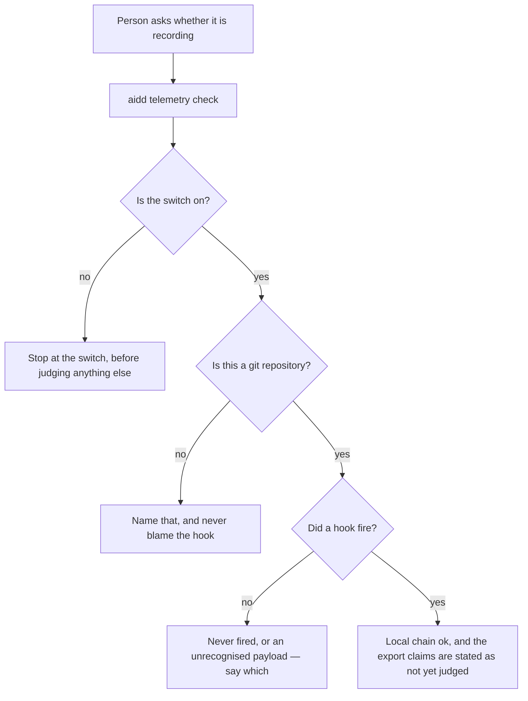
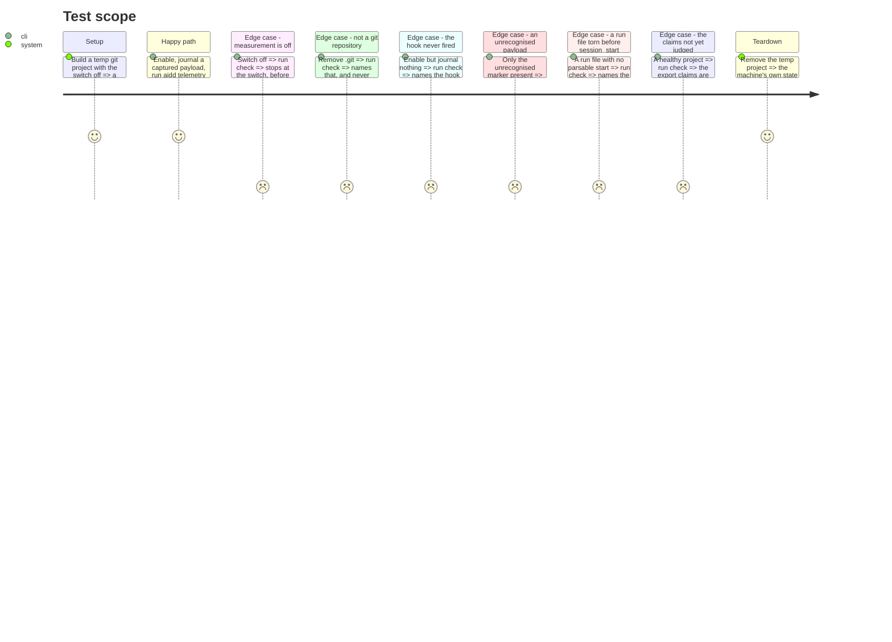

# Instruction: `aidd telemetry check` — the claims it can settle without reading an export

## Architecture projection

> Tree of the final files. ✅ create · ✏️ modify · ❌ delete
>
> The check is split in two because it is ~1,100 lines with no CLI equivalent. This half ships
> a working command that answers the local claims and **states which claims it does not yet
> judge** — the same rule the figures obey: an unknown is never a silent pass.

```txt
.
└── cli
    ├── src
    │   ├── application
    │   │   ├── commands
    │   │   │   └── telemetry.ts                                    ✏️ the check subcommand, wiring only
    │   │   ├── display
    │   │   │   └── telemetry-check-display.ts                      ✅ a claim, its verdict, its reason
    │   │   └── use-cases
    │   │       └── telemetry
    │   │           └── diagnose-telemetry-use-case.ts              ✅ gathers evidence, then judges
    │   ├── domain
    │   │   └── models
    │   │       ├── telemetry-claim.ts                              ✅ the closed set of claims and verdicts
    │   │       └── session-anchor.ts                               ✅ which session this run is, per tool
    │   └── infrastructure
    │       └── adapters
    │           └── telemetry-evidence-adapter.ts                   ✅ switch, repository, journal, marker
    └── tests
        ├── application
        │   └── use-cases
        │       └── telemetry
        │           └── diagnose-telemetry-use-case.unit.test.ts    ✅ one test per claim and per reason
        └── e2e
            └── telemetry-check.e2e.test.ts                         ✅ the local claims, pinned against the script
```

## User Journey



## Test Scope



## Tasks to do

### `1)` Name every claim before porting any of them

> The diagnostic's value is that it distinguishes reasons. That set is the contract, and it is
> written whole here even though this phase settles only part of it.

1. Enumerate every claim the current checker can make, from `diagnose.cjs`, as a closed union in `domain/models/telemetry-claim.ts`.
2. Give each a verdict and a reason, so "no run file" and "untrusted hook" can never collapse into one answer.
3. Mark the claims this phase does not settle, so the display can state them rather than omit them.

### `2)` The local evidence, behind one port

1. Port the switch, repository, journal and marker reads into `telemetry-evidence-adapter.ts`.
2. Port `session-anchor.cjs` into `domain/models/` — resolving which session this is, is a derivation, not I/O.
3. A read that fails becomes stated evidence, never a thrown error.

### `3)` The use-case gathers, then judges

1. Gather all evidence first, then judge, so a missing piece names itself instead of aborting the run.
2. Stop at the switch, in the order the journey shows.
3. Never let absent evidence produce an `ok`.

### `4)` Wire the command, and say what is not judged yet

1. Add `check` to `telemetry.ts` and a display printing claim, verdict and reason.
2. List the export claims as not yet judged, in the output itself.
3. Pin the local claims against `telemetry-check.cjs` on the same fixtures — the script is still present, and this is the window to compare.

## Test acceptance criteria

| Task | Acceptance criteria                                                                                                       |
| ---- | ------------------------------------------------------------------------------------------------------------------------- |
| 1    | Every claim the current checker can make exists in the union, and no two distinct reasons share one verdict.                |
| 2    | A read that fails appears as stated evidence, and the run still produces a verdict for the other claims.                    |
| 3    | Measurement off stops at the switch; a non-repository names that and never blames the hook; absent evidence never yields `ok`. |
| 4    | On a healthy project the export claims are printed as not yet judged, and every local claim equals the script's on the same fixture. |
