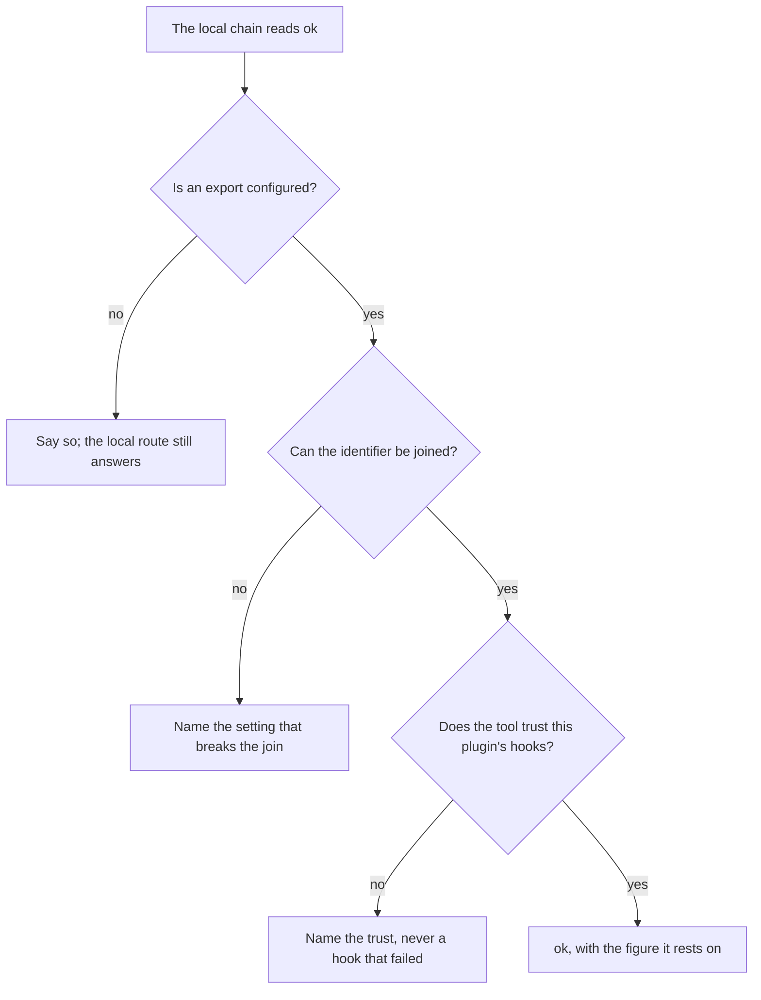
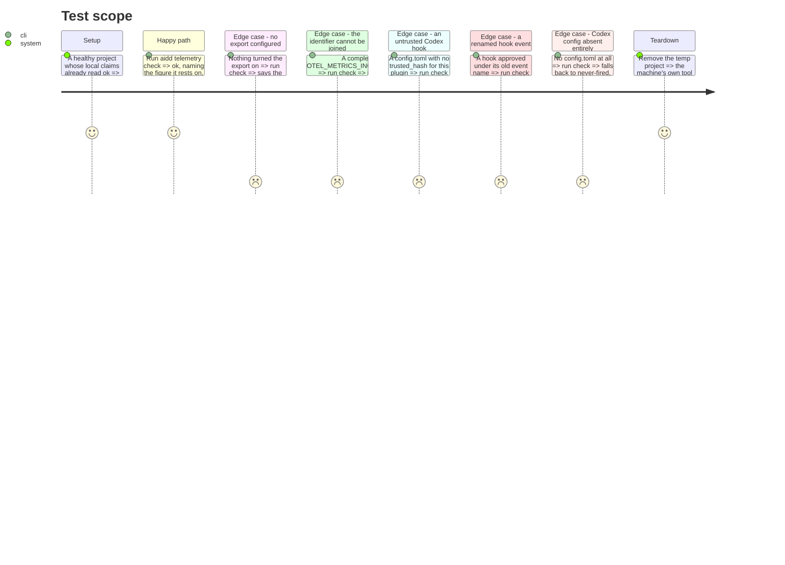

# Instruction: `aidd telemetry check` — the export, the trust, and the join

## Architecture projection

> Tree of the final files. ✅ create · ✏️ modify · ❌ delete
>
> The half that needs a tool's own configuration: whether an export is set up, whether the
> identifier can be joined, and whether the tool trusts this plugin's hooks at all.

```txt
.
├── cli
│   ├── src
│   │   ├── application
│   │   │   └── use-cases
│   │   │       └── telemetry
│   │   │           └── diagnose-telemetry-use-case.ts              ✏️ judges the remaining claims
│   │   ├── domain
│   │   │   └── ports
│   │   │       ├── export-config-reader.ts                         ✅ what a tool's own config says about exporting
│   │   │       └── hook-trust-reader.ts                            ✅ whether a tool trusts this plugin's hooks
│   │   └── infrastructure
│   │       └── adapters
│   │           ├── export-config-reader-adapter.ts                 ✅ ports export-config.cjs, 182 lines
│   │           ├── export-sink-reader-adapter.ts                   ✅ ports export-sink.cjs, 88 lines
│   │           └── hook-trust-reader-adapter.ts                    ✅ ports hook-trust.cjs, 62 lines
│   └── tests
│       └── e2e
│           └── telemetry-check.e2e.test.ts                         ✏️ the full claim set, pinned against the script
├── plugins
│   └── aidd-telemetry
│       └── skills
│           └── 02-check
│               ├── SKILL.md                                        ✏️ names aidd, not a script beside it
│               ├── actions
│               │   ├── 01-locate.md                                ✏️ requires the CLI, stops with the reason
│               │   └── 02-diagnose.md                              ✏️ aidd telemetry check
│               ├── package.json                                    ❌ no script left to declare commonjs for
│               └── scripts/                                        ❌ 13 files, 1,664 lines
└── scripts
    └── __tests__
        └── telemetry-check.test.js                                 ❌ the checker it exercised is deleted
```

## User Journey



## Test Scope



## Tasks to do

### `1)` The export configuration, behind a port

1. Port `export-config.cjs` into `export-config-reader-adapter.ts`, keeping the one setting that survives identity resolution.
2. Port `export-sink.cjs` into `export-sink-reader-adapter.ts`.
3. Read Codex's own `[otel]` table when its thread identifier names the session, never Claude's settings files.

### `2)` Hook trust, per entry

1. Port `hook-trust.cjs` into `hook-trust-reader-adapter.ts`.
2. Keep the measured rule: trust is keyed per entry, so a renamed event inherits no approval.
3. An absent configuration falls back to never-fired, never to a guess at trust.

### `3)` Judge the remaining claims

1. Extend the use-case to settle every claim marked unjudged in phase 4.
2. The display stops listing anything as not yet judged, because nothing is.

### `4)` Confront it with a machine's real configuration

> Every fixture in this plan was written against the code that reads it. Only a configuration
> nobody authored for this test can disagree — which is how the Codex over-count surfaced.

1. Run both checkers against the real tool configurations present on the development machine.
2. Record every claim where they differ, and settle each as a defect in one or the other before proceeding.
3. Keep the finding in the phase's own notes; it is evidence, not a test that CI can rerun.

### `5)` Pin the full set, then delete the checker

1. Drive both `telemetry-check.cjs` and `aidd telemetry check` against the same fixtures, covering every claim in the union.
2. Rewrite `02-check`'s `SKILL.md` and both actions to call the CLI.
3. Delete `02-check/scripts/`, its `package.json`, and `scripts/__tests__/telemetry-check.test.js`.

## Test acceptance criteria

| Task | Acceptance criteria                                                                                             |
| ---- | ----------------------------------------------------------------------------------------------------------------- |
| 1    | An export configured but unjoinable names the exact setting that breaks the join, and Codex's own table is read for a Codex session. |
| 2    | A hook approved under an old event name reports untrusted; an absent configuration reports never-fired.            |
| 3    | No claim is printed as not yet judged, on any fixture.                                                            |
| 4    | Both checkers were run against the machine's real tool configurations, and every divergence is settled and written down.          |
| 5    | For every claim in the union, the CLI's verdict and reason equal the deleted checker's, and `02-check/scripts/` no longer exists. |
