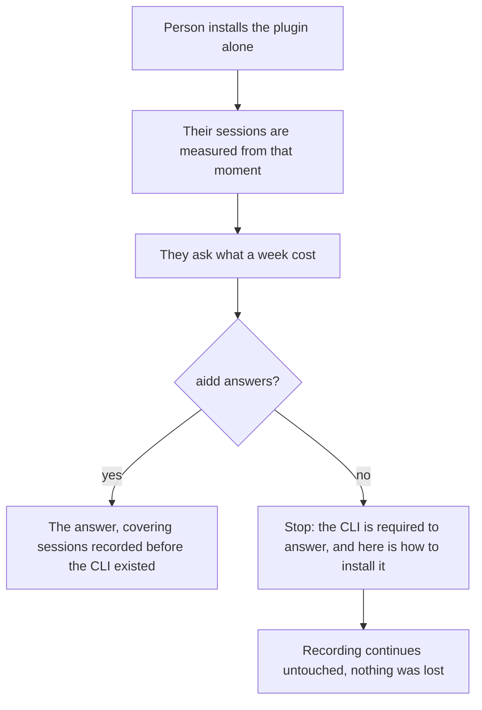
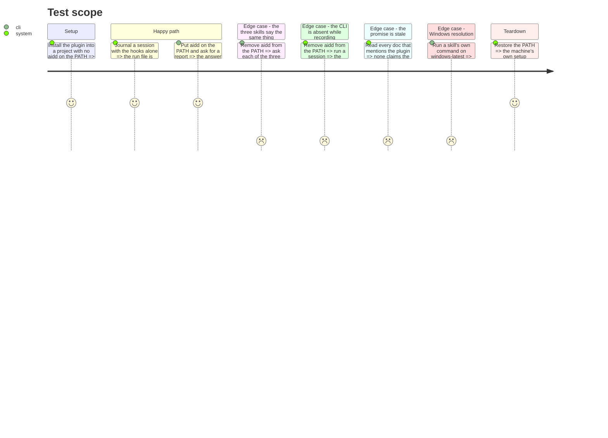

# Instruction: The promise, and the absent CLI

## Architecture projection

> Tree of the final files. ✅ create · ✏️ modify · ❌ delete

```txt
.
├── .github
│   └── workflows
│       └── cli-ci.yml                                              ✏️ the Windows job runs a skill's own command
├── docs
│   ├── CATALOG.md                                                  ✏️ the plugin's dependency, stated
│   └── FAQ.md                                                      ✏️ measuring needs node, answering needs aidd
├── plugins
│   └── aidd-telemetry
│       ├── README.md                                               ✏️ drops "no npm install, no CLI, no account"
│       └── skills
│           ├── 00-init/actions/01-check.md                         ✏️ one shared way to require the CLI
│           ├── 01-cost/actions/01-locate.md                        ✏️ idem
│           └── 02-check/actions/01-locate.md                       ✏️ idem
└── scripts
    └── __tests__
        └── telemetry-cli-required.test.js                          ✅ every skill states it, and none is silent
```

## User Journey



## Test Scope



## Tasks to do

### `1)` Hold the three skills to one wording

> The rule itself was written in phase 1 and reused in phase 3. What is missing is a guard
> that a fourth skill cannot invent a fourth behaviour.

1. Assert the three locating actions carry the same absent-CLI wording, character for character.
2. Assert none of them can reach a report when `aidd` does not answer.

### `2)` Restate the promise per capability

> The README's claim became false in phase 1. This is where it is corrected, once, for every doc.

1. `plugins/aidd-telemetry/README.md`: replace "no npm install, no CLI, no account" with what is now true — measuring needs plain node and works from install; answering needs `aidd`.
2. `docs/FAQ.md` and `docs/CATALOG.md`: the same split, one line each.
3. Say plainly what is unchanged: nothing leaves the machine, and no amount is computed.

### `3)` Prove recording survives without the CLI

> The whole reason the write path stayed in node.

1. An install with no `aidd` anywhere journals a session end to end.
2. The figures for that session are read later, once the CLI is present, and are complete.

### `4)` Make Windows exercise a skill's own command

> The layer has already paid once for assuming a POSIX rule, when `os.homedir()` turned out never to read `$HOME` there.

1. The `cli / Windows` job runs one command lifted from a skill's markdown, not only the suites.
2. It fails if the CLI cannot be resolved on the PATH there.

## Test acceptance criteria

| Task | Acceptance criteria                                                                                                              |
| ---- | -------------------------------------------------------------------------------------------------------------------------------- |
| 1    | The three skills' absent-CLI wording is identical, and none reaches a report when `aidd` does not answer.                         |
| 2    | No file in the repository claims the plugin answers without the CLI, and every one naming the dependency also says recording does not need it. |
| 3    | A session journalled with no `aidd` present is read completely once the CLI is installed.                                         |
| 4    | `cli / Windows` runs a command lifted from a skill's own markdown, and fails when the CLI cannot be resolved on the PATH.         |
