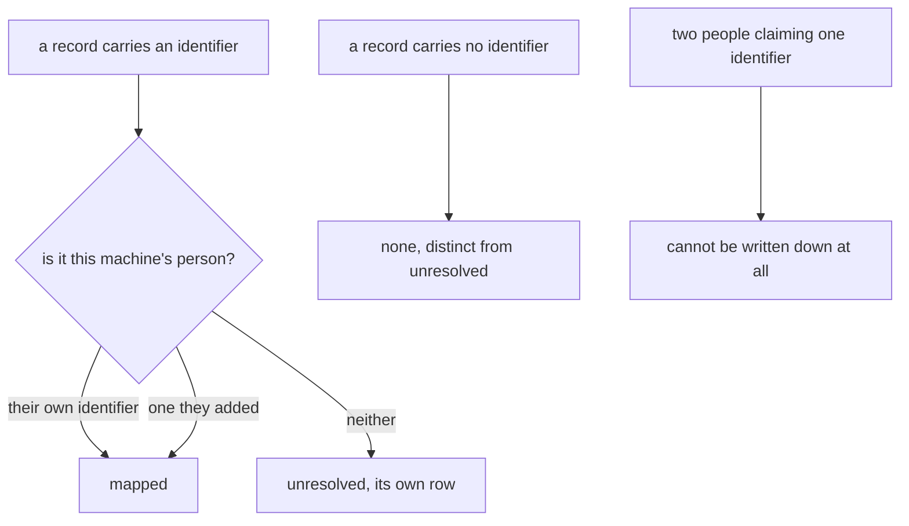
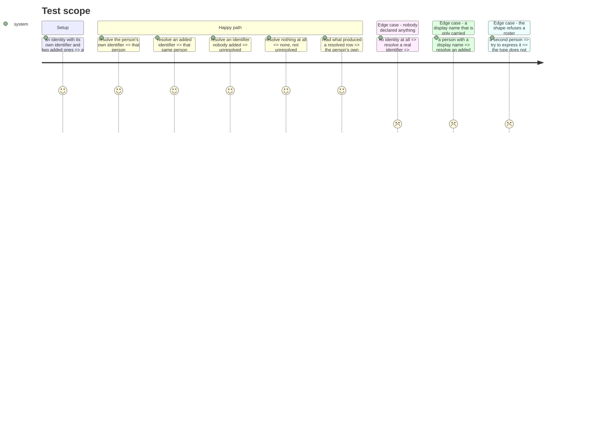

# Instruction: the identity carries who is also this person

## Architecture projection

```txt
.
└── cli
    ├── src/domain
    │   ├── ports/person-identity-reader.ts                 ✏️
    │   ├── models/person-resolution.ts                     ✅
    │   ├── models/person-mapping.ts                        ❌
    │   └── errors.ts                                       ✏️
    └── tests/domain/models
        ├── person-resolution.unit.test.ts                  ✅
        └── person-mapping.unit.test.ts                     ❌
```

## User Journey



## Test Scope



## Tasks to do

### `1)` The identity becomes the whole declaration

> One type for "who this machine's user is", where there were two.

1. Extend `PersonIdentity` in `cli/src/domain/ports/person-identity-reader.ts` with `origin: "minted" | "adopted"` and `alsoMe: readonly string[]`.
2. Document that `alsoMe` holds identifiers this person did not choose — an identifier from before a withdrawal, or a tool's own pseudonymous identifier — and that the ordinary way to be one person on two machines is to take the same identity, not to add one here.
3. Document that `origin` records the only checkable fact about an identity, at the only moment it is knowable, and that no third value is reserved for a verification nothing can perform yet.
4. Keep `displayName` exactly as it is: carried, never produced, and still silent on the name-versus-pseudonym question.

### `2)` Resolution moves, unchanged in behaviour

> The three outcomes and their guards are the expensive part of the previous delivery. They survive.

1. Add `cli/src/domain/models/person-resolution.ts`, carrying `PersonResolution`, `ResolvedPerson` and `resolvePerson`, moved from `person-mapping.ts`.
2. Change `resolvePerson`'s first argument from a mapping to `PersonIdentity | null`. A match is the identity's own `personId` or any member of `alsoMe`.
3. Keep every outcome exactly as it is: `mapped`, `unresolved` for a real identifier nobody declared, `none` for no identifier at all, and a `null` identity resolving everything to `unresolved` with the identifier still named.
4. Keep `identities` on the result carrying what produced the row: the person's own identifier plus every added one when mapped, the raw identifier alone when unresolved.
5. Delete `cli/src/domain/models/person-mapping.ts`.

### `3)` The failure that cannot happen loses its code

> A shape that cannot express two claimants needs no error for two claimants.

1. Delete `AmbiguousPersonMappingError` from `cli/src/domain/errors.ts` and every reference to it.
2. Delete `validatePersonMapping` and its tests.
3. Do not replace them with a runtime check. The type is the guard: state that in the model's doc comment, so a later reader does not add one back.

### `4)` Port the tests rather than rewrite them

1. Move `person-mapping.unit.test.ts`'s cases into `person-resolution.unit.test.ts`, adapting only the construction of the subject.
2. Keep every case that distinguishes `unresolved` from `none`, and the one asserting two undeclared identifiers stay distinct. These are mutation-proven guards; losing one silently is the failure this phase most risks.

## Test acceptance criteria

| Task | Acceptance criteria                                                                                          |
| ---- | -------------------------------------------------------------------------------------------------------------- |
| 1    | An identity can be built with no display name and no added identifiers, and reads back with neither invented     |
| 2    | The person's own identifier and any added one resolve to the same person                                         |
| 2    | No identifier resolves to `none`, an undeclared one to `unresolved`, and the two remain distinguishable          |
| 2    | A `null` identity resolves a real identifier to `unresolved` with that identifier still named                     |
| 3    | Nothing in the codebase can express two people claiming one identifier                                           |
| 4    | Every case the deleted test file carried still exists, and still fails when the behaviour it guards is broken     |
