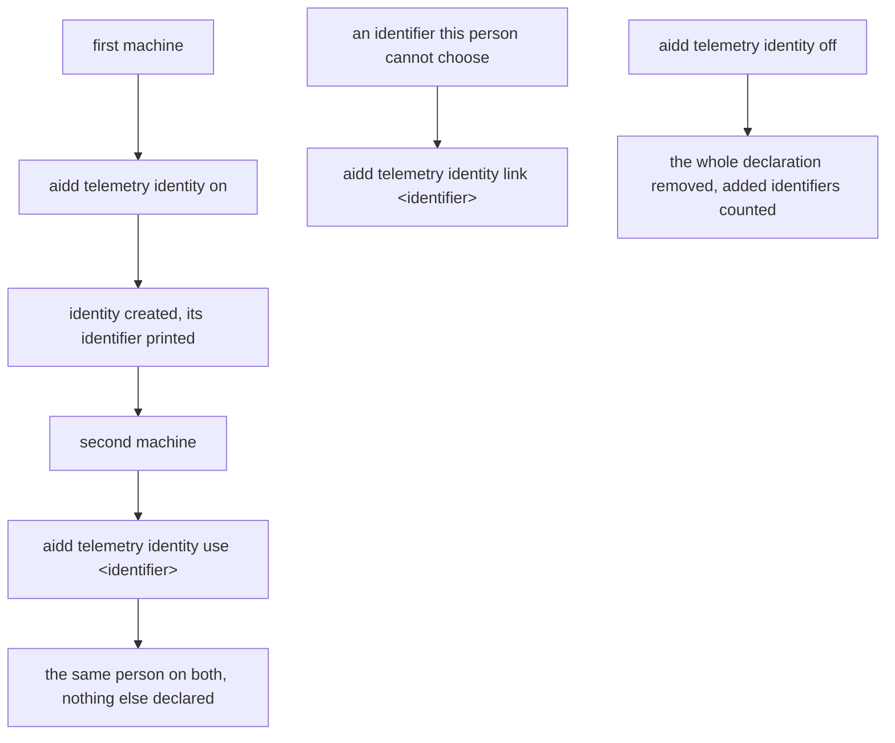
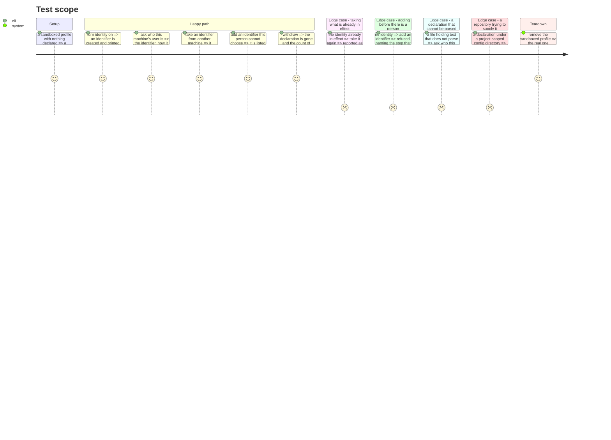

# Instruction: one store, one file, one set of verbs

## Architecture projection

```txt
.
└── cli
    ├── src
    │   ├── domain
    │   │   ├── ports/person-identity-store.ts              ✏️
    │   │   ├── ports/person-mapping-reader.ts               ❌
    │   │   ├── ports/person-mapping-store.ts                ❌
    │   │   └── models/person-mapping.ts                     ❌
    │   ├── infrastructure
    │   │   ├── adapters/person-identity-adapter.ts         ✏️
    │   │   ├── adapters/person-mapping-adapter.ts          ❌
    │   │   ├── errors.ts                                   ✏️
    │   │   └── deps.ts                                     ✏️
    │   └── application
    │       ├── use-cases/telemetry/person-identity-use-case.ts ✏️
    │       ├── use-cases/telemetry/person-mapping-use-case.ts  ❌
    │       ├── display/telemetry-display.ts                    ✏️
    │       └── commands/telemetry.ts                           ✏️
    └── tests
        ├── domain/models/person-mapping.unit.test.ts       ❌
        ├── helpers/ports/in-memory-person-mapping-*.ts     ❌
        ├── infrastructure/adapters/person-mapping-location.unit.test.ts ❌
        └── application/use-cases/telemetry/person-identity-use-case.unit.test.ts ✏️
```

`models/person-mapping.ts` and its test were left standing at the end of phase 1 — their
cases were already ported to `person-resolution.unit.test.ts` there — and are deleted here,
alongside the rest of the mapping subsystem, so this phase's own deletion is not duplicated
across two commits.

## User Journey



## Test Scope



## Tasks to do

### `1)` One store

> Two ports and two adapters described one file's worth of facts. Now they are one.

1. Extend `PersonIdentityStore` with `adopt(personId)`, `addAlsoMe(identity)` and `removeAlsoMe(identity)`.
2. `mint()` records `origin: "minted"`; `adopt()` records `origin: "adopted"` and keeps any `alsoMe` already declared.
3. Delete `person-mapping-reader.ts`, `person-mapping-store.ts`, `person-mapping-adapter.ts`, `person-mapping-use-case.ts`, `models/person-mapping.ts` and its test (left standing at the end of phase 1), both in-memory doubles and `person-mapping-location.unit.test.ts`.
4. Fold the on-disk shape into `person-identity-adapter.ts`: `person_id`, `origin`, optional `display_name`, optional `also_me`. Keep the file's private mode and its profile-only resolution unchanged.
5. Read an identity file with no `origin` as `minted`, and document why: it is what every file written before this change was. Never guess anything else.
6. Delete `UnreadablePersonMappingFileError` and fold its case into the identity file's own unreadable error, which now covers the one file that exists.

### `2)` The verbs

> `on` and `use` are the two ways to have an identity. `link` is for what a person cannot choose.

1. Add `aidd telemetry identity use <identifier>` to `cli/src/application/commands/telemetry.ts`, taking an identity from another machine.
2. Taking the identifier already in effect reports it as already in effect, and writes nothing.
3. Taking a different identifier replaces the current one and says so plainly, naming that records already written keep the identifier they carried.
4. Keep `link`/`unlink`, now writing `also_me` on the identity file, and keep their existing refusals: linking before there is a person, unlinking what was never listed.
5. Every one of these says, in one sentence, that taking or adding an identifier is a declaration the tool cannot check.

### `3)` `status` tells the whole truth

1. `status` shows the identifier, how it was obtained, and every added identifier.
2. Keep the strict read: a file that exists and cannot be parsed is refused by name, never folded into "nobody chose".
3. When a stale separate declaration file is present beside the identity, say it is ignored and can be removed. No migration, no silent deletion.

### `4)` `off` removes the whole declaration

1. `off` removes the file, added identifiers included, and states how many went with it.
2. Keep `off` working on a file too damaged to parse: it is how a person gets out, and that is exactly when it must still work.
3. Delete the message saying a declaration is left standing after a withdrawal. It described the two-file split and is no longer true.

## Test acceptance criteria

| Task | Acceptance criteria                                                                                    |
| ---- | -------------------------------------------------------------------------------------------------------- |
| 1    | One file holds the identifier, how it was obtained, and every added identifier                            |
| 1    | An identity file written before this change reads back as created here, with nothing invented              |
| 1    | The declaration is read from the OS profile even when a project-scoped config directory is set             |
| 2    | Taking an identifier from another machine leaves one person, obtained as taken                             |
| 2    | Taking the identifier already in effect writes nothing and says it is already in effect                    |
| 2    | Adding an identifier before there is a person is refused, naming the missing step                          |
| 3    | Asking who this machine's user is shows the identifier, its origin, and every added identifier             |
| 3    | A declaration that cannot be parsed is refused by name, never reported as nobody having chosen             |
| 4    | Withdrawing leaves no declaration, and states how many added identifiers went with it                      |
| 4    | Withdrawing still works on a declaration too damaged to parse                                              |
