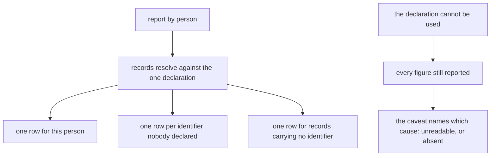
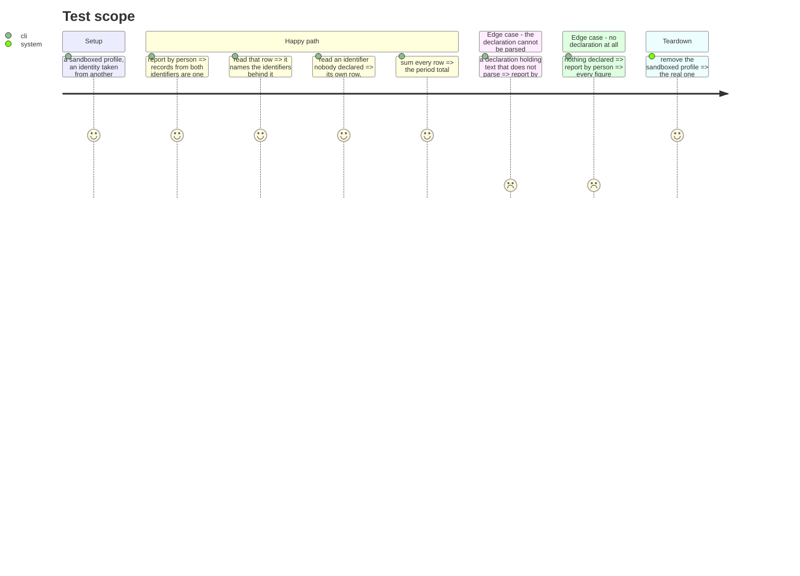

# Instruction: the report reads it, and names what stopped it

## Architecture projection

```txt
.
└── cli
    ├── src
    │   ├── application/use-cases/telemetry/report-cost-use-case.ts ✏️
    │   ├── application/display/cost-report-artefact.ts             ✏️
    │   └── domain/models
    │       ├── cost-report.ts                                      ✏️
    │       └── cost-report-envelope.ts                             ✏️
    ├── tests/e2e
    │   ├── telemetry-person-mapping.e2e.test.ts                    ✏️
    │   └── helpers.ts                                              ✏️
    └── ../aidd_docs/product/cost-report-contract.md                ✏️
    └── ../plugins/aidd-telemetry                                   ✏️
```

## User Journey



## Test Scope



## Tasks to do

### `1)` The report reads one declaration

> The domain took a shape, not a file, so this is a substitution rather than a rewrite.

1. Change `ReportCostUseCase` to depend on `PersonIdentityStore` instead of the deleted mapping store.
2. Pass the identity into `buildCostReport` where the mapping went, keeping the argument-not-module rule that keeps the domain free of I/O.
3. Rename the report's own carried field from a mapping to an identity, in `cost-report.ts` and `cost-report-envelope.ts`, without touching the grouping or the row shape.

### `2)` The failure names its cause

> The debt this phase inherits: the contract already required an attribution to state its own strength, and this path did not.

1. Replace the bare `catch` in `personMappingFields` with one that distinguishes what happened: a declaration that could not be read back, and no declaration at all.
2. Carry that as a named cause on the envelope rather than a boolean, so a program reading the envelope can tell the two apart as well as a person can.
3. Never let an unexpected error be reported as one of the named causes. An error this does not recognise is re-thrown, not relabelled.
4. Make the caveat line say which cause fired.
5. Do not bump the report version a second time: version 4 is unreleased, so the field it carries can still change shape.

### `3)` The journeys follow the file

1. Rename `telemetry-person-mapping.e2e.test.ts` for what it now proves, and rewrite its setup to declare through `identity use` and `identity link` rather than by writing a separate file.
2. Keep the two-machines journey, the never-merge assertion and the reconciliation assertion exactly as they are. They are the point.
3. Keep the project-scoped-directory journey non-vacuous: seed the sink under the decoy so the report is non-empty, the way the previous delivery had to be corrected to do.
4. Delete `personMappingFileIn` from `cli/tests/e2e/helpers.ts`: `identityFileIn` beside it already resolves the one
   file that now exists, and already branches per platform rather than hardcoding `.config` — which is why that
   helper family exists at all, after a hardcoded path broke Windows CI on this branch. Do not reintroduce one.
5. Prove the two named causes are distinguishable end to end, by asserting the two caveats differ.

### `4)` What the documentation now promises

1. Update `aidd_docs/product/cost-report-contract.md` for the renamed field and its named causes.
2. Update `plugins/aidd-telemetry/skills/00-init/actions/04-identify.md`: taking an identity is the ordinary way to be one person on two machines, and adding one is for identifiers a person cannot choose.
3. Update `plugins/aidd-telemetry/README.md`'s shared-sink paragraph for the same reason, keeping its true statement that the declaration never follows a project-scoped directory and that the tool cannot check a claim.
4. Regenerate `plugins/aidd-telemetry/CATALOG.md` and `docs/prompts-documentation.md` through their own scripts, never by hand.
5. Grep for every remaining mention of the separate declaration file and remove it.

## Test acceptance criteria

| Task | Acceptance criteria                                                                                  |
| ---- | ------------------------------------------------------------------------------------------------------ |
| 1    | A report resolves people against the identity file, with no second file present anywhere                |
| 1    | The person rows, their identities and their totals are unchanged from the previous delivery              |
| 2    | A declaration that cannot be read and no declaration at all produce different caveats                    |
| 2    | An unrecognised error is not reported as either named cause                                              |
| 2    | Every figure is still reported whichever cause fired                                                     |
| 3    | The two-machines journey passes with the identity taken through the CLI, not by writing a file            |
| 3    | The project-scoped journey asserts a non-empty report before asserting no row resolved                    |
| 4    | No documentation mentions the separate declaration file                                                  |
| 4    | The generated catalogue and prompt index match what their scripts produce                                |
