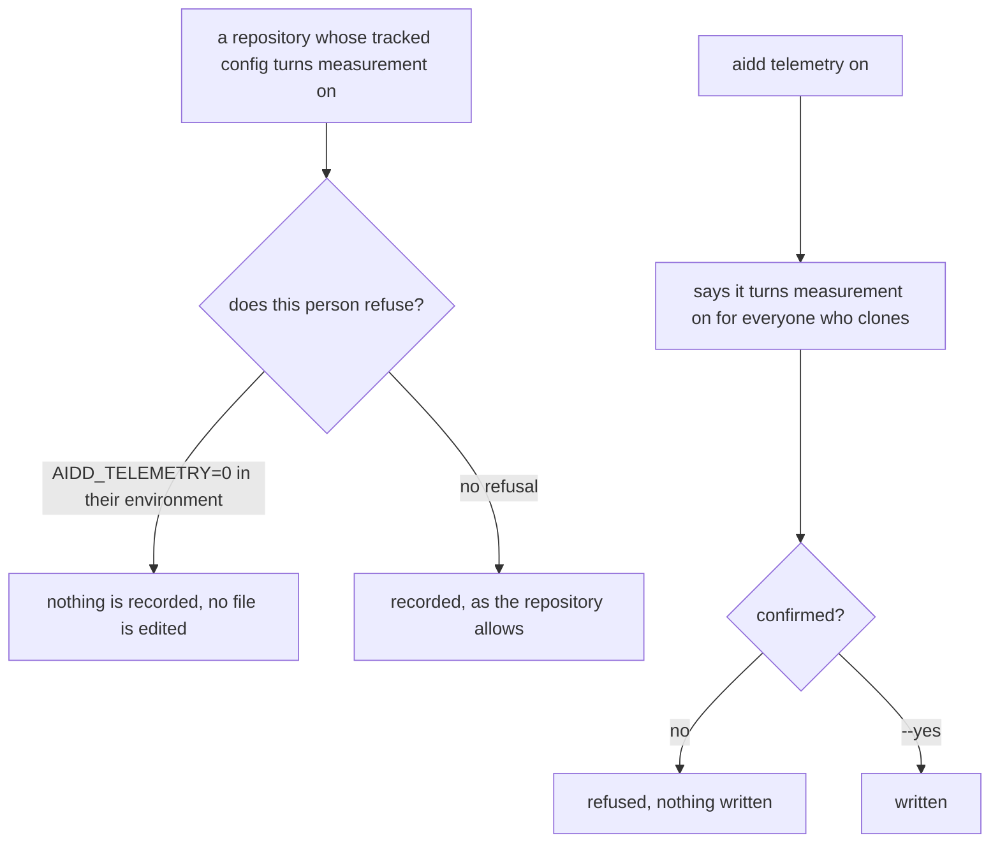
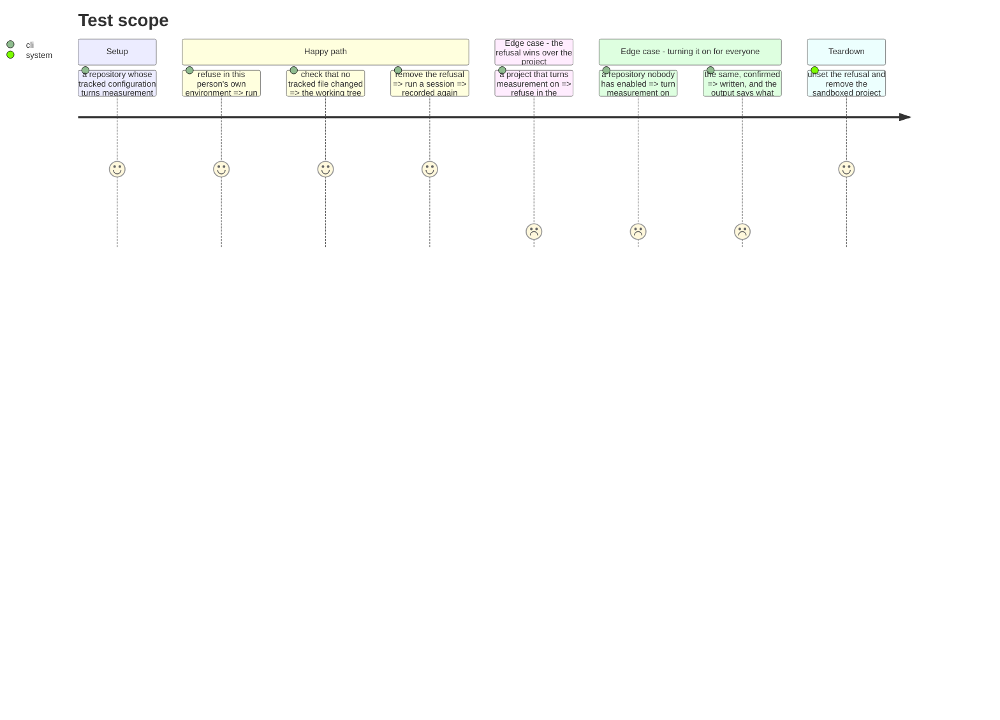

# Instruction: a refusal, and a consent that is asked for

## Architecture projection

```txt
.
├── plugins/aidd-telemetry/hooks/lib/repo.cjs                ✏️
└── cli
    ├── src
    │   ├── domain/models/telemetry-switch.ts                ✏️
    │   ├── application/errors.ts                            ✏️
    │   ├── application/use-cases/telemetry/telemetry-on-use-case.ts ✏️
    │   ├── application/display/telemetry-display.ts         ✏️
    │   └── application/commands/telemetry.ts                ✏️
    └── tests
        ├── e2e/telemetry-refusal.e2e.test.ts                ✅
        └── domain/models/telemetry-switch.unit.test.ts      ✏️
```

## User Journey



## Test Scope



## Tasks to do

### `1)` A person can refuse, without touching a tracked file

> The switch lives in a file a repository commits. Nothing today lets a person say no.

1. In `plugins/aidd-telemetry/hooks/lib/repo.cjs`'s `telemetryEnabled`, read a refusal from the environment before reading the project's configuration, and answer not-enabled when it is set.
2. Use one variable name, documented in the code, and treat only an explicit refusal as a refusal — an unset or empty variable is not a choice, and never turns measurement on by itself.
3. Mirror the same reading in `cli/src/domain/models/telemetry-switch.ts`, so the CLI and the hooks agree about whether measurement is on. They must not be able to disagree.
4. Document, where the variable is read, that this is the only refusal available at the person's scope and why it is not a file: the point of this change is that state lives in fewer places, not more.

### `2)` Turning it on for everyone is confirmed

> The same consequence as `endpoint --scope project`, which already refuses without confirmation.

1. Add `--yes` to `aidd telemetry on`, and refuse without it when the switch file is tracked by git or would be committed, naming the consequence in the same terms `TelemetryProjectScopeRequiresYesError` already uses.
2. Reuse that error's wording rather than writing a second sentence for the same fact. If the two acts need one sentence, they need one error.
3. Do not gate turning it **off**. A refusal never needs permission.

### `3)` What the two commands say afterwards

1. `telemetry on` states what was written, where, and that it applies to everyone who clones.
2. Correct its existing claim that the journal names who worked on what: no journal line carries any identity field. Say what the journal does record — the repository, the task folders written into, the skills run, and the timings.
3. `telemetry off` states where the data already written still is, rather than mentioning only the switch.

## Test acceptance criteria

| Task | Acceptance criteria                                                                                       |
| ---- | ----------------------------------------------------------------------------------------------------------- |
| 1    | A person who refuses in their environment is not recorded, in a project whose tracked configuration allows it |
| 1    | Refusing changes no file, and leaves the working tree clean                                                   |
| 1    | An unset variable turns nothing on by itself                                                                  |
| 1    | The hooks and the CLI agree about whether measurement is on, for every combination of the two inputs           |
| 2    | Turning measurement on without confirmation is refused, and names the consequence                             |
| 2    | Turning it off needs no confirmation                                                                          |
| 3    | Nothing in the output claims the journal names a person                                                       |
