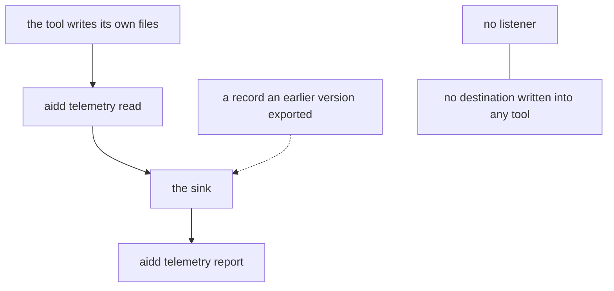
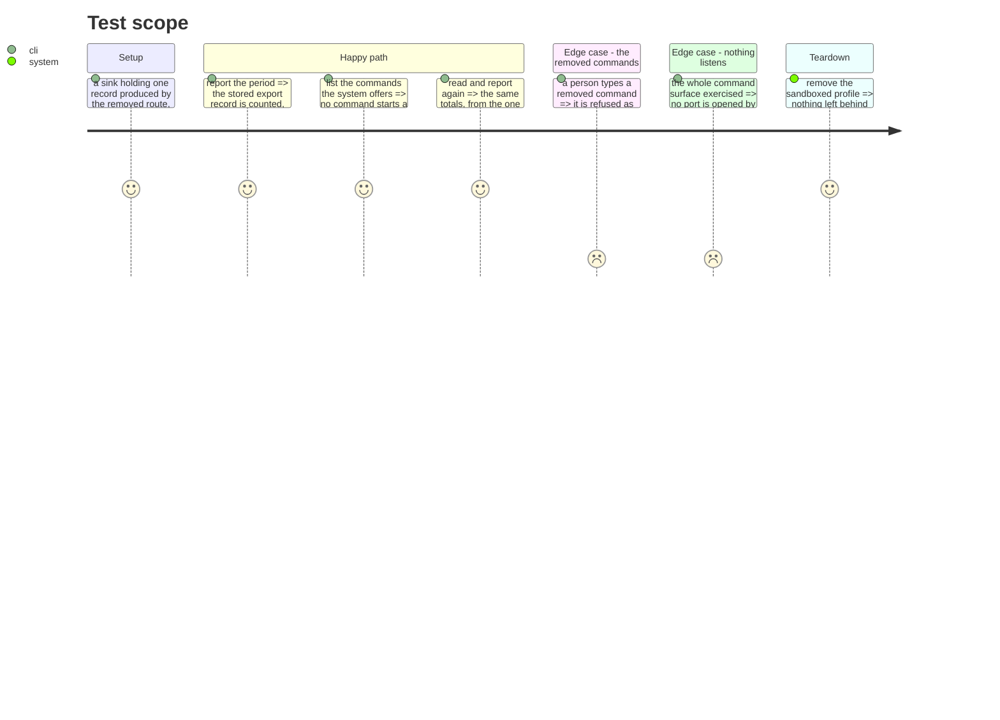

# Instruction: one route — the writing side goes

## Architecture projection

```txt
.
└── cli
    ├── src
    │   ├── application
    │   │   ├── use-cases/telemetry/receive-telemetry-use-case.ts        ❌
    │   │   ├── use-cases/telemetry/telemetry-endpoint-use-case.ts       ❌
    │   │   ├── use-cases/telemetry/telemetry-endpoint-clear-use-case.ts ❌
    │   │   └── commands/telemetry.ts                                    ✏️
    │   ├── infrastructure
    │   │   ├── adapters/otlp-http-receiver-adapter.ts                   ❌
    │   │   ├── adapters/export-config-reader-adapter.ts                 ❌
    │   │   └── deps.ts                                                  ✏️
    │   └── domain
    │       ├── ports/export-config-reader.ts                            ❌
    │       ├── tools/contracts.ts                                       ✏️
    │       └── tools/ai/{claude,codex,copilot,cursor,opencode}.ts       ✏️
    └── tests
        ├── infrastructure/adapters/otlp-http-receiver-adapter.integration.test.ts ❌
        ├── application/use-cases/telemetry/telemetry-endpoint*.test.ts   ❌
        ├── application/use-cases/telemetry/receive-telemetry-use-case.unit.test.ts ❌
        └── e2e/telemetry-stored-export-record.e2e.test.ts               ✅
```

## User Journey



## Test Scope



## Tasks to do

### `1)` Delete the writing side

> Three commands, one server, one destination writer, and every test that pinned them.

1. Remove `receive`, `endpoint` and `endpoint clear` from `cli/src/application/commands/telemetry.ts`, with their use cases, the OTLP receiver adapter, the export-config reader and its port, and their tests and fixtures.
2. Unwire all of them from `cli/src/infrastructure/deps.ts`.
3. Narrow each tool's declaration in `cli/src/domain/tools/ai/` and the shape in `cli/src/domain/tools/contracts.ts`: a tool no longer declares an export route, because nothing configures one. Keep `telemetryLocalRead` exactly as it is.
4. Delete the OTLP request fixtures under `cli/tests/fixtures/telemetry-sink/`. They describe a payload nothing parses any more.

### `2)` A stored record still reads

> Removing a way of writing never removes a way of reading. This is the task most at risk of being deleted along with the rest.

1. Keep `provenance` on `TelemetrySinkRecord`, keep `"export"` as one of its values, and keep every rule that reads it: the double-count rules, `withPersonBackfill`, and the per-tool coverage rows.
2. Add `cli/tests/e2e/telemetry-stored-export-record.e2e.test.ts`: seed a sink holding a record produced by the removed route, report the period, and assert it is counted with its own figures.
3. Document at `provenance`'s own declaration that one of its values can no longer be produced by this system and is kept because a stored line outlives the code that wrote it.

### `3)` Prove nothing listens

1. Assert that no source file in `cli/src` creates a server, by the same kind of check the repository already uses to keep source text-only.
2. Make that check name what it protects, so a future listener is a deliberate decision and not an accident.

## Test acceptance criteria

| Task | Acceptance criteria                                                                              |
| ---- | -------------------------------------------------------------------------------------------------- |
| 1    | No command offered by the system starts a server or writes an export destination                    |
| 1    | A removed command is refused as unknown, like any other unknown command                             |
| 1    | Nothing in the source reads or writes a tool's export configuration                                 |
| 2    | A stored record produced by the removed route is still read, counted and reported, with its figures  |
| 2    | The three double-count rules still hold with both kinds of stored record present                     |
| 3    | A check fails if a server is introduced anywhere in the CLI source                                   |
