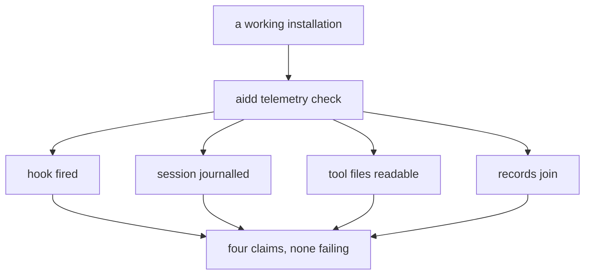
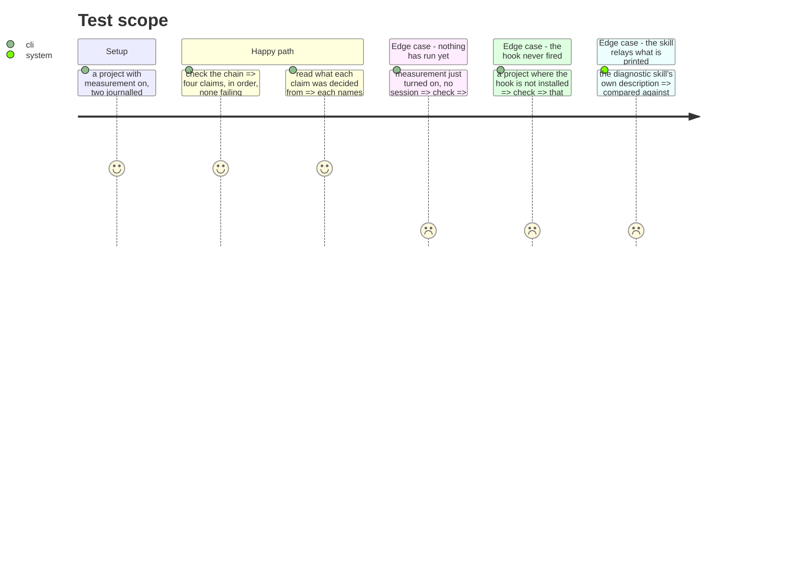

# Instruction: the diagnostic grades only what exists

## Architecture projection

```txt
.
├── cli
│   ├── src
│   │   ├── domain/models/telemetry-claim.ts                        ✏️
│   │   ├── application/use-cases/telemetry/diagnose-telemetry-use-case.ts ✏️
│   │   ├── domain/ports/telemetry-evidence-reader.ts               ✏️
│   │   ├── infrastructure/adapters/telemetry-evidence-adapter.ts   ✏️
│   │   └── application/display/telemetry-check-display.ts          ✏️
│   └── tests/e2e/telemetry-check.e2e.test.ts                       ✏️
└── plugins/aidd-telemetry/skills/02-check/actions/02-diagnose.md   ✏️
```

## User Journey



## Test Scope



## Tasks to do

### `1)` Four claims, not six

> Two of the six graded a route that no longer exists, and failed on a healthy install.

1. Remove `export-configured` and `identifier-joinable` from `TelemetryClaimId`, with every reason only they used.
2. Remove the export evidence from `TelemetryEvidence`, its reader port and its adapter, keeping everything the four remaining claims read.
3. Keep the contract that the claims print always in the same order and that nothing summarises them — now for four.
4. Re-read each remaining claim's wording: any that mentions exporting, a destination or an identifier attribute is now describing something that cannot happen.

### `2)` A healthy installation reports no failure

1. Assert, end to end, that a project with measurement on and one journalled, read session reports no failing claim.
2. Assert that a state with nothing measured yet reports claims with nothing to evaluate, never failures — the difference between "not yet" and "broken" is the whole reason this command exists.
3. Make sure no remaining claim can recommend a command the system no longer offers.

### `3)` The skill and the command agree

> The consumer must change in the same commit. This is the failure that halted the cost skill twice.

1. Update `plugins/aidd-telemetry/skills/02-check/actions/02-diagnose.md`: it names "all six claims" and both removed claims by name, in its own instructions and its test table.
2. Sweep the plugin for any other mention of the removed claims or the removed commands.
3. Add a check that fails if the skill's stated claim count and the command's actual claim count disagree, so this consumer cannot silently go stale a third time.

## Test acceptance criteria

| Task | Acceptance criteria                                                                        |
| ---- | -------------------------------------------------------------------------------------------- |
| 1    | The diagnostic prints four claims, always in the same order                                   |
| 1    | No claim mentions exporting, a destination, or an identity attribute                          |
| 2    | A working installation reports no failing claim                                               |
| 2    | An installation with nothing measured yet reports nothing to evaluate, not a failure          |
| 2    | No claim recommends a command that no longer exists                                           |
| 3    | The diagnostic skill states the claims the command prints, in the number it prints them        |
| 3    | A check fails if the two ever disagree again                                                  |
